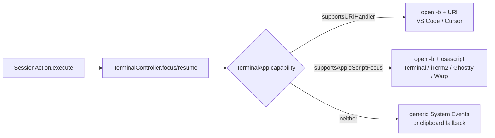
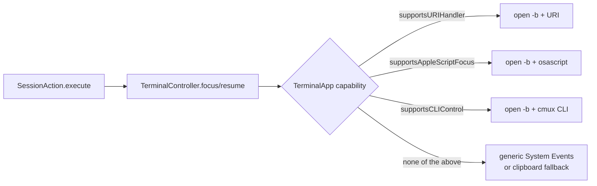
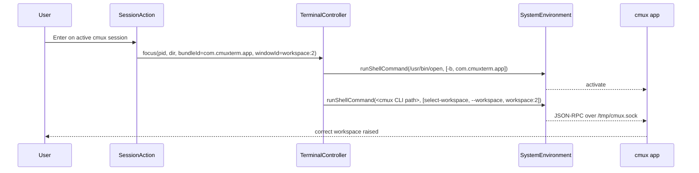

# Plan: Add cmux terminal app support

## Working Protocol
- Use parallel subagents for independent work (enum + capabilities, hook scripts, tests).
- Run `make kill-build` before any retry if `swift build` / `swift test` hangs; always pass a 120s build / 30s test timeout.
- After each Implementation Step, run `swift build` then the relevant test target. Mark the step `[x]` only when both green.
- Tests ALWAYS run via subagents (global AGENTS.md rule).
- If blocked, record the blocker inline here under the step before stopping.

## Overview
Add [cmux](https://cmux.com/) (bundle ID `com.cmuxterm.app`) as a first-class terminal target alongside Terminal, iTerm2, Ghostty, Warp, VS Code, VS Code Insiders, and Cursor. cmux exposes neither an AppleScript scripting dictionary nor a custom URL scheme — it is driven by a native CLI (`/Applications/cmux.app/Contents/Resources/bin/cmux`) that wraps a Unix-socket JSON-RPC API. Introduce a third integration pattern — **CLI control** — so seshctl can focus a cmux workspace (`cmux select-workspace --workspace <id>`) and resume a session in a new workspace (`cmux new-workspace --cwd <dir> --command <cmd>`) using the workspace ID captured from `$CMUX_WORKSPACE_ID` in the session-start hook.

## User Experience

**Launch a coding-agent session inside cmux.** The user runs `claude` or `codex` inside a cmux workspace. The existing Claude Code / Codex `session-start.sh` hook fires; it now also reads `$CMUX_WORKSPACE_ID` from the shell environment and passes it as `--window-id` to `seshctl-cli start`. seshctl records the session with `hostAppBundleId=com.cmuxterm.app` (auto-detected from the PID walk) and `windowId=<cmux workspace ref>`.

**Focus an active cmux session from the seshctl panel.** The user opens the seshctl command panel, picks a running session hosted in cmux, and presses Enter. seshctl:
1. Resolves the bundle ID to `com.cmuxterm.app` via `resolveAppBundleId`.
2. Activates cmux via `open -b com.cmuxterm.app` (brings the app forward; creates a window if none is open).
3. Runs `cmux select-workspace --workspace <stored workspace ref>` to raise the correct tab.
4. Panel dismisses; cmux is frontmost showing the user's workspace.

**Resume an inactive cmux session.** User picks an inactive (completed / canceled / stale) session hosted in cmux. seshctl:
1. Builds the resume command via `buildResumeCommand` (e.g., `claude --resume abc-123`).
2. Invokes `cmux new-workspace --cwd <session dir> --command "<resume cmd>"` — cmux CLI launches the cmux app itself if it isn't running.
3. On any failure (binary missing, socket unreachable, non-zero exit), `TerminalController.resume` returns `false` and `SessionAction` falls back to copying `cd <dir> && <cmd>` to the clipboard (existing path — unchanged).

**No change for non-cmux users.** Every switch on `TerminalApp` remains exhaustive, so the new case only affects paths where `com.cmuxterm.app` is actually detected.

## Architecture

### Current

seshctl dispatches focus/resume by asking `TerminalApp` two capability booleans:



The session-start hook forwards `--window-id` only for Ghostty today, via an AppleScript probe inside `hooks/{claude,codex}/session-start.sh`.

### Proposed

Add a third capability — `supportsCLIControl` — and a third branch that shells out to the app's own CLI. cmux is the first (and currently only) consumer.



**Runtime data flow — focus path for cmux:**



**Runtime data flow — resume path for cmux:**

```mermaid
sequenceDiagram
    participant SA as SessionAction
    participant TC as TerminalController
    participant SE as SystemEnvironment
    participant C as cmux app
    SA->>TC: resume(cmd="claude --resume abc", dir=/path, bundleId=com.cmuxterm.app)
    TC->>SE: runShellCommand(<cmux CLI path>, [new-workspace, --cwd, /path, --command, claude --resume abc])
    Note over SE,C: cmux CLI launches app if not running; streams request via socket
    C-->>TC: async (fire-and-forget)
    TC-->>SA: true
```

**What's in memory vs on disk vs over the network:**
- **Disk:** sqlite DB at `~/.local/share/seshctl/seshctl.db` — gains the cmux workspace ref in the existing `windowId` column (no schema change). Hook shell scripts on disk at `~/.local/share/seshctl/hooks/{claude,codex}/*.sh`.
- **Network:** none. cmux CLI communicates over a Unix domain socket `/tmp/cmux.sock` — local only.
- **Process tree:** cmux is a regular GUI app; `NSWorkspace.shared.runningApplications` finds it during the PID walk in `SeshctlCLI.detectHostApp()`.
- **Environment variables at session start:** cmux sets `CMUX_WORKSPACE_ID`, `CMUX_SURFACE_ID`, and `TERM_PROGRAM=ghostty` in every shell it spawns. The `TERM_PROGRAM=ghostty` collision is the only surprise — addressed below.

**cmux CLI binary resolution.** Strategy: ask `NSWorkspace` for the cmux app bundle URL by bundle ID, append `Contents/Resources/bin/cmux`. Falls back to absolute `/Applications/cmux.app/Contents/Resources/bin/cmux` if the workspace lookup fails. Deliberately *not* using `$PATH` or `/opt/homebrew/bin/cmux` — the Swift app may run with a sanitized PATH, and we already have the bundle ID.

## Current State

**`Sources/SeshctlCore/TerminalApp.swift`** (enum source of truth, 101 lines):
- Cases: `terminal`, `iterm2`, `warp`, `ghostty`, `vscode`, `vscodeInsiders`, `cursor`.
- Capability booleans (all exhaustive switches): `supportsAppleScriptFocus`, `supportsAppleScriptResume`, `supportsURIHandler`.
- Lookup: `from(bundleId:)`, `from(termProgram:)` (pure string → case; doesn't see env), `allTerminals`, `allVSCodeVariants`, `allBundleIds`.

**`Sources/SeshctlUI/TerminalController.swift`** (599 lines):
- Public entry points: `focus(pid:directory:launchDirectory:hostWorkspaceFolder:bundleId:windowId:environment:)` (lines 125–161), `resume(command:directory:bundleId:environment:)` (lines 168–188), `resolveAppBundleId(session:environment:)` (lines 235–244), `buildResumeCommand(session:)` (lines 194–217), `detectFrontmostTerminal(environment:)` (lines 222–230), `escapeForAppleScript(_:)` (lines 506–516).
- Dispatch for `focus`: `if app.supportsURIHandler { focusVSCode } else if app.supportsAppleScriptFocus { focusTerminal } else { generic System Events or activateApp }` (lines 130–160).
- Dispatch for `resume`: `if app.supportsURIHandler { resumeInVSCode } else if app.supportsAppleScriptResume { resumeInTerminal } else { false }` (lines 178–187).
- AppleScript execution routes through `SystemEnvironment.runAppleScript`; shell commands through `SystemEnvironment.runShellCommand(_:args:)` (no output capture — sufficient for our needs).
- No existing helper captures Process stdout/stderr — **not needed** for cmux (fire-and-forget).

**`Sources/seshctl-cli/SeshctlCLI.swift`** (349 lines):
- `Start.run()` calls `detectHostApp(pid:)` which does a PID walk through `NSWorkspace.shared.runningApplications`, then falls back to `TERM_PROGRAM` matching, then frontmost app (lines 98–133).
- `--window-id` option already exists (line 58) and is persisted via `db.startSession(..., windowId:, ...)`.

**`hooks/claude/session-start.sh` (lines 15–32) and `hooks/codex/session-start.sh` (lines 11–29):**
Both already have an `ARGS+=(--window-id "$ID")` conditional — currently only for Ghostty via an AppleScript probe. The existing idiom is the template for the cmux branch.

**Tests** (`Tests/SeshctlUITests/TerminalControllerTests.swift`):
- `MockSystemEnvironment` (lines 9–31) records every `shellCommands`, `executedScripts`, `openedURLs`, `activatedApps`, and `runningApps` call.
- Routing tests populate the mock and assert via `#expect(env.shellCommands.contains { ... })` — same pattern we'll use for cmux.
- `makeSession(...)` helper at lines 611–640 / 861–887.
- No hook-script tests exist today — will add one for the new cmux branch.

**README** has a compatibility table for terminals; must be updated.

## Proposed Changes

1. **Add `.cmux` case and `supportsCLIControl` capability** to `TerminalApp`. All existing exhaustive switches gain a `.cmux` arm. Add a `cliBinaryPath(env:)` accessor (returns the resolved cmux binary URL) so the capability stays data-driven rather than hardcoding the path inside `TerminalController`.

2. **Add CLI-control dispatch to `TerminalController`.** Extend the `focus` and `resume` routing ladders with a `supportsCLIControl` branch that calls new private `focusCmux(...)` and `resumeInCmux(...)` helpers. Each helper: activates the app via `open -b`, then runs the cmux CLI via `SystemEnvironment.runShellCommand`. Reuses existing infrastructure — no new `SystemEnvironment` protocol members.

3. **Forward `$CMUX_WORKSPACE_ID` from both session-start hooks.** One-line addition to `hooks/claude/session-start.sh` and `hooks/codex/session-start.sh`, patterned on the existing Ghostty branch but simpler (no AppleScript probe needed — env var is already set).

4. **Add an env-aware host-app detection helper.** New `TerminalApp.from(environment:)` (a convenience wrapper that checks `CMUX_WORKSPACE_ID` / `CMUX_SOCKET_PATH` before consulting `TERM_PROGRAM`). Call it from the `SeshctlCLI.detectHostApp()` fallback. The PID walk will usually already classify cmux correctly via `NSRunningApplication`; this is belt-and-suspenders against the `TERM_PROGRAM=ghostty` collision.

5. **Documentation:** Add cmux to the README compatibility table and add a short "CLI control pattern" section to `AGENTS.md` beside the existing AppleScript and URI-handler patterns.

6. **Tests:** Extend `TerminalControllerTests` to cover (a) CLI command generation for focus and resume, (b) routing by bundle ID for `com.cmuxterm.app`, (c) resume-success vs resume-failure exit handling. Add a small test for `TerminalApp.from(environment:)` in `SeshctlCoreTests`. Hook scripts: add a sanity test that executes the script with a fixture environment and asserts `--window-id $CMUX_WORKSPACE_ID` is in the argv (or, if shell-script tests are too awkward, add a review checklist item and rely on manual verification — documented in Key Decisions).

### Complexity Assessment
**Low.** Four Swift source files touched (`TerminalApp.swift`, `TerminalController.swift`, `SeshctlCLI.swift`, plus tests), two hook shell scripts, plus README/AGENTS docs. The pattern mirrors existing code (VS Code's URI-handler dispatch and Ghostty's hook-env forwarding). No schema changes, no new protocol members, no new public API. The one genuinely new thing is the `supportsCLIControl` capability — but it's strictly additive, compiler-enforced exhaustiveness catches missed arms, and the blast radius is gated on bundle ID `com.cmuxterm.app`. Regression risk is contained to the tight dispatch ladder in `TerminalController.focus` / `resume`, which is covered by existing routing tests.

## Impact Analysis

- **New Files**: None. All changes are edits.
- **Modified Files**:
  - `Sources/SeshctlCore/TerminalApp.swift` — add `.cmux` case, new `supportsCLIControl` capability, new `cliBinaryPath(env:)` accessor, new `from(environment:)` helper, extend existing switches, update `allTerminals` collection.
  - `Sources/SeshctlUI/TerminalController.swift` — add `focusCmux(...)` and `resumeInCmux(...)` private helpers and extend `focus` / `resume` dispatch ladders.
  - `Sources/seshctl-cli/SeshctlCLI.swift` — update `detectHostApp` fallback to prefer `TerminalApp.from(environment:)` over raw `from(termProgram:)`.
  - `hooks/claude/session-start.sh` — add `$CMUX_WORKSPACE_ID` branch.
  - `hooks/codex/session-start.sh` — add `$CMUX_WORKSPACE_ID` branch.
  - `Tests/SeshctlUITests/TerminalControllerTests.swift` — new suites for cmux focus/resume generation + routing.
  - `Tests/SeshctlCoreTests/TerminalAppTests.swift` (if it exists; otherwise create) — `from(environment:)` cases.
  - `README.md` — compatibility table row.
  - `AGENTS.md` — "Adding Terminal App Support" gains a CLI-control pattern note.
- **Dependencies** (runtime): the installed cmux app at `com.cmuxterm.app` with its bundled CLI under `Contents/Resources/bin/cmux`. No new Swift packages.
- **Similar Modules** (for reuse):
  - `focusVSCode` / `resumeInVSCode` (lines 540–569 in `TerminalController.swift`) — mirror their shape for `focusCmux` / `resumeInCmux`.
  - Ghostty hook branch (`hooks/claude/session-start.sh` lines 22–34) — mirror its `ARGS+=(--window-id ...)` idiom.
  - `MockSystemEnvironment` + `makeSession()` — reuse as-is.
  - `resolveAppBundleId`, `buildResumeCommand` — call unchanged.

## Key Decisions

1. **Capability name:** `supportsCLIControl` (mirrors `supportsURIHandler` / `supportsAppleScriptFocus`). Generic on purpose — if a future terminal ships a similar CLI, this capability can cover it. An app-specific name like `supportsCmuxCLI` would lock us in.
2. **Binary path resolution:** `NSWorkspace.shared.urlForApplication(withBundleIdentifier: "com.cmuxterm.app")?.appendingPathComponent("Contents/Resources/bin/cmux")`, falling back to the absolute `/Applications/cmux.app/Contents/Resources/bin/cmux`. Avoids PATH dependence and handles users who install cmux to `~/Applications`.
3. **Activation before CLI call:** We still run `open -b com.cmuxterm.app` before `cmux select-workspace`, matching the VS Code / Terminal patterns. `cmux new-workspace` self-launches the app, so the `open -b` is technically redundant on the resume path but we keep it for symmetry and to guarantee foreground ordering.
4. **No output capture from the cmux CLI.** `runShellCommand` is fire-and-forget. The resume-failure path is gated on `Process.terminationStatus`, which `runShellCommand` already captures into its `Bool` return. Don't add a new `SystemEnvironment` method for the sake of one caller.
5. **Detection guard lives in `TerminalApp.from(environment:)`, not in `detectHostApp` directly.** Keeps terminal-app logic in `TerminalApp.swift`; `SeshctlCLI` just uses the helper. Respects the "all bundle IDs and per-app knowledge live in `TerminalApp`" rule from `AGENTS.md`.
6. **No schema change.** The existing `windowId` column carries the cmux workspace ref (e.g., `workspace:2` or a UUID). If cmux's ref format later changes, it's still an opaque string from seshctl's perspective.
7. **`--id-format`:** we use whatever `$CMUX_WORKSPACE_ID` holds at session-start (cmux defaults to `refs` like `workspace:2`, but can return UUIDs). `select-workspace` accepts both, so we don't need to normalize.

## Implementation Steps

### Step 1: Add `.cmux` case + `supportsCLIControl` capability to `TerminalApp`
- [x] Add `case cmux` to `TerminalApp` enum in `Sources/SeshctlCore/TerminalApp.swift`.
- [x] Add arms to every existing `switch self` (bundleId → `"com.cmuxterm.app"`, displayName → `"cmux"`, uriScheme → `nil`, supportsAppleScriptFocus → `false`, supportsAppleScriptResume → `false`, supportsURIHandler → `false`).
- [x] Add new capability: `public var supportsCLIControl: Bool` with exhaustive switch (cmux → true, all others → false).
- [x] Add `public func cliBinaryPath(using workspace: NSWorkspace = .shared) -> URL?` — returns the bundled cmux binary URL for `.cmux`; `nil` for all other cases. Live in `SeshctlCore` but resolve via `AppKit` — if that import cost is a concern, return a `String` of the fallback path and let `TerminalController` do the `NSWorkspace` lookup (decide while implementing; prefer the URL variant if AppKit is already a transitive dep of `SeshctlCore`; it likely is not — in that case put the resolver in `TerminalController` and keep the enum accessor returning just the fallback absolute path).
- [x] Add `public static func from(environment env: [String: String]) -> TerminalApp?` — priority: `env["CMUX_WORKSPACE_ID"] != nil || env["CMUX_SOCKET_PATH"] != nil` → `.cmux`; else `env["TERM_PROGRAM"].flatMap(from(termProgram:))`.
- [x] Extend `allTerminals` to include `.cmux`.
- [x] Build: `swift build`. Every missing switch arm will fail the build — fix until green.

### Step 2: CLI-control dispatch in `TerminalController`
- [x] In `Sources/SeshctlUI/TerminalController.swift`, extend the `focus` dispatch ladder: add `else if app.supportsCLIControl { focusCmux(app: app, bundleId: bundleId, windowId: windowId, environment: env) }` before the generic fallback.
- [x] Extend the `resume` dispatch ladder: add `else if app.supportsCLIControl { return resumeInCmux(command: command, directory: directory, app: app, bundleId: bundleId, environment: env) }`.
- [x] Implement private `focusCmux(...)`:
  - Run `open -b com.cmuxterm.app` via `env.runShellCommand`.
  - If `windowId` is non-nil/non-empty, run `<cliBinary> select-workspace --workspace <windowId>`.
  - If `windowId` is nil, skip the select-workspace call (no-op — cmux will show whatever is current).
- [x] Implement private `resumeInCmux(...)`:
  - Run `open -b com.cmuxterm.app`.
  - Run `<cliBinary> new-workspace --cwd <directory> --command <command>`.
  - Return `env.runShellCommand(..)` success (Bool) — existing protocol surface gives us this.
- [x] Resolve the binary URL once (via `NSWorkspace.shared.urlForApplication(withBundleIdentifier: "com.cmuxterm.app")`, falling back to `/Applications/cmux.app/Contents/Resources/bin/cmux`). If the binary doesn't exist, `resumeInCmux` returns `false` → clipboard fallback kicks in via `SessionAction.resumeInactiveSession`.

### Step 3: Host-app detection guard for `TERM_PROGRAM=ghostty` collision
- [x] In `Sources/seshctl-cli/SeshctlCLI.swift` `detectHostApp(pid:)` fallback (lines 117–123), replace the current `if let termProgram = ...; let app = TerminalApp.from(termProgram:)` block with `if let app = TerminalApp.from(environment: ProcessInfo.processInfo.environment)`.
- [x] Keep the existing running-app name lookup unchanged.

### Step 4: Update session-start hook scripts
- [x] Edit `hooks/claude/session-start.sh` — after the existing Ghostty block (line ~34), add:
  ```bash
  if [ -n "${CMUX_WORKSPACE_ID:-}" ]; then
    ARGS+=(--window-id "$CMUX_WORKSPACE_ID")
  fi
  ```
- [x] Edit `hooks/codex/session-start.sh` — same addition after its Ghostty block.
- [x] Note: order matters only if both `TERM_PROGRAM=ghostty` and `CMUX_WORKSPACE_ID` are set (which happens inside cmux). Place the cmux block *after* the Ghostty probe so cmux's `--window-id` wins — arrays appended last don't override, but `seshctl-cli start` takes the last `--window-id` it sees from `ArgumentParser`. Actually: `ArgumentParser` rejects duplicate `--window-id`. Solution: wrap the Ghostty block in `if [ -z "${CMUX_WORKSPACE_ID:-}" ]` so the AppleScript probe is skipped when cmux is detected. Implement the guard; cover it in the tests in Step 6.

### Step 5: Documentation
- [x] Add a cmux row to the compatibility table in `README.md`.
- [x] In `AGENTS.md`, under "Adding Terminal App Support" → "How focusing and resuming works", add **Pattern 3: CLI control** describing cmux's flow (alongside the existing AppleScript and URI patterns).
- [x] Renumber the existing "Pattern 3: Generic AppleScript fallback" → "Pattern 4".

### Step 6: Write tests
- [x] In `Tests/SeshctlUITests/TerminalControllerTests.swift`, add a `CmuxCLIGenerationTests` suite:
  - Test case: `focusCmux` issues `open -b com.cmuxterm.app` followed by `<cli> select-workspace --workspace workspace:2`.
  - Test case: `focusCmux` with nil windowId issues only `open -b` (no select-workspace).
  - Test case: `resumeInCmux` issues `<cli> new-workspace --cwd /path --command "claude --resume abc"`.
  - Test case: `resumeInCmux` returns `false` when `runShellCommand` reports failure; returns `true` otherwise.
  - Test case: `TerminalController.focus` with `bundleId=com.cmuxterm.app` routes through the CLI path (not AppleScript, not URI).
  - Test case: `TerminalController.resume` with `bundleId=com.cmuxterm.app` routes through the CLI path.
- [x] If `Tests/SeshctlCoreTests/TerminalAppTests.swift` exists, add: `from(environment:)` returns `.cmux` when `CMUX_WORKSPACE_ID` is present; returns `.ghostty` when only `TERM_PROGRAM=ghostty` is set; returns `.cmux` when both are set (cmux wins). If the file doesn't exist, create it with just these cases.
- [ ] Test hook-script guard manually: run the hook with `TERM_PROGRAM=ghostty CMUX_WORKSPACE_ID=workspace:2 bash hooks/claude/session-start.sh <fixture>` and confirm `--window-id workspace:2` appears exactly once in the resulting argv. (Shell-script unit tests are awkward and out of scope; this is listed as `[test-manual]` below.)
- [x] Run the full test suite via subagent with a 30s timeout.

### Step 7: Local smoke test
- [ ] `make install` to rebuild and install the CLI + hooks + app.
- [ ] Open a workspace in cmux, run `claude` to start a session.
- [ ] Confirm via `seshctl-cli show <id>` that `hostAppBundleId=com.cmuxterm.app` and `windowId` is populated.
- [ ] Switch to a different cmux workspace, then use seshctl panel → Enter on the session → confirm cmux focuses the original workspace.
- [ ] Let the session go idle, open seshctl panel → Enter → confirm a new workspace opens in cmux with the resume command running.
- [ ] Test clipboard fallback: temporarily rename the cmux binary, attempt resume, confirm clipboard contains `cd <dir> && <cmd>`.

## Acceptance Criteria
- [x] [test] `focusCmux` emits `open -b com.cmuxterm.app` + `<cli> select-workspace --workspace <id>` in order when given a non-nil windowId.
- [x] [test] `resumeInCmux` emits `<cli> new-workspace --cwd <dir> --command <cmd>` and returns the shell command's success flag.
- [x] [test] `TerminalController.focus` and `resume` route to the CLI helpers for `bundleId=com.cmuxterm.app`.
- [x] [test] `TerminalApp.from(environment:)` prefers cmux over ghostty when `CMUX_WORKSPACE_ID` is present.
- [ ] [test] Clipboard fallback triggers (via existing `SessionAction.resumeInactiveSession` coverage) when cmux CLI returns non-zero.
- [x] [test] Every existing exhaustive switch on `TerminalApp` compiles without a `default` clause after adding `.cmux` (enforced by compiler; verified by `swift build`).
- [ ] [test-manual] Launch `claude` in cmux → seshctl detects `com.cmuxterm.app` as host and stores `$CMUX_WORKSPACE_ID` as windowId.
- [ ] [test-manual] Focus from seshctl panel raises the correct cmux workspace.
- [ ] [test-manual] Resume from seshctl panel opens a new cmux workspace with the resume command pre-running.
- [ ] [test-manual] Hook script does not pass two `--window-id` flags when both `TERM_PROGRAM=ghostty` and `CMUX_WORKSPACE_ID` are set.
- [ ] [test-manual] README compatibility table updated; `AGENTS.md` documents the CLI-control pattern.

## Edge Cases
- **cmux binary missing** (user deleted `/Applications/cmux.app` after a session was recorded): `runShellCommand` returns false → `TerminalController.resume` returns false → clipboard fallback. Focus path: `open -b com.cmuxterm.app` fails silently → nothing happens. Acceptable for focus; the user can see cmux isn't running and reopen it manually. Not worth extra UX.
- **cmux CLI socket unreachable** (cmux app crashed, socket stale): `cmux select-workspace` exits non-zero; focus is best-effort so we simply do nothing (same as today for a closed Ghostty window). Resume returns false → clipboard fallback.
- **`--window-id` is nil** (session started in cmux before this feature shipped, or `$CMUX_WORKSPACE_ID` was unset): `focusCmux` still activates cmux via `open -b` but skips `select-workspace`. User lands in cmux's current workspace — acceptable degraded behavior.
- **User has cmux installed to `~/Applications/`**: `NSWorkspace.urlForApplication(withBundleIdentifier:)` handles it.
- **User has multiple cmux builds** (e.g., debug + release): `NSWorkspace` returns one — usually the most recently registered. Acceptable.
- **Conversation-id-less sessions**: existing `buildResumeCommand` returns nil → `SessionAction.resumeInactiveSession` uses the pid-based focus fallback → `focusCmux` without windowId. Degraded but correct.
- **cmux updates change the CLI command surface**: `select-workspace` / `new-workspace` are stable public commands per the docs. Low risk.
- **Privacy: the `--command` payload (resume command) is visible to cmux's logging subsystem.** `buildResumeCommand` output is the same data we show in the UI; no new exposure.

## Postscript: pivot to AppleScript

The CLI-control approach above landed in commit `88a773a` but didn't actually work in practice. When I smoke-tested, `cmux select-workspace` silently failed from a Dock-launched SeshctlApp. Root cause: cmux's Unix socket defaults to `cmuxOnly` auth mode, which validates peer PID ancestry — only processes whose tree includes `cmux.app` can talk to the socket. A Dock-launched Swift app isn't a child of cmux, so every `select-workspace` call was rejected before it reached the app. Running the same CLI command from a shell *inside* cmux works; running it from anywhere else does not.

Rather than routing seshctl through a cmux-spawned helper (complicated) or asking users to relax auth mode (wrong tradeoff), I pivoted to cmux's AppleScript dictionary at `/Applications/cmux.app/Contents/Resources/cmux.sdef`. It exposes `window` → `tab` → `terminal` with a stable `id of tab` that matches `$CMUX_WORKSPACE_ID`, plus commands `activate window`, `select tab`, `new window`, `new tab`, and `input text`. AppleScript goes through Apple Events / an entitled scripting bridge, not the socket, so peer-PID checks don't apply. I verified `tell application "cmux" ... select tab` works live from SeshctlApp with no auth issue.

Net change: removed `supportsCLIControl`, `focusCmux`, `resumeInCmux`, `cmuxBinaryPath`, and the `applicationURL` / `cmuxBinaryOverride` test hooks. `.cmux` now rides Pattern 1 (AppleScript focus) alongside Terminal/iTerm2/Ghostty/Warp, with cmux-specific `buildFocusScript` and `buildResumeScript` arms. Hook-forwarded `$CMUX_WORKSPACE_ID` still flows through `windowId` as before — only the dispatch target changed.

Follow-up: hook now captures `$CMUX_SURFACE_ID` too; `windowId` carries both IDs as `<workspace>|<surface>`; focus script adds a nested `focus <terminal>` step so the horizontal tab gets raised too.
