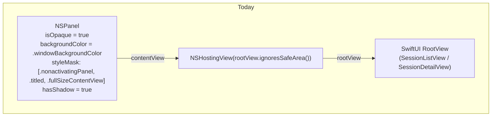
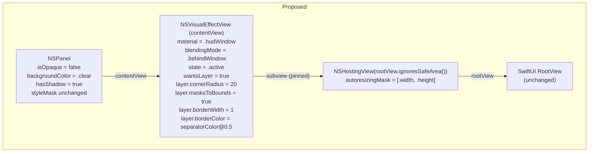

# Plan: Translucent "glass" panel chrome for the seshctl floating panel

## Context

The seshctl floating panel today renders as an opaque grey rectangle. The user wants it to look like macOS Spotlight — translucent, blurred desktop behind, rounded corners, subtle edge — without changing any behavior (floating level, click-outside dismiss, keyboard handling, size, placement). This is a chrome-only change focused on `Sources/SeshctlApp/FloatingPanel.swift`.

Decisions already taken (from clarification):
- **Material:** `NSVisualEffectView.Material.hudWindow`
- **Chrome:** 20pt corner radius + 1pt hairline separator stroke (Spotlight-ish)

## Working Protocol
- Implement sequentially — this is a single small file plus one test file; parallelism offers no speedup here.
- Run `make kill-build` once before the first build to clear any stale SwiftPM locks.
- Use a **120s** timeout for `swift build` and **30s** for `swift test` (per AGENTS.md).
- After implementation, install and manually toggle the panel (`make install`) — glass effects can't be fully verified from unit tests.
- Mark each `- [ ]` box done as you complete it so a fresh agent can resume mid-way.

## Overview

Flip the NSPanel from opaque to transparent, set an `NSVisualEffectView` with `.hudWindow` material as the panel's `contentView`, host the existing SwiftUI `rootView` as a subview of the effect view, and round/stroke the whole thing via the content view's CALayer. No behavioral changes, no SwiftUI changes in this plan.

## User Experience

Before: invoking the seshctl hotkey reveals an opaque grey panel centered on screen.

After, step by step:
1. User presses the seshctl hotkey.
2. The panel fades in at screen center (animation behavior unchanged).
3. The panel's body is a **translucent dark HUD-style surface** — the desktop, finder windows, browser, etc. behind the panel are visibly blurred through it.
4. The panel's outer shape is a **rounded rectangle with 20pt corners** and a **1pt hairline stroke** (`NSColor.separatorColor` at partial alpha) — it reads as a defined card against bright wallpapers.
5. The shadow behind the panel is unchanged — still `hasShadow = true`.
6. All SwiftUI content (session list, detail view, turn views) renders on top of the glass exactly as before.
7. Typing, j/k navigation, Enter to focus/resume, Esc to dismiss, click-outside to dismiss — all behave identically to today.

No preference toggle, no dark-mode/light-mode switch — the material adapts to system appearance automatically.

## Architecture

### Current

The panel is an `NSPanel` whose `contentView` is an `NSHostingView` wrapping the SwiftUI `RootView`. The panel itself paints its `.windowBackgroundColor` opaquely; the hosting view sits flush against this opaque surface. There is no CALayer manipulation and no AppKit compositing in between.

### Proposed

The panel becomes transparent (`isOpaque = false`, `backgroundColor = .clear`). A new `NSVisualEffectView` is inserted between the panel and the hosting view: it becomes the panel's `contentView`, and the existing `NSHostingView` is added as a subview, pinned to fill. The visual effect view owns the CALayer that gets rounded corners (`cornerRadius = 20`, `masksToBounds = true`) and the hairline border (`borderWidth = 1`, `borderColor = NSColor.separatorColor @ 0.5 alpha`). Everything else — focus routing, key handling, click-outside dismissal, size, center placement — is untouched.

Runtime data flow when the panel is toggled on:
1. `FloatingPanel.toggle()` calls `centerOnScreen()` then `makeKeyAndOrderFront(nil)`.
2. macOS composites the panel's window-server surface. Because `isOpaque = false`, the window server samples the desktop pixels behind the panel and hands them to the `NSVisualEffectView`.
3. `NSVisualEffectView` applies the `.hudWindow` material (live Gaussian-style blur + darkening tint) on the GPU every frame while the panel is visible. This is cheap on Apple Silicon; on Intel it's still fine at 900×720.
4. The `NSHostingView` renders the SwiftUI content into its own layer on top of the effect view. The content view's `masksToBounds = true` clips both the effect view's blur and the hosting view's pixels to the rounded rectangle.
5. The window's shadow is drawn by the window server using the window's alpha mask — rounded because the layer-backed content clips alpha to the rounded rect.

Nothing in this is expensive. No new memory allocations per frame, no new disk or network I/O, no change to session DB access. The only new cost is the visual-effect GPU blur, which is what macOS itself uses everywhere (Spotlight, Menu Bar, Notification Center, Control Center).

## Current State

- `Sources/SeshctlApp/FloatingPanel.swift:36-38` — the opaque chrome lines: `backgroundColor = .windowBackgroundColor`, `isOpaque = true`, `hasShadow = true`.
- `Sources/SeshctlApp/FloatingPanel.swift:41-42` — `NSHostingView(rootView: rootView.ignoresSafeArea())` is installed directly as `contentView`.
- `Sources/SeshctlApp/FloatingPanel.swift:25-30` — titlebar is already `titleVisibility = .hidden`, `titlebarAppearsTransparent = true`, and the traffic-light buttons are hidden. Good foundation — no titlebar work needed.
- `Sources/SeshctlApp/AppDelegate.swift:70` — `FloatingPanel(rootView: rootView)` is the only construction site; no downstream code touches `panel.contentView` or `panel.backgroundColor`.
- `Sources/SeshctlUI/SessionListView.swift`, `SessionDetailView.swift`, `TurnView.swift` — verified (earlier exploration) to have **no hardcoded opaque backgrounds** (no `Color.black`, no `Color(NSColor.windowBackgroundColor)`). Only semi-transparent tints (`Color.accentColor.opacity(0.06)` on `UserTurnView`, `.opacity(0.2)` on selected rows). These will composite over the glass correctly, though contrast may need a small bump if the tint is invisible — see Edge Cases.
- No `NSVisualEffectView`, `NSViewRepresentable`, SwiftUI material modifiers, or `cornerRadius` on `NSWindow`/`NSPanel`/`contentView.layer` exist anywhere in the repo today. This is a greenfield addition — no abstraction to reuse.
- `Package.swift` deployment target: `.macOS(.v13)`. All APIs used here (`NSVisualEffectView`, `.hudWindow`, CALayer corner radius) are available on 10.10+, well within target.
- No existing tests for `FloatingPanel` in `Tests/SeshctlCoreTests/` or `Tests/SeshctlUITests/` — this plan creates the first.

## Proposed Changes

**Strategy:** keep this change maximally local. All edits happen inside `FloatingPanel.init` — the public API and call sites are unchanged. The `NSVisualEffectView` becomes the panel's `contentView` (the simplest valid pattern — no extra container view needed) and the existing `NSHostingView` is added as its subview. CALayer properties live on `contentView.layer` since it is now layer-backed (`wantsLayer = true`).

**Why this shape over alternatives:**
- *SwiftUI `.background(.ultraThinMaterial)` on the root view.* Uses the same behind-window blur, but the rounded window shape, clipping, and shadow mask still require window-level changes — so you pay most of the cost anyway without the full control `NSVisualEffectView` gives (material choice, state, active-vs-follows-key). Rejected for parity with Spotlight.
- *Wrap contents in a custom `NSView` subclass that holds both `NSVisualEffectView` and `NSHostingView` as siblings.* More flexible if we later need per-edge strokes or a header bar that doesn't blur, but adds a file with no current use case. YAGNI — skip.
- *Force `appearance = .vibrantDark` to match Spotlight (always dark regardless of system theme).* Considered and deliberately not done. `.hudWindow` already renders dark-leaning in both themes, and pinning appearance makes the panel feel out-of-place in light mode. Left as a trivial follow-up if real usage shows it's needed (see Edge Cases).

### Complexity Assessment

**Low.** One file touched (plus one new test file). No new dependencies. No new patterns — the `NSVisualEffectView`-as-`contentView` pattern is textbook AppKit and has been stable since macOS 10.10. Regression risk is contained to panel chrome — behavior paths (key handling, `resignKey`, `toggle`, `centerOnScreen`) are untouched. The only tricky part is confirming that SwiftUI content still looks good over dark blur in light mode, which is a manual-verification step, not a coding risk.

## Impact Analysis

- **New Files**
  - `Tests/SeshctlUITests/FloatingPanelTests.swift` (see Step 4 — may relocate depending on target visibility).
- **Modified Files**
  - `Sources/SeshctlApp/FloatingPanel.swift` — chrome-only edits in `init`.
- **Dependencies**
  - Uses: `AppKit.NSVisualEffectView` (already linked), `QuartzCore.CALayer` (implicit via `NSView.layer`). No new package deps.
  - Used by: `Sources/SeshctlApp/AppDelegate.swift` (construction only — signature unchanged).
- **Similar Modules**
  - None. Confirmed by grep — first `NSVisualEffectView` in the codebase.

## Key Decisions

- **Material:** `.hudWindow` (user pick). Dark HUD feel, strongest "Spotlight" resemblance.
- **Corner radius:** 20pt (user pick). Matches Spotlight visually.
- **Border:** 1pt `NSColor.separatorColor` at ~0.5 alpha (user pick). Provides definition on bright wallpapers without being loud.
- **Blending mode:** `.behindWindow` — blurs desktop / other apps, like Spotlight. (`.withinWindow` would only blur sibling views, not what we want.)
- **State:** `.active`. `.followsWindowActiveState` would drop to a flat grey when the user clicks another app, which looks broken given the panel is a non-activating HUD-style floater.
- **Appearance:** leave as-is (system-following). Do not force `.vibrantDark` — see Edge Cases.
- **Move FloatingPanel to SeshctlUI?** No. Keep it in `SeshctlApp` to minimize scope. If the test target can't reach it, handle via Step 4's branching guidance rather than a relocation.

## Implementation Steps

### Step 1: Make the panel transparent and install an NSVisualEffectView as contentView
- [ ] Open `Sources/SeshctlApp/FloatingPanel.swift`.
- [ ] Change line 36 `backgroundColor = .windowBackgroundColor` → `backgroundColor = .clear`.
- [ ] Change line 37 `isOpaque = true` → `isOpaque = false`.
- [ ] Keep line 38 `hasShadow = true` unchanged.
- [ ] Replace lines 40–42 so that before the `NSHostingView` is assigned, an `NSVisualEffectView` is created and used as the `contentView`. Concretely:
  - Build `let effect = NSVisualEffectView(frame: NSRect(x: 0, y: 0, width: 900, height: 720))`.
  - Set `effect.material = .hudWindow`.
  - Set `effect.blendingMode = .behindWindow`.
  - Set `effect.state = .active`.
  - Set `effect.wantsLayer = true`.
  - Set `effect.autoresizingMask = [.width, .height]`.
  - Assign `self.contentView = effect`.
- [ ] Build the existing `NSHostingView(rootView: rootView.ignoresSafeArea())`, set `hostingView.frame = effect.bounds`, `hostingView.autoresizingMask = [.width, .height]`, then `effect.addSubview(hostingView)`.

### Step 2: Round the corners and draw the hairline stroke
- [ ] Immediately after `self.contentView = effect`, configure the layer:
  - `effect.layer?.cornerRadius = 20`
  - `effect.layer?.masksToBounds = true`
  - `effect.layer?.borderWidth = 1`
  - `effect.layer?.borderColor = NSColor.separatorColor.withAlphaComponent(0.5).cgColor`
- [ ] Verify `hasShadow = true` continues to produce a rounded shadow (the window server derives the shadow from the alpha mask, which is now rounded — no extra work needed).

### Step 3: Build & smoke-test locally
- [ ] `make kill-build`
- [ ] `swift build` (120s timeout) — should complete with no new warnings.
- [ ] `make install` to deploy the updated app.
- [ ] Trigger the panel hotkey and visually confirm: desktop blurred through, rounded corners clipping correctly, hairline edge visible over a bright wallpaper, shadow unchanged.
- [ ] Drag a Safari/Finder window partly behind the panel — live blur should update as the window moves. This confirms `.behindWindow` blending is working.
- [ ] Click outside the panel — it should dismiss exactly as before.
- [ ] Use j/k, arrows, Enter, Esc — keyboard behavior must be identical.

### Step 4: Write tests for the chrome setup
- [ ] First, verify whether `FloatingPanel` is reachable from an existing test target. Try adding a blank `Tests/SeshctlUITests/FloatingPanelTests.swift` importing `SeshctlApp`; if the module isn't exposed to tests (likely — app executables usually aren't), fall back to `Tests/SeshctlAppTests/` (create this target in `Package.swift` if it doesn't exist) or skip unit tests and rely on manual verification with a documented checklist in the PR description. Prefer adding a test target over moving `FloatingPanel.swift` — cheaper diff.
- [ ] Assuming a reachable target, create `FloatingPanelTests.swift` with these cases (each instantiating `FloatingPanel(rootView: EmptyView())`):
  - [ ] Test case: `test_panelIsTransparent` — assert `panel.isOpaque == false` and `panel.backgroundColor == .clear`.
  - [ ] Test case: `test_contentViewIsVisualEffectWithHUDMaterial` — assert `panel.contentView is NSVisualEffectView`, then cast and assert `material == .hudWindow`, `blendingMode == .behindWindow`, `state == .active`.
  - [ ] Test case: `test_contentViewHasRoundedCornersAndBorder` — assert `contentView.wantsLayer == true`, `layer.cornerRadius == 20`, `layer.masksToBounds == true`, `layer.borderWidth == 1`, `layer.borderColor != nil`.
  - [ ] Test case: `test_hostingViewIsPinnedSubviewOfEffectView` — assert the effect view has exactly one `NSHostingView` subview whose autoresizing mask contains both `.width` and `.height`.
  - [ ] Test case: `test_shadowAndFloatingBehaviorPreserved` — assert `hasShadow == true`, `level == .floating`, `isFloatingPanel == true` (regression guard so future chrome refactors don't drop behavior).
- [ ] Run `swift test` (30s timeout). All new tests green.
- [ ] Run `swift test --enable-code-coverage` and extract coverage for `FloatingPanel.swift` per AGENTS.md's jq snippet. Coverage of `FloatingPanel.swift` should stay ≥ its pre-change level (likely now substantially higher since this file had no tests before).

### Step 5: Visual QA checklist (manual, documented)
- [ ] On a dark-mode desktop, confirm text in `SessionListView` and `SessionDetailView` is clearly legible over the glass.
- [ ] Switch to light mode (System Settings → Appearance), re-trigger the panel, and re-verify legibility. If SwiftUI text colors (using `.primary`) look too dark on the dark blur, make the one-line follow-up in Edge Cases.
- [ ] Verify the selected-row tint (`Color.accentColor.opacity(0.2)` at `SessionListView.swift:152-156`) is still visible over glass. If it washes out, bump the opacity in a separate small PR — do not scope-creep this one.
- [ ] Verify `UserTurnView`'s `Color.accentColor.opacity(0.06)` background (`TurnView.swift:62`) is still distinguishable from assistant turns. Same scope rule.

## Acceptance Criteria
- [ ] [test] `FloatingPanel` initializer produces a panel with `isOpaque == false` and `backgroundColor == .clear`.
- [ ] [test] `FloatingPanel.contentView` is an `NSVisualEffectView` with `material == .hudWindow`, `blendingMode == .behindWindow`, `state == .active`.
- [ ] [test] `FloatingPanel.contentView.layer` has `cornerRadius == 20`, `masksToBounds == true`, `borderWidth == 1`, and a non-nil `borderColor`.
- [ ] [test] The effect view's single subview is an `NSHostingView` whose autoresizing mask includes both `.width` and `.height`.
- [ ] [test] `hasShadow == true`, `level == .floating`, `isFloatingPanel == true` (regression guard on preserved behavior).
- [ ] [test-manual] With a Safari window behind the panel, dragging it produces **live** blur updates in the panel (confirms `.behindWindow` blending).
- [ ] [test-manual] Click-outside dismissal, j/k navigation, Enter, and Esc behave identically to before the change.
- [ ] [test-manual] The rounded shadow behind the panel looks clean (no rectangular shadow bleeding past the rounded corners).

## Edge Cases
- **Light-mode legibility.** `.hudWindow` is dark-biased even in light mode, but SwiftUI `.primary` in light mode is black-on-dark-material → possibly low contrast. Mitigation if observed: set `panel.appearance = NSAppearance(named: .vibrantDark)` in `FloatingPanel.init`. One line, easy to add later — don't preemptively.
- **`isMovableByWindowBackground = true` + transparent window.** Still works: the `NSVisualEffectView` contentView catches the mouse drag on its (invisible to hit-testing? no — opaque to hit-testing) surface. If users report "can't drag the panel by its background," revisit; not expected.
- **Multi-monitor / screen scaling.** `.hudWindow` blur is composed by the window server; no per-screen adjustments needed. `centerOnScreen` is unchanged.
- **Reduce transparency accessibility setting.** If the user enables System Settings → Accessibility → Display → "Reduce transparency", `NSVisualEffectView` automatically falls back to a solid color. This is the correct behavior — no code required.
- **Desktop pictures that are dynamic (Sonoma aerial etc.).** Visual effect blur samples them fine; live updates follow the dynamic wallpaper. No action needed.

## Verification

After merge, verify end-to-end:
1. `make install` — full deploy.
2. Toggle the panel. Confirm Spotlight-like translucent appearance.
3. `swift test --enable-code-coverage` — new tests pass; `FloatingPanel.swift` coverage is non-zero.
4. Eyeball the panel over: a dark wallpaper, a bright wallpaper, a busy Safari page, and with another app's window dragging behind it. Blur should be live in the last case.
