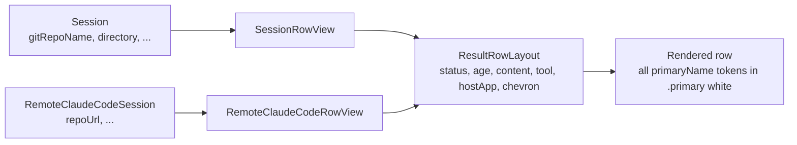

# Plan: Per-Repo Color Coding in Session List

## Working Protocol
- Use parallel subagents for independent tasks (reading, searching, implementing across files)
- Mark steps done as you complete them — a fresh agent should be able to find where to resume
- Run tests after each step before moving on (SwiftPM: 120s build timeout, 30s test timeout; `make kill-build` on hang)
- Respect the existing test style — Swift Testing (`@Suite`, `@Test`, `#expect`), not XCTest
- If blocked, document the blocker here before stopping

## Overview

Derive a stable accent color per repo from `session.gitRepoName` (local) or the short name extracted from `repoUrl` (remote), then tint three surfaces: the `primaryName` text on flat-list rows, the `primaryName` text on remote rows, and the group header in tree mode. This makes sessions from the same repo visually cluster without reordering the recency-sorted list, and closes the gap with the reference Claude Control dashboard's colored group identity.

## User Experience

### Flat list (default mode)
1. User opens seshctl. The session list renders as today — sorted by recency, with "Today/Yesterday/Older" date headers.
2. On each row, the repo name (the first monospaced token on line 1, e.g. `seshctl` or `mozi-app`) now appears in a stable accent color instead of the default white.
3. Two sessions from the same repo show the same tint. Different repos show different tints.
4. The branch (`· main`), non-standard dir label (cyan), unread pill, status dot, tool name, and host-app icon are unchanged — they remain the signals for "state" while the tinted name signals "which repo".
5. The tint survives restarts (deterministic hash) and is identical for the local row and the remote (claude.ai) row of the same repo.

### Tree view
1. User switches to tree mode. Sessions are grouped by repo as today.
2. Each `GroupHeaderView` gains a small filled circle (6–8px) before the name, filled with the same repo accent color.
3. The group name itself stays secondary-colored (it's already bold and sized-up; the dot carries the color signal so the header doesn't compete with individual row tints).
4. Rows inside each group keep the tinted `primaryName` so the color anchors both layers of the hierarchy.

### Session detail view
No change (per scope decision — only one repo is visible at a time, so the color carries no additional signal).

### Recall search results
No change (per scope decision — `RecallResult` lacks a reliable repo identifier; adding one is out of scope).

## Architecture

### Current

Session rows flow through a shared layout primitive. All color choices on a row are either status-driven (status dot, animated halo) or semantic (cyan for non-standard dir, purple for assistant role, orange for unread pill). There is no per-repo signal — identical repo names in different rows are distinguishable only by reading the text.

### Proposed

A new pure function `repoAccentColor(for: String?) -> Color?` lives in `Sources/SeshctlUI/RepoAccentColor.swift`. It hashes a non-empty repo identifier via `StableHash.djb2` (extracted from the existing private helper in `ConversationTurn.swift`) and indexes a curated 10-color dark-mode palette. Returns `nil` for `nil`/empty input so callers fall back to the current `.primary` styling.

At render time, each row view:
1. Computes its repo identifier (`session.gitRepoName` for local, `DisplayRow.repoShortName(from: session.repoUrl)` for remote).
2. Calls `repoAccentColor(for:)` — a cheap string hash, O(name length).
3. Applies the returned color via `.foregroundStyle(...)` to the `primaryName` text only.

No caching, no state — the function is deterministic and cheap enough to call on every row render. Tree-view group headers receive the same color via the same function; the group's identifier is already the repo name.

```mermaid
flowchart LR
  Session --> SRV[SessionRowView]
  Remote --> RRV[RemoteClaudeCodeRowView]
  Group[SessionGroup.name] --> GHV[GroupHeaderView]

  SRV -->|session.gitRepoName| RAC[repoAccentColor&#40;for:&#41;]
  RRV -->|DisplayRow.repoShortName&#40;repoUrl&#41;| RAC
  GHV -->|group.name| RAC

  RAC -->|StableHash.djb2| Palette[Curated 10-color palette<br/>hash % 10]
  Palette --> SRV
  Palette --> RRV
  Palette --> GHV

  SRV --> RRL[ResultRowLayout]
  RRV --> RRL
  RRL --> Row[Rendered row<br/>primaryName tinted, everything else unchanged]
  GHV --> Header[Rendered group header<br/>dot tinted, name stays secondary]
```

**Where data lives:**
- `StableHash.djb2` in `SeshctlCore` — pure function, no state.
- `repoAccentColor(for:)` in `SeshctlUI` — pure function, no state.
- Palette is a `static let` array of 10 `Color` values in `RepoAccentColor.swift`.
- No persistence, no database, no per-user overrides. A user who renames a repo gets a new color on next render; that's expected.

**Performance:** djb2 runs in O(n) where n = repo name length (typically < 30 chars). Called once per visible row per SwiftUI body invocation. Cost is negligible compared to the existing row layout work.

## Current State

- **Shared row layout:** `Sources/SeshctlUI/ResultRowLayout.swift` — takes status, age, content (ViewBuilder), tool name, host app, chevron. Used by all three row views (`SessionRowView`, `RecallResultRowView`, `RemoteClaudeCodeRowView`).
- **Local row:** `Sources/SeshctlUI/SessionRowView.swift:48` renders `Text(session.primaryName)` with `.foregroundStyle(.primary)` inside its main-content HStack. `primaryName` is defined in `Sources/SeshctlUI/Session+Display.swift:47` as `gitRepoName ?? directory-last-component`.
- **Remote row:** `Sources/SeshctlUI/RemoteClaudeCodeRowView.swift` — renders `repoShortName` via `DisplayRow.repoShortName(from: repoUrl)` (at `Sources/SeshctlUI/DisplayRow.swift:73`). Line 1 currently also white/primary.
- **Tree view:** `Sources/SeshctlUI/SessionTreeView.swift` groups by repo. `GroupHeaderView` at line 101 renders `Text(name)` in `.secondary`. No colored dot today.
- **Stable hash:** `Sources/SeshctlCore/ConversationTurn.swift:26–34` already has a private `stableHash(_:)` using djb2, labeled explicitly as stable-across-launches (Swift's `hashValue` is not). The comment documents why it exists.
- **Existing color budget on a row (must coexist):**
  - Status dot + halo: orange/blue/green/red/gray (`StatusKind.swift`, `AnimatedStatusDot.swift`)
  - Non-standard dir label: `.cyan.opacity(0.7)` (`SessionRowView.swift:58`, `SessionDetailView.swift:23`)
  - Branch: `.secondary`
  - Unread pill: `.orange.opacity(0.8)` with white text (`UnreadPill.swift`)
  - Assistant role label: `Color.assistantPurple` (`RoleColors.swift:5`)
  - Row selection bg: `Color.accentColor.opacity(0.2)` / `0.05`
- **Tests:** `Tests/SeshctlUITests/` uses Swift Testing framework (`import Testing`, `@Suite`, `@Test`, `#expect`). `SessionAgeDisplayTests.swift` is a good template for testing pure helpers.

## Proposed Changes

### Strategy

One small utility (`RepoAccentColor.swift`) and three small render-site edits. No new protocols, no new parameters on `ResultRowLayout` (the chosen accent is tinted text inside the content slot, so `ResultRowLayout` stays untouched).

1. **Extract djb2 to a shared helper.** Move the body of `ConversationTurn.stableHash` into `Sources/SeshctlCore/StableHash.swift` as `public enum StableHash { public static func djb2(_ string: String) -> UInt64 { ... } }`. Update `ConversationTurn.stableHash` to call through. This is mechanical — same input, same output.
2. **Add `RepoAccentColor.swift`.** Pure function `repoAccentColor(for name: String?) -> Color?`. Curated 10-color dark-mode palette as a file-scope `private let`. Return `nil` for nil/empty → caller uses `.primary`.
3. **Tint `primaryName` in `SessionRowView.swift:48`.** Replace `.foregroundStyle(.primary)` with `.foregroundStyle(repoAccentColor(for: session.gitRepoName) ?? .primary)`. No other changes to the row.
4. **Tint repo name in `RemoteClaudeCodeRowView.swift`.** Same pattern — use the short name already being rendered.
5. **Add colored dot to `GroupHeaderView`.** Prepend `Circle().fill(repoAccentColor(for: name) ?? .secondary).frame(width: 7, height: 7)` inside the HStack at `SessionTreeView.swift:106`.
6. **Unit tests.** Stability, determinism, palette coverage, nil/empty handling, known fixture mappings that lock in behavior.

### Why this approach (and not the alternatives)

- **Text tint over leading bar:** user selected this in clarification. Advantage: no layout changes to `ResultRowLayout`, no new visual element, survives narrow windows. Cost: subtler signal than a bar.
- **Curated 10-color palette over HSL-from-hash:** hand-picked hues guarantee readability on dark backgrounds and avoid the status/cyan/purple lanes. Collisions are acceptable — typical seshctl users have < 10 active repos in view.
- **Pure function over registry:** no persistence needed. If a user renames a repo, they get a new color — that's correct behavior. A registry adds state without benefit at the current scale.
- **`primaryName` tint only, not branch or dir:** the repo name is the stable identity; branch rotates and dir may match repo name. Tinting one element keeps the signal focused.

### Complexity Assessment

**Low.** 2 new files (`StableHash.swift`, `RepoAccentColor.swift`, plus a test file), 4 modified files (`ConversationTurn.swift`, `SessionRowView.swift`, `RemoteClaudeCodeRowView.swift`, `SessionTreeView.swift`). No new patterns — extending existing color/hash conventions. Regression risk is near-zero: the tint is additive (caller falls back to `.primary` when hash/name unavailable) and the djb2 extraction preserves behavior byte-for-byte. Trickiest bit is picking 10 palette colors that both read well on dark backgrounds and stay out of the status/cyan/purple lanes — covered by a manual acceptance check.

## Impact Analysis

- **New Files:**
  - `Sources/SeshctlCore/StableHash.swift` — public djb2 helper
  - `Sources/SeshctlUI/RepoAccentColor.swift` — palette + lookup function
  - `Tests/SeshctlUITests/RepoAccentColorTests.swift`
- **Modified Files:**
  - `Sources/SeshctlCore/ConversationTurn.swift` — delegate `stableHash` to `StableHash.djb2`
  - `Sources/SeshctlUI/SessionRowView.swift:48` — tint `primaryName`
  - `Sources/SeshctlUI/RemoteClaudeCodeRowView.swift` — tint repo short name on line 1
  - `Sources/SeshctlUI/SessionTreeView.swift:101–119` — add colored dot to `GroupHeaderView`
- **Dependencies:** None new. No CryptoKit needed (djb2 is hand-rolled, already in the codebase).
- **What this relies on:** `Session.gitRepoName` populated by existing git-context code (`Sources/SeshctlCore/GitContext*`). `RemoteClaudeCodeSession.repoUrl` populated by the claude.ai sync path. Both are stable inputs today.
- **What relies on this:** Nothing downstream. This is purely visual.
- **Similar modules to avoid duplicating:**
  - The private `stableHash(_:)` in `ConversationTurn.swift:26` — reuse by extraction, don't re-implement.
  - `DisplayRow.repoShortName(from:)` in `DisplayRow.swift:73` — reuse for remote rows.
  - `RoleColors.swift` — follow its `extension Color { static let ... }` pattern for the palette.

## Key Decisions

- **Accent surface: tinted repo-name text** (user choice over leading bar / separate dot). No change to `ResultRowLayout`; tint lives inside the content slot.
- **Scope: flat list + remote rows + tree-view group headers.** `SessionDetailView` excluded — only one repo visible at a time. `RecallResultRowView` excluded — `RecallResult` lacks a repo identifier.
- **Palette: curated 10 colors**, dark-mode readable, outside the status/cyan/purple lanes. Saturation ~0.45–0.6, brightness ~0.78–0.88.
- **Hash key:** `gitRepoName` for local, `DisplayRow.repoShortName(from: repoUrl)` for remote. Both the same repo → same color across local and cloud rows.
- **djb2 extraction** into `SeshctlCore.StableHash` — one canonical stable-hash helper in the codebase, reused by `ConversationTurn` and `RepoAccentColor`.
- **Fallback:** `nil`/empty repo name → `.primary` (current white). No warning, no special color.

## Implementation Steps

### Step 1: Extract `StableHash` helper
- [x] Create `Sources/SeshctlCore/StableHash.swift` with `public enum StableHash { public static func djb2(_ string: String) -> UInt64 }` — move body from `ConversationTurn.stableHash`
- [x] Update `Sources/SeshctlCore/ConversationTurn.swift:26` — replace private `stableHash` body with `StableHash.djb2(string)` call-through (or delete the private helper and update callsites to use `StableHash.djb2` directly, whichever is cleaner)
- [x] Run tests: `swift test` (30s timeout) — all existing `ConversationTurn` tests must still pass byte-identical

### Step 2: Define palette and accent function
- [x] Create `Sources/SeshctlUI/RepoAccentColor.swift`
- [x] Define `private let repoAccentPalette: [Color]` — 10 hand-picked hex colors covering warm/cool/neutral zones outside status (orange/blue/green/red), cyan, and purple. Suggested zones: soft peach, dusty rose, warm amber, sage, slate-teal, periwinkle (outside assistantPurple), mauve, terracotta, muted gold, cool mint
- [x] Define `func repoAccentColor(for name: String?) -> Color?` — returns `nil` for `nil`/empty, else `palette[Int(StableHash.djb2(name) % UInt64(palette.count))]`
- [x] File header comment explaining why we avoid status/cyan/purple hues (link back to README or existing color conventions)

### Step 3: Apply tint in `SessionRowView`
- [x] Edit `Sources/SeshctlUI/SessionRowView.swift:48` — change `.foregroundStyle(.primary)` on the `primaryName` Text to `.foregroundStyle(repoAccentColor(for: session.gitRepoName) ?? .primary)`
- [x] Verify the rest of line 1 (branch, dir label, unread pill) is unchanged

### Step 4: Apply tint in `RemoteClaudeCodeRowView`
- [x] Locate the `repoShortName` Text on line 1 in `Sources/SeshctlUI/RemoteClaudeCodeRowView.swift`
- [x] Apply the same tint, preserving the existing `isStale` dimming. Used `AnyShapeStyle` to unify the ternary branches since `.tertiary` (`HierarchicalShapeStyle`) and `Color` don't unify: `.foregroundStyle(isStale ? AnyShapeStyle(HierarchicalShapeStyle.tertiary) : AnyShapeStyle(repoAccentColor(for: repo) ?? .primary))`
- [x] Confirm the short-name extraction matches the key used by local rows for the same repo (so `seshctl` local and `seshctl` remote pick the same palette index) — uses `DisplayRow.repoShortName(from: session.repoUrl)` which returns the same short name the local `gitRepoName` field holds

### Step 5: Add colored dot to `GroupHeaderView`
- [x] Edit `Sources/SeshctlUI/SessionTreeView.swift:101–119` — prepend a `Circle().fill(repoAccentColor(for: name) ?? .secondary).frame(width: 7, height: 7)` inside the `HStack(spacing: 6)`, before the name `Text`
- [x] Keep the name `Text` in `.secondary` — the dot carries the color signal; tinting both competes with row-level tints

### Step 6: Write tests
- [x] Create `Tests/SeshctlUITests/RepoAccentColorTests.swift` using Swift Testing style (`import Testing`, `@Suite`, `@Test`, `#expect`)
- [x] Test: `repoAccentColor(for: nil)` returns `nil`
- [x] Test: `repoAccentColor(for: "")` returns `nil`
- [x] Test: `repoAccentColor(for: "seshctl")` equals `repoAccentColor(for: "seshctl")` (determinism)
- [x] Test: fixture mapping — `StableHash.djb2("")` == 5381 (initial seed) and `djb2("a")` == 177670 lock in the exact algorithm across refactors
- [x] Test: different inputs produce distinct hashes for common repo names (`seshctl`, `mozi-app`, `dashboard`, `infra`, `api`) — no bucket-collapse
- [x] Test: palette has exactly 10 colors (guards against accidental palette shrink)
- [x] Created `Tests/SeshctlCoreTests/StableHashTests.swift` — covers djb2 independently of `ConversationTurn`

### Step 7: Coverage and manual verification
- [x] Run `swift test --enable-code-coverage` (30s timeout); extract coverage for `RepoAccentColor.swift` and `StableHash.swift` and confirm ≥ 60% — both at **100%**
- [ ] `make install` and visually verify: 3+ repos in flat list show distinct tints; same repo across multiple rows shows the same tint; tree-view group headers show matching dots; local + remote row for the same repo share a color

## Acceptance Criteria

- [ ] [test] `repoAccentColor(for:)` returns `nil` for nil and empty string
- [ ] [test] `repoAccentColor(for:)` is deterministic — same input → same output across invocations
- [ ] [test] `StableHash.djb2("seshctl")` returns a locked-in literal value (guards refactor drift)
- [ ] [test] Palette contains exactly 10 colors
- [ ] [test] All existing `ConversationTurn` tests still pass after djb2 extraction
- [ ] [test-manual] In flat list, repo names are tinted and same-repo rows share a color
- [ ] [test-manual] In tree view, group headers show a colored dot matching their rows' tint
- [ ] [test-manual] A local session and a remote (claude.ai) session for the same repo show the same color
- [ ] [test-manual] No palette color is confusable with a status dot color (orange/blue/green/red) or the cyan dir label or the assistant purple
- [ ] [test-manual] On a narrow window, tinted repo names remain readable (not washed out)

## Edge Cases

- **No `gitRepoName` (non-git directory):** `primaryName` falls back to directory's last path component (`Session+Display.swift:47`). We call `repoAccentColor(for: session.gitRepoName)` explicitly, which returns `nil` — the row renders in `.primary` white. Acceptable: the row's repo identity is ambiguous, so tinting it would be misleading.
- **Same repo name, different absolute paths** (e.g., two worktrees of `seshctl`): both hash to the same color — desired behavior, since they're the same repo.
- **Different repos with name collision** (unlikely, but e.g., two `utils` repos): both hash to the same color. Acceptable within the 10-color palette scope.
- **Remote session where `repoUrl` is a URL but `repoShortName` extraction returns nil/empty:** fall through to `.primary`.
- **Tree-view group named `"Ungrouped"` or similar sentinel:** hashes like any string. Users won't see this unless there's a session with no repo context, in which case a tint is harmless.
- **Dark mode vs light mode:** the app is currently dark-mode-oriented. If light mode support lands later, palette may need a light-mode variant. Not in scope for this plan.
