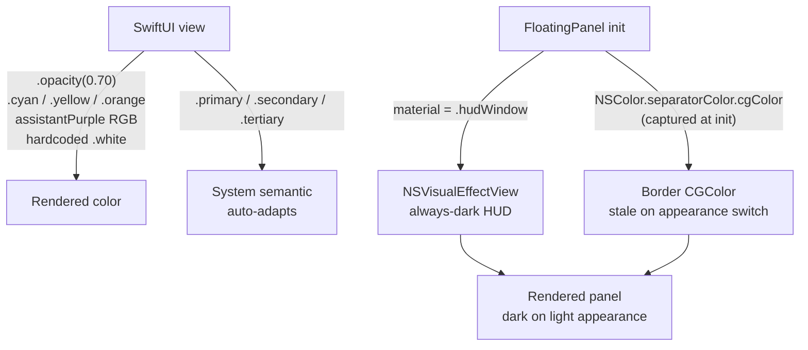

# Plan: Light-Mode Color System (Spotlight-style, adaptive both modes)

## Context

Seshctl has been developed exclusively in dark mode. Light mode is visibly broken — the panel renders as a muddy gray HUD (wrong material), selection and hover overlays almost vanish, subtitle text is too light against the panel, and several hardcoded colors (`.cyan.opacity(0.7)`, `.yellow.opacity(0.25)`, `.orange.opacity(0.6)`, `.white`, `assistantPurple` fixed RGB, the `NSColor.separatorColor` CGColor captured at panel init) don't adapt. The FloatingPanel also captures its border `CGColor` at init and never re-resolves on appearance change.

Target: mimic Spotlight in both modes — dark HUD glass with lighter-than-base overlays for elevation; light frosted glass with white tint bleach and darker-than-base overlays. Accent blue is kept for the selection tint (Spotlight also uses accent blue when the selection is focused). Subtitles on light mode get custom, darker tiers (system `.secondary`/`.tertiary` are too faint on a white surface).

This plan assumes the branch is rebased onto `main`. PR #23 ("Per-repo color coding in session list") merged to main on 2026-04-23 (commit `753586e`) — #23 removed the user/assistant role color usages in `SessionRowView` and `RecallResultRowView` and introduced a per-repo accent palette, but explicitly deferred a light-mode palette variant. We pick up that debt here.

## Working Protocol

- Rebase `julo/light-mode-colors` onto `origin/main` as Step 1 (PR #23 is already merged to main). All later steps reference real post-#23 file contents.
- SwiftPM: **120 s** build timeout, **30 s** test timeout. If a build/test hangs, run `make kill-build` before retrying.
- Run tests via subagents (per `AGENTS.md`).
- Use Swift Testing framework (`@Suite`, `@Test`, `#expect`) — not XCTest.
- Mark each implementation checkbox as soon as its step passes tests. A fresh agent should be able to find where to resume.
- Verify light and dark mode visually after every UI-site migration by toggling system appearance (System Settings → Appearance). `make install` rebuilds the app.
- If blocked, append a blocker note at the end of this document before stopping.

## Overview

Introduce a small semantic color token layer (`Theme.swift`) in `SeshctlUI` whose tokens resolve to dark- or light-mode values via `NSColor(name:dynamicProvider:)` — so every usage adapts automatically on appearance change. Switch `FloatingPanel`'s `NSVisualEffectView.material` from `.hudWindow` (always dark) to `.popover` (adaptive) and overlay a white tint (`Color.white.opacity(0.40)`) in light mode only so the panel reads as Spotlight-style frosted white. Re-evaluate the panel's hairline border `CGColor` on `viewDidChangeEffectiveAppearance`. Add a light-mode variant to the per-repo accent palette introduced by PR #23. Migrate every hardcoded opacity/cyan/yellow/white/assistantPurple site to the new tokens.

## User Experience

Appearance switch (System Settings → Appearance → Light/Dark/Auto) produces the following behavior. The panel is the same Spotlight-style `FloatingPanel` in both modes.

### Dark mode (target: visually ~unchanged vs today)
1. User invokes the floating panel (hotkey).
2. Dark frosted HUD glass appears (`.popover` material, no white overlay). Hairline border is white @ 0.15 alpha.
3. Selected row: accent-blue fill @ 0.20. Per-repo accent bar: current dark-tuned 10-color palette.
4. Primary/secondary/tertiary text sit on system semantic colors — legible as today.
5. Search highlights: orange @ 0.60 (current match), yellow @ 0.25 (other matches).
6. Assistant role label ("Claude" in detail view): current `#937CBF` purple.

### Light mode (target: Spotlight-style whitened frosted glass)
1. User invokes the floating panel on a light system appearance.
2. Light frosted glass appears (`.popover` material) with a white @ 0.40 alpha overlay bleaching the blur toward pure white — still frosted, not opaque. Hairline border is black @ 0.12.
3. Selected row: accent-blue fill @ 0.20 (same alpha — `accentColor` is semantic and stays readable on white).
4. Primary text is near-black (system). **Secondary text is black @ 0.78, tertiary is black @ 0.58** — overriding system `.secondary`/`.tertiary`, which are too faint on the whitened panel.
5. Search highlights: orange @ 0.45 (current match, tuned down so it doesn't burn on white), yellow @ 0.50 (bumped up — yellow @ 0.25 is invisible on white).
6. Assistant role label: denser purple (`#6B53A0`) so the character silhouette reads on white; the current `#937CBF` muddies into the whitened panel.
7. Per-repo accent bar: light-mode palette variant — each of the 10 hues darkened/desaturated so they read on white without vibrating.
8. Non-standard directory label and all other cyan-tinted labels: adaptive cyan token (darker/denser on light).

### Independent touches
- **Unread pill** (orange @ 0.8 fill, white text): keep as-is. Orange @ 0.8 reads on both modes; the "white text on saturated fill" pattern is standard.
- **Filter-active badge** (`accentColor @ 0.8` fill, white text): keep as-is. `accentColor` is adaptive; white-on-accent reads on both modes.
- **Sign-in banner** (tint @ 0.12 background): keep tint, but token bumps the alpha to 0.18 on light so faint banners don't vanish.
- **Search bar background** (`accentColor @ 0.06`): keep accent, but the token resolves to 0.06 dark / 0.10 light so the input chip stays visible on white.

## Architecture

### Current

Every color decision is inlined at the call site. System semantic text colors (`.primary`, `.secondary`, `.tertiary`) adapt automatically, but custom opacity layers and hardcoded hex/RGB values do not. The floating panel uses `.hudWindow`, a material that is always-dark (does not flip on appearance). The panel's `borderColor` is a `CGColor` captured at init from `NSColor.separatorColor.withAlphaComponent(0.15)` — if the user switches appearance while the panel is open, the color is stale.



### Proposed

All color sites consume a semantic token from `Theme` (new file, `Sources/SeshctlUI/Theme.swift`). Each token is an adaptive `Color` backed by `NSColor(name:dynamicProvider:)` — `Color` asks the current `NSAppearance` for the correct value at render time, so tokens flip automatically when the system appearance changes. Panel material becomes `.popover` (adaptive); a second layer (SwiftUI `Color.white.opacity(0.40)` overlay, or an `NSView` with dynamic background) bleaches the material toward white in light mode only. The panel's hairline re-resolves its `CGColor` on `viewDidChangeEffectiveAppearance`.

```mermaid
flowchart TD
  A[SwiftUI view] -->|"Theme.textSecondary<br/>Theme.searchHighlightCurrent<br/>Theme.roleAssistant<br/>Theme.hudBorder<br/>..."| T[Theme tokens]
  T -->|"Color(nsColor: NSColor(name:dynamicProvider:))"| NS[NSColor dynamic provider]
  NS -->|"appearance.isDarkMode ? dark : light"| R[Rendered color<br/>adapts live]
  P[FloatingPanel init] -->|material = .popover| V[NSVisualEffectView<br/>adaptive]
  P -->|add overlay view| O["LightWhiteTintView<br/>(NSView + dynamic bg)"]
  P -->|viewDidChangeEffectiveAppearance| U[updateColors&#40;&#41;<br/>re-resolve border CGColor]
  V --> R2[Rendered panel]
  O --> R2
  U --> R2
```



**Runtime walkthrough (light-mode first render):**
1. `FloatingPanel.init` configures `NSVisualEffectView(material: .popover, blendingMode: .behindWindow, state: .active)`.
2. A `LightWhiteTintView` (plain `NSView`, layer-backed) is added above the effect view. Its `layer.backgroundColor` is set from a dynamic `CGColor` derived from `NSColor(name: ...) { $0.isDarkMode ? .clear : .white.alpha(0.40) }`.
3. `NSHostingView(rootView:)` is added above the tint view. SwiftUI content renders on top.
4. Every SwiftUI view reads `Theme.*` tokens. At render, SwiftUI evaluates each `Color`'s underlying `NSColor` against the current `NSAppearance`, returning the light-mode variant.
5. User switches system appearance → `viewDidChangeEffectiveAppearance` fires → the panel's `updateColors()` re-evaluates the border `CGColor` and nudges the tint view to re-resolve. SwiftUI content re-renders automatically because `NSColor(name:dynamicProvider:)` is appearance-reactive.

**Where values live:**
- `Theme.swift` (new, `Sources/SeshctlUI/`) — single source of truth for all semantic tokens. Pure stateless file, ~80 lines.
- `NSAppearance+IsDark.swift` (new, `Sources/SeshctlUI/`) — small extension `var isDarkMode: Bool` computed via `bestMatch(from: [.darkAqua, .vibrantDark, .accessibilityHighContrastDarkAqua, .accessibilityHighContrastVibrantDark])`. Used inside every dynamic provider.
- `RepoAccentColor.swift` (modified, from PR #23) — palette becomes adaptive: each slot is a `Color(nsColor: NSColor(name:dynamicProvider:))` with a dark and light hex pair.
- `FloatingPanel.swift` (modified) — material change, tint overlay view, `viewDidChangeEffectiveAppearance` hook.

**Performance:** `NSColor(name:dynamicProvider:)` is the Apple-recommended pattern; the provider closure is cheap (just a conditional + alpha value), called once per appearance resolution and cached per appearance instance. No per-frame cost. No state, no caches of our own.

## Current State

*(Described against `main` post-PR-#23 merge — Step 1 rebases onto `origin/main`.)*

- **`Sources/SeshctlApp/FloatingPanel.swift`** — panel chrome: `material = .hudWindow`, `blendingMode = .behindWindow`, `borderColor = NSColor.separatorColor.withAlphaComponent(0.15).cgColor` captured at init. Chrome constants: `cornerRadius: 20`, `borderWidth: 1`, `borderAlpha: 0.15`. Panel is transient (dismisses on resign key) so appearance drift is narrow, but not zero.
- **`Sources/SeshctlUI/RoleColors.swift`** — single hardcoded `Color.assistantPurple = Color(red: 0x93/255, green: 0x7C/255, blue: 0xBF/255)`. Still referenced by `TurnView.swift:79` (Claude header in detail). PR #23 removed the other two call sites (`SessionRowView` preview, `RecallResultRowView` role tag).
- **`Sources/SeshctlUI/RepoAccentColor.swift`** (added by PR #23) — 10-color `private let repoAccentPalette: [Color]` hand-tuned for dark mode only. Each entry is `Color(red:, green:, blue:)`. PR #23's plan notes: *"palette may need a light-mode variant — not in scope"*.
- **Stray hardcoded opacity / non-adaptive color sites** (full list in `Impact Analysis`):
  - `.cyan.opacity(0.7)` dir label fallbacks (`SessionRowView`, `SessionDetailView`)
  - `.yellow.opacity(0.25)`, `.orange.opacity(0.6)` search highlights (`TurnView`)
  - `Color.white` text in `UnreadPill`
  - `Color.accentColor.opacity(0.06)` search bar bg (`SearchBar`)
  - `tint.opacity(0.12)` sign-in banner bg (`SignInBanner`)
  - `Color.secondary.opacity(0.7)` message preview (`SessionRowView`, `RecallResultRowView`) — 4 sites (PR #23 introduced 2 of these)
  - `Color.primary.opacity(0.85)` assistant body text (`TurnView`)
  - `.gray.opacity(0.5)` stale status (`StatusKind`)
  - Pulsing halo opacities: 0.4, 0.25, 0.8, 0.3 (`AnimatedStatusDot`)
- **No `@Environment(\.colorScheme)` usage anywhere** — no code currently branches on light/dark.
- **No `.xcassets` / color sets** — all colors in code.
- **Tests**: `Tests/SeshctlUITests/FloatingPanelTests.swift` (5 tests, covers translucent chrome setup). `Tests/SeshctlUITests/RepoAccentColorTests.swift` (from PR #23, covers palette determinism and nil handling).

## Proposed Changes

### Strategy

One new file (`Theme.swift`) defines every semantic token. One small appearance helper (`NSAppearance+IsDark.swift`). The post-#23 `RepoAccentColor.swift` palette becomes adaptive. `FloatingPanel.swift` switches material, adds a white tint overlay, and reacts to appearance changes. Every color call site in `Sources/SeshctlUI/` migrates to a token. No Color assets, no asset catalog — keep it all in code to match seshctl's existing conventions.

**Why `NSColor(name:dynamicProvider:)` over `@Environment(\.colorScheme)` branching:** one write, appearance-aware everywhere. SwiftUI re-evaluates `Color` values against the current `NSAppearance` automatically; no per-view `@Environment` reads, no `if colorScheme == .light { ... }` noise. Tokens are definition-site conditional, call-site agnostic.

**Why `.popover` over `.menu` / `.fullScreenUI`:** `.popover` is the adaptive analog of `.hudWindow` (both intended as floating surfaces). On Sequoia, `.popover` gives a close visual match to Spotlight on light mode. `.menu` is denser (less translucent) and `.fullScreenUI` is very transparent — neither matches the reference screenshots as well.

**Why bleach with a white overlay in light mode:** `.popover` alone gives a frosted gray-tinted surface that picks up the desktop. The user specified *"on light mode, the background is light but it needs to be whiter"* — a 0.40 alpha white layer drags the apparent surface color toward pure white while keeping a hint of blur (Spotlight-style). Dark mode skips the overlay entirely.

**Why keep accent tint on selection:** corrected mid-clarification — Spotlight's selection *is* accent blue (gray in the reference screenshot was the unfocused state). `Color.accentColor.opacity(0.20)` reads as blue on both the dark HUD and the whitened light panel; no alpha adaptation needed.

**Why custom secondary/tertiary on light only:** system `.secondary` is ~50% black in light mode, compounded by existing `.opacity(0.7)` sites it becomes ~35% black on a now-nearly-white panel — unreadable. Custom values (black @ 0.78 / 0.58) match the contrast of Spotlight's own subtitle text on white. Dark mode system values are fine — leave them.

**Why a light-mode palette for per-repo accent bars:** the current palette's dark-tuned saturations (e.g. `Color(red: 0.93, green: 0.66, blue: 0.49)` peach) wash out on white. Each slot gets a denser/darker sibling so the 2pt bars are still readable. Palette order must match so a given repo name maps to the same index in both modes — the color shifts, the identity doesn't.

### Complexity Assessment

**Medium.** ~4 new files, ~14 modified files, ~100 color sites migrated. No new frameworks, no runtime state machines. The one tricky bit is `FloatingPanel` appearance reactivity — capturing `CGColor` at init vs re-resolving on `viewDidChangeEffectiveAppearance`, plus the white tint overlay view insertion (must sit between the `NSVisualEffectView` and the `NSHostingView`, with correct autoresizing mask). Regression risk is contained because each token migration is one-line and tokens map 1:1 to prior values in dark mode (dark mode is the "reference"; we're adding a light path). Existing `FloatingPanelTests` will need one or two updates for the new overlay view and the border-color-on-appearance-change logic.

## Impact Analysis

### New Files
- `Sources/SeshctlUI/Theme.swift` — semantic color tokens (dark + light variants for every non-adaptive color).
- `Sources/SeshctlUI/NSAppearance+IsDark.swift` — `var isDarkMode: Bool` helper used inside every dynamic provider.
- `Tests/SeshctlUITests/ThemeTests.swift` — unit tests verifying each token resolves distinct values in `NSAppearance.darkAqua` vs `NSAppearance.aqua`.
- `Tests/SeshctlUITests/NSAppearanceIsDarkTests.swift` — unit tests for the appearance helper (all 4 dark variants return `true`; aqua / vibrantLight return `false`).

### Modified Files
- `Sources/SeshctlApp/FloatingPanel.swift` — material change, white tint overlay view, `viewDidChangeEffectiveAppearance` override, `updateColors()` helper.
- `Sources/SeshctlUI/RepoAccentColor.swift` — palette entries become adaptive `Color`s (dark + light hex pair each).
- `Sources/SeshctlUI/RoleColors.swift` — `assistantPurple` becomes adaptive (`#937CBF` dark / `#6B53A0` light). Kept because `TurnView` still uses it.
- `Sources/SeshctlUI/StatusKind.swift` — `.stale` `.gray.opacity(0.5)` → `Theme.statusStale`.
- `Sources/SeshctlUI/AnimatedStatusDot.swift` — halo opacities unchanged in dark, tuned via `Theme.pulseHaloAlpha(appearance:)` if needed (verify on light first; status dots are already saturated primaries, halos may read fine).
- `Sources/SeshctlUI/SessionListView.swift` — filter-active badge `accentColor.opacity(0.8)` → `Theme.badgeBackgroundAccent`; selection `accentColor.opacity(0.2)` → `Theme.selectionTint`.
- `Sources/SeshctlUI/SessionTreeView.swift` — same selection-tint migration.
- `Sources/SeshctlUI/SessionRowView.swift` — `.secondary.opacity(0.7)` preview → `Theme.textSecondary` (PR #23 introduced two of these); cyan-dir-label fallback path → `Theme.directoryLabel`.
- `Sources/SeshctlUI/RemoteClaudeCodeRowView.swift` — `.secondary.opacity(0.7)` → `Theme.textSecondary`.
- `Sources/SeshctlUI/RecallResultRowView.swift` — `.primary.opacity(0.8)` body text → `Theme.textPrimaryDimmed`; role-tag `.primary.opacity(0.8)` (PR #23) → same token.
- `Sources/SeshctlUI/ResultRowLayout.swift` — tertiary chevron stays on system tertiary; no change unless we discover a light-mode contrast issue.
- `Sources/SeshctlUI/SessionDetailView.swift` — dir label cyan fallback → `Theme.directoryLabel`.
- `Sources/SeshctlUI/TurnView.swift` — search highlights (`orange.opacity(0.6)` current, `yellow.opacity(0.25)` other) → `Theme.searchHighlightCurrent` / `Theme.searchHighlightOther`; user/assistant body colors; `assistantPurple` reference continues via the adaptive token; `primary.opacity(0.85)` assistant body → `Theme.textPrimary` (drop the 0.85 — it made assistant body dimmer than user body on dark; we don't want that on light).
- `Sources/SeshctlUI/SearchBar.swift` — `accentColor.opacity(0.06)` → `Theme.searchBarBackground`; cursor `accentColor` stays (it's already adaptive).
- `Sources/SeshctlUI/UnreadPill.swift` — `.white` text → `Theme.pillForeground` (white in both modes since pill fill is saturated orange); `orange.opacity(0.8)` fill → `Theme.pillBackgroundUnread`.
- `Sources/SeshctlUI/SignInBanner.swift` — `tint.opacity(0.12)` → `Theme.bannerBackground(tint:)` which returns 0.12 dark / 0.18 light.
- `Tests/SeshctlUITests/FloatingPanelTests.swift` — one additional assertion for overlay view presence; one assertion that `borderColor` updates on `viewDidChangeEffectiveAppearance`.

### Dependencies
- **What this relies on:** `NSColor(name:dynamicProvider:)` — available macOS 10.15+, already a project requirement. `NSView.viewDidChangeEffectiveAppearance` — available macOS 10.14+. No new frameworks.
- **What relies on this:** every SwiftUI view in `SeshctlUI` that renders color post-migration. Zero external consumers — `Theme` is internal.

### Similar Modules
- **`RoleColors.swift`** — existing `extension Color { static let ... }` pattern. `Theme.swift` follows the same shape but with adaptive backing. We could merge `RoleColors` into `Theme`, but keeping it separate makes the role-specific tokens discoverable in one place.
- **`RepoAccentColor.swift`** (PR #23) — already uses a palette-table pattern; we extend its entries to be adaptive rather than replacing the structure.

## Key Decisions

- **Token layer, not asset catalog.** Single `Theme.swift` file for all semantic tokens, backed by `NSColor(name:dynamicProvider:)`. Rationale: seshctl has no existing asset catalog; adding one is a structural change. Code-defined tokens are greppable, reviewable, and PR-diffable.
- **`.popover` + white-overlay bleach in light mode only.** Picked by the user in clarification (option 2 of 3). Preserves a hint of frosted glass while reading as near-white. Dark-mode behavior unchanged.
- **Selection stays accent-blue (Color.accentColor @ 0.20 both modes).** Per user correction — Spotlight's selection is accent too. `accentColor` is semantic/adaptive so no per-mode alpha tuning needed.
- **Custom subtitle contrast in light mode only.** `Theme.textSecondary` → black @ 0.78 light / system `.secondary` dark. `Theme.textTertiary` → black @ 0.58 light / system `.tertiary` dark.
- **Every existing `.opacity(0.x)` on a system semantic color is deleted.** The pattern `Color.secondary.opacity(0.7)` produces ~35% black on light — unacceptable. Replaced by explicit tokens (e.g. `Theme.textSecondaryDimmed` resolves to a deliberately chosen value per appearance, not a multiplicative `.opacity`).
- **`assistantPurple` stays, becomes adaptive.** `TurnView` still uses it. Light-mode variant `#6B53A0` (~20% darker/denser than `#937CBF`) reads on white.
- **Per-repo accent palette becomes adaptive.** Same 10 slots, same indexing, but each slot has a dark + light pair. Palette entries documented inline with both hexes.
- **FloatingPanel border re-resolves on appearance change.** `override func viewDidChangeEffectiveAppearance()` + an `updateColors()` helper fixes the stale-CGColor bug. Covered by a new `FloatingPanelTests` assertion.
- **Scope: all migrations in one PR.** Per user choice. Single PR leaves codebase fully consistent.

## Implementation Steps

### Step 1: Rebase onto `main` (PR #23 merged at `753586e`)
- [x] From `/Users/julianlo/Documents/me/seshctl/.claude/worktrees/julo+light-mode-colors`: `git fetch origin && git rebase origin/main`.
- [x] Our branch has no commits yet, so this is effectively a fast-forward — no conflicts expected.
- [x] Run `swift build` (120 s timeout) and `swift test` (30 s timeout) via subagent to confirm the rebased state is green before proceeding. *(Build green; 490 tests / 42 suites pass.)*

### Step 2: Add the appearance helper
- [x] Create `Sources/SeshctlUI/NSAppearance+IsDark.swift` with:
  ```swift
  extension NSAppearance {
      var isDarkMode: Bool {
          bestMatch(from: [.darkAqua, .vibrantDark,
                           .accessibilityHighContrastDarkAqua,
                           .accessibilityHighContrastVibrantDark]) != nil
      }
  }
  ```

### Step 3: Create `Theme.swift` with all tokens
- [x] Create `Sources/SeshctlUI/Theme.swift`. Scaffold:
  - `enum Theme` namespace, all tokens as `static let` (or `static func` where a tint parameter is needed).
  - Every token backed by `Color(nsColor: NSColor(name: "seshctl.<tokenName>") { appearance in ... })`.
- [x] Tokens to define (token → dark value → light value):
  - `textPrimary` → `NSColor.labelColor` → `NSColor.labelColor` (system handles both; keep token for semantic consistency)
  - `textSecondary` → `NSColor.secondaryLabelColor` → `NSColor.black.withAlphaComponent(0.78)`
  - `textTertiary` → `NSColor.tertiaryLabelColor` → `NSColor.black.withAlphaComponent(0.58)`
  - `textPrimaryDimmed` → `NSColor.labelColor.withAlphaComponent(0.85)` → `NSColor.black.withAlphaComponent(0.80)`
  - `selectionTint` → `NSColor.controlAccentColor.withAlphaComponent(0.20)` → same (accentColor is adaptive)
  - `hoverTint` → `NSColor.white.withAlphaComponent(0.06)` → `NSColor.black.withAlphaComponent(0.06)` *(not used today; reserved for future hover state)*
  - `hudBorder` → `NSColor.white.withAlphaComponent(0.15)` → `NSColor.black.withAlphaComponent(0.12)`
  - `panelLightTintOverlay` → `NSColor.clear` → `NSColor.white.withAlphaComponent(0.40)`
  - `directoryLabel` → `NSColor.systemCyan.withAlphaComponent(0.70)` → `NSColor.systemCyan.shadow(withLevel: 0.35) ?? NSColor.systemCyan` at full alpha *(verify the shadow-level helper resolves to a darker cyan; alternatively hand-pick `NSColor(red:0.00,green:0.45,blue:0.60,alpha:1.0)` to avoid relying on `shadow(withLevel:)` quirks)*
  - `searchHighlightCurrent` → `NSColor.systemOrange.withAlphaComponent(0.60)` → `NSColor.systemOrange.withAlphaComponent(0.45)`
  - `searchHighlightOther` → `NSColor.systemYellow.withAlphaComponent(0.25)` → `NSColor.systemYellow.withAlphaComponent(0.50)`
  - `searchBarBackground` → `NSColor.controlAccentColor.withAlphaComponent(0.06)` → `NSColor.controlAccentColor.withAlphaComponent(0.10)`
  - `pillBackgroundUnread` → `NSColor.systemOrange.withAlphaComponent(0.80)` → same
  - `pillForeground` → `NSColor.white` → `NSColor.white` (pill fill is saturated, white reads on both)
  - `badgeBackgroundAccent` → `NSColor.controlAccentColor.withAlphaComponent(0.80)` → same
  - `statusStale` → `NSColor.gray.withAlphaComponent(0.50)` → `NSColor.black.withAlphaComponent(0.35)` *(gray @ 0.5 vanishes on white)*
  - `bannerBackground(tint: Color)` → tint-derived at 0.12 dark / 0.18 light *(implemented as a `static func` that takes a tint `Color`, downcasts to `NSColor` via `NSColor(tint)`, and returns an adaptive `Color`)*
- [x] File header comment: ~10 lines explaining the token pattern, how to add a new token (dark + light value + naming convention), and the one-invariant rule: *"Never apply `.opacity()` to a `Theme.*` token at a call site — bake the alpha into the token."*

### Step 4: Migrate `RoleColors.swift`
- [x] Rewrite `Color.assistantPurple` as adaptive:
  ```swift
  static let assistantPurple = Color(nsColor: NSColor(name: "seshctl.assistantPurple") { appearance in
      appearance.isDarkMode
          ? NSColor(red: 0x93/255.0, green: 0x7C/255.0, blue: 0xBF/255.0, alpha: 1.0)
          : NSColor(red: 0x6B/255.0, green: 0x53/255.0, blue: 0xA0/255.0, alpha: 1.0)
  })
  ```
- [x] No call-site changes — existing `Color.assistantPurple` consumers in `TurnView.swift:79` pick up the adaptive value automatically.

### Step 5: Migrate `RepoAccentColor.swift` palette to adaptive
- [x] Replace the 10-entry `repoAccentPalette` with a 10-entry `[Color]` where each slot is `Color(nsColor: NSColor(name:dynamicProvider:))` returning the current dark hex and a new darker/desaturated light hex. Hand-pick light values so brightness ~0.35–0.55 — they read on white without vibrating. Document each slot with both hexes inline.
- [x] Verify `repoAccentColor(for:)` call sites unchanged — indexing logic is identical.
- [x] Update `Tests/SeshctlUITests/RepoAccentColorTests.swift`:
  - Kept existing determinism / nil-handling / palette-count / distribution tests.
  - Added `adaptivePalette` test: every slot resolves to distinct RGB under `.darkAqua` vs `.aqua` via `performAsCurrentDrawingAppearance`.

### Step 6: Migrate `FloatingPanel.swift`
- [x] Change `effect.material = .hudWindow` → `effect.material = .popover`.
- [x] Insert a `LightWhiteTintView` (plain `NSView`) between the `NSVisualEffectView` and the `NSHostingView`. Layer-backed, overrides `updateLayer()` to pull `Theme.panelLightTintOverlayNSColor.cgColor` (resolves per-appearance because `NSAppearance.current` is set inside `updateLayer()`).
- [x] Subclass `NSVisualEffectView` as `PanelBackgroundView` inside `FloatingPanel.swift`. Override `updateLayer()` to set `layer?.borderColor = Theme.hudBorderNSColor.cgColor`, and override `viewDidChangeEffectiveAppearance()` to mark `needsDisplay = true` so the CGColor re-resolves on every appearance flip.
- [x] Removed `borderAlpha` constant — the alpha now lives inside `Theme.hudBorderNSColor`'s dynamic provider.
- [x] Verified: the traffic-light-hidden, `nonactivatingPanel`, `titled`, `fullSizeContentView` style-mask, corner radius (20), shadow, and key-down / dismiss behavior are all preserved untouched.
- [x] Promoted `Theme` and all tokens to `public` (required since `FloatingPanel` in `SeshctlApp` imports `SeshctlUI`).

### Step 7: Migrate UI call sites
- [x] `Sources/SeshctlUI/StatusKind.swift`: `.stale` color → `Theme.statusStale`.
- [x] `Sources/SeshctlUI/SessionListView.swift`: selection `accentColor.opacity(0.2)` → `Theme.selectionTint`; filter-badge `accentColor.opacity(0.8)` → `Theme.badgeBackgroundAccent`; filter-badge text `.white` → `Theme.pillForeground`. *(Active-row `accentColor.opacity(0.05)` is already removed by PR #23.)*
- [x] `Sources/SeshctlUI/SessionTreeView.swift`: selection `accentColor.opacity(0.2)` → `Theme.selectionTint`.
- [x] `Sources/SeshctlUI/SessionRowView.swift`:
  - Cyan dir-label fallback (inside `dirLabelColor(for:)`) → `Theme.directoryLabel`.
  - `Color.secondary.opacity(0.7)` on message preview prefix and body → `Theme.textSecondary`. *(PR #23 introduced these.)*
- [x] `Sources/SeshctlUI/RemoteClaudeCodeRowView.swift`: `Color.secondary.opacity(0.7)` cloud-title → `Theme.textSecondary`.
- [x] `Sources/SeshctlUI/RecallResultRowView.swift`: `.primary.opacity(0.8)` (role tag + body) → `Theme.textPrimaryDimmed`.
- [x] `Sources/SeshctlUI/SessionDetailView.swift`: cyan dir-label fallback → `Theme.directoryLabel`.
- [x] `Sources/SeshctlUI/TurnView.swift`:
  - Search highlights: `orange.opacity(0.6)` → `Theme.searchHighlightCurrent`; `yellow.opacity(0.25)` → `Theme.searchHighlightOther`.
  - Assistant body `.primary.opacity(0.85)` → `Theme.textPrimary` (drop the 0.85 — we don't want assistant dimmer than user).
  - User-turn `accentColor.opacity(0.06)` background → `Theme.searchBarBackground` (same alpha recipe). Consider renaming `searchBarBackground` → `faintAccentBackground` if confusing.
- [x] `Sources/SeshctlUI/SearchBar.swift`: `accentColor.opacity(0.06)` → `Theme.searchBarBackground`.
- [x] `Sources/SeshctlUI/UnreadPill.swift`: `.white` text → `Theme.pillForeground`; `orange.opacity(0.8)` → `Theme.pillBackgroundUnread`.
- [x] `Sources/SeshctlUI/SignInBanner.swift`: `tint.opacity(0.12)` → `Theme.bannerBackground(tint:)`.
- [ ] `Sources/SeshctlUI/AnimatedStatusDot.swift`: re-check halos visually on light mode at `make install` time. Status colors are system semantic primaries (`.orange`, `.blue`, `.green`, `.red`) — their pulses should still read on white, but if they feel weak, introduce `Theme.statusHaloAlpha(appearance:)` helpers and route halo opacities through it. Otherwise leave untouched.

### Step 8: Write / update tests
- [ ] Create `Tests/SeshctlUITests/NSAppearanceIsDarkTests.swift`: one `@Suite` with `@Test`s covering each of the 4 dark variants → `true`, and each light variant (`aqua`, `vibrantLight`) → `false`.
- [ ] Create `Tests/SeshctlUITests/ThemeTests.swift`:
  - For each token, invoke it inside `NSAppearance.darkAqua.performAsCurrentDrawingAppearance { ... }` and `NSAppearance.aqua.performAsCurrentDrawingAppearance { ... }`, extract the resolved `NSColor`, and assert the components match the intended dark / light values.
  - Guard against regressions by locking in the exact RGBA components for each token's dark and light variants (e.g. `#expect(dark.redComponent == 0.0 && dark.alphaComponent == 0.15 ...)`).
  - Test the invariant: dark and light resolutions differ for every token whose two appearances should yield different colors (most of them).
- [ ] Update `Tests/SeshctlUITests/RepoAccentColorTests.swift` as described in Step 5.
- [ ] Update `Tests/SeshctlUITests/FloatingPanelTests.swift`:
  - Existing 5 tests stay green.
  - Add: `init` wires `LightWhiteTintView` between `NSVisualEffectView` and `NSHostingView` (assert the view hierarchy contains it at the right index).
  - Add: `viewDidChangeEffectiveAppearance` re-evaluates `borderColor` — simulate by constructing the panel, swapping `appearance` to `.aqua`, invoking the hook manually, and asserting `effect.layer?.borderColor` differs from the pre-swap value.
  - Add: material is `.popover`, not `.hudWindow`.

### Step 9: Coverage + build + visual verification
- [ ] `swift test --enable-code-coverage` (30 s timeout) via subagent. Extract coverage with the `jq` pipeline in `AGENTS.md` and confirm `Theme.swift`, `NSAppearance+IsDark.swift`, and `RepoAccentColor.swift` are each ≥ 60% line coverage (expectation: all ≥ 90% since they're pure).
- [ ] `make install` then:
  - In Dark appearance: confirm panel looks ~identical to pre-plan (regression check).
  - In Light appearance: confirm panel is whitened frosted glass; subtitles read crisply; selection is visible accent-blue; search highlights are visible; repo-accent bars are distinct and readable; assistant purple label in detail view is denser and readable; directory labels are readable.
  - Toggle appearance live (System Settings → Appearance) with panel open: hairline border updates; white tint overlay fades in/out; text colors flip; accent bar hues shift.

## Acceptance Criteria

- [ ] [test] `NSAppearance.isDarkMode` returns `true` for all 4 dark variants and `false` for `aqua` / `vibrantLight`.
- [ ] [test] Each `Theme.*` token resolves to the documented dark value when queried under `NSAppearance.darkAqua` and the documented light value under `NSAppearance.aqua`.
- [ ] [test] `Color.assistantPurple` resolves to `#937CBF` on dark, `#6B53A0` on light.
- [ ] [test] Every `repoAccentPalette` slot resolves to distinct dark and light `NSColor` values.
- [ ] [test] `FloatingPanel`'s view hierarchy contains `NSVisualEffectView` → `LightWhiteTintView` → `NSHostingView`, in that order.
- [ ] [test] `FloatingPanel.material == .popover`.
- [ ] [test] `FloatingPanel`'s border `CGColor` updates when `viewDidChangeEffectiveAppearance` is invoked after changing `effectiveAppearance`.
- [ ] [test] All existing `FloatingPanelTests` (5 tests) still pass.
- [ ] [test] All existing `RepoAccentColorTests` still pass after palette becomes adaptive.
- [ ] [test-manual] Dark mode visually identical to pre-plan (regression).
- [ ] [test-manual] Light mode: panel is Spotlight-style whitened frosted glass, not a dark HUD.
- [ ] [test-manual] Light mode: subtitle text is clearly readable (no "ghost gray" sites).
- [ ] [test-manual] Light mode: selected row accent-blue tint is visible.
- [ ] [test-manual] Light mode: search highlights (current + other matches) are both visible.
- [ ] [test-manual] Light mode: per-repo accent bars are distinguishable from each other and from status-dot colors.
- [ ] [test-manual] Light mode: assistant "Claude" role label in `TurnView` is legible, not muddy.
- [ ] [test-manual] Appearance toggle while panel is open: hairline, tint overlay, and text colors all re-resolve without requiring panel dismissal.

## Edge Cases

- **Panel open during appearance switch:** `viewDidChangeEffectiveAppearance` covers this for the border CGColor and tint overlay. SwiftUI content re-renders automatically because each `Color` is backed by an adaptive `NSColor`.
- **Accessibility high-contrast appearances:** `NSAppearance.isDarkMode` includes both `accessibilityHighContrastDarkAqua` and `accessibilityHighContrastVibrantDark` in its `bestMatch` list, so high-contrast dark maps to the dark branch. High-contrast light (`accessibilityHighContrastAqua`) falls through to the light branch — our custom `0.78` / `0.58` light-mode contrasts will benefit accessibility users (they're *higher* contrast than system `.secondary` / `.tertiary`).
- **Vibrancy materials + dynamic provider alpha:** `NSColor` dynamic providers resolve correctly under vibrancy. If a token's alpha appears to be ignored, ensure the color is drawn with `NSColor.*` semantics, not composited through a vibrancy-blocking layer. Relevant mostly to the border `CGColor`, which is set directly on a `CALayer` (no vibrancy — safe).
- **Palette count drift:** plan assumes the 10 slots from PR #23 as merged. If a follow-up PR changes the count before this lands, Step 5 must apply to the new count.
- **User's system accent color is not blue:** `NSColor.controlAccentColor` adapts. Selection tint and filter-badge pill inherit the user's chosen accent. No assumption of blue anywhere in the tokens.
- **Future: asset catalog migration:** the token layer is forward-compatible. Moving to an asset catalog later means swapping `NSColor(name:dynamicProvider:)` for `NSColor(named:)` in one file; all call sites stay.

## Blockers

*(Append here if anything stalls during implementation.)*
