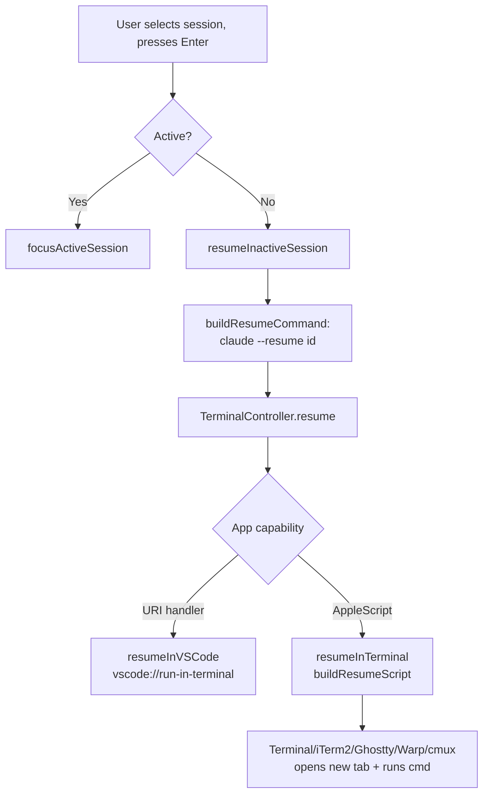
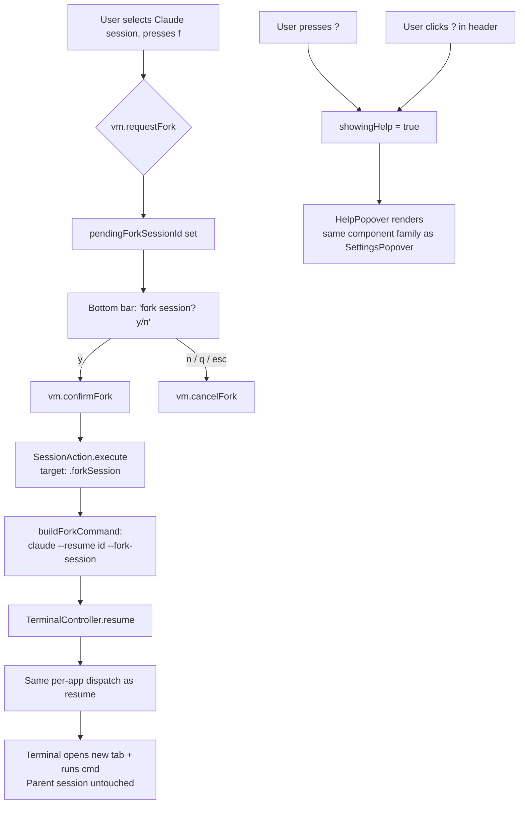

# Plan: Fork sessions + help popover

## Working Protocol
- Use parallel subagents for independent file reads/searches
- Mark steps done as you complete them — a fresh agent should be able to find where to resume
- Build with `swift build` (120s timeout) and run tests with `swift test` (30s timeout) after each step
- If a build/test hangs, run `make kill-build` immediately and retry
- Run `swift test --enable-code-coverage` once at the end and confirm new files (`HelpPopover.swift`, fork-related additions) clear the 60% line-coverage bar per AGENTS.md
- All terminal interaction goes through `TerminalController`; all session actions go through `SessionAction.execute()`. Do not break those invariants.
- Branch is `julo/fork-and-help-pane`

## Overview
Add a "fork session" command (`f`) that spawns a branched Claude Code session in a new tab using the existing per-terminal resume pipeline, leaving the parent session untouched. Add a help popover (`?` or header button) listing every keyboard command, and shrink the bottom bar to a small set of essentials so it stops overflowing.

## User Experience

### Forking a session
1. User opens the seshctl panel (cmd+shift+s) and selects any **Claude** session — active or inactive.
2. User presses `f`. Bottom bar swaps to a confirmation prompt: `fork session? y/n` (accent-colored, mirroring the existing `kill process? y/n` and `mark all as read? y/n` patterns).
3. User presses `y` to confirm (or `n` / `q` / esc to cancel).
4. seshctl resolves the session's host terminal app (DB → PID walk → frontmost) and routes through `TerminalController.resume(...)` with `claude --resume <id> --fork-session`. The terminal opens a new tab/pane (cmux: new surface in current window; iTerm2/Ghostty/Warp/Terminal: new tab in front window; VS Code/Cursor: new terminal in workspace).
5. Original session is unaffected — it keeps running if active, stays closed if inactive.
6. seshctl panel dismisses (same flow as resume today).

If the user presses `f` on a non-Claude session (gemini/codex), nothing happens — the key is silently ignored at the AppDelegate level (no confirmation prompt fires).

### Opening help
1. User presses `?` from the list view, **or** clicks the `?` button in the header next to the settings gear.
2. A popover appears below the button (same style as `SettingsPopover`), listing every keyboard command grouped by category (Navigation / Actions / Search / View). Sections are short and scannable.
3. User presses esc or clicks outside to dismiss.
4. Help popover is read-only — no commands can be triggered from inside it. Pressing letters there falls through to popover dismissal, not the underlying list.

### Bottom bar
Shrinks from the current ~12-command line to:
`enter focus · f fork · / search · ? help · q close`

The full command list lives in the help popover. Confirmation prompts (`kill process? y/n`, `mark all as read? y/n`, new `fork session? y/n`) still take over the bottom bar when active.

## Architecture

### Current
Resume already handles "spawn a new tab and run a command" generically across every supported terminal. The pipeline is:

Key invariants in the current code:
- `TerminalController.resume(command:directory:bundleId:)` is the canonical entry point (`Sources/SeshctlUI/TerminalController.swift:172`)
- `buildResumeCommand(session:)` constructs the shell string (`TerminalController.swift:198`)
- `SessionAction.execute(target:...)` is the canonical routing entry (`Sources/SeshctlUI/SessionAction.swift:33`)
- AppDelegate's `handleNormalKey` is a single ~120-line switch on keycode/char (`Sources/SeshctlApp/AppDelegate.swift:152`)
- Bottom bar is rendered inline in `SessionListView.swift:261-277`, with a confirmation-prompt branch already wired up via `pendingKillSessionId` and `pendingMarkAllRead`

### Proposed
Fork piggybacks on the existing resume pipeline. The only differences are (a) the constructed command appends `--fork-session`, and (b) a new pending-confirmation flag drives the bottom-bar prompt. The help popover is a parallel UI surface with no backend changes.

Runtime characteristics:
- **Memory**: one extra `@Published var pendingForkSessionId: String?` on `SessionListViewModel`; one `@State var showingHelp: Bool` on `SessionListView`. Negligible.
- **Disk/network**: none. Fork command is built in-memory and dispatched via `osascript`/`open` like resume.
- **Cost**: identical to resume. A single AppleScript or URL-handler invocation.
- **State persistence**: none beyond what already persists. Fork doesn't write to the seshctl DB; the new claude session writes its own session record on launch (via the existing SessionStart hook).
- **Help popover**: stateless. Opens/closes purely on `@State` flag. No async work.

## Current State
Files this plan touches (all paths absolute from repo root):
- `Sources/SeshctlUI/TerminalController.swift` — resume pipeline + per-app AppleScript/URI dispatch
- `Sources/SeshctlUI/SessionAction.swift` — routing layer between key handlers and TerminalController
- `Sources/SeshctlUI/SessionListViewModel.swift` — `@Published` state for selection, kill-confirm, mark-all-read-confirm
- `Sources/SeshctlUI/SessionListView.swift` — header (settings gear), bottom bar with confirmation prompt branches
- `Sources/SeshctlUI/SettingsPopover.swift` — reference for the popover pattern (do not modify)
- `Sources/SeshctlApp/AppDelegate.swift` — `handleNormalKey` switch, where `f` and `?` will slot in
- Tests: `Tests/SeshctlUITests/{TerminalControllerTests,SessionActionTests,SessionListViewModelTests}.swift`

Confirmed via `claude --help`: `--fork-session` is documented and works with `--resume <id>` or `--continue`. Parent is unaffected.

## Proposed Changes

**Strategy: minimal new code, lean on existing patterns.**

1. **Fork command building** — extend `TerminalController.buildResumeCommand` with an optional `fork: Bool = false` parameter (or add a sibling `buildForkCommand`). Single switch case for tool: only Claude returns a non-nil command; Gemini/Codex return nil and the action no-ops. This is one ~5-line change.
2. **Fork routing** — add `.forkSession(Session)` to `SessionActionTarget`. Add a private `forkSession(_:markRead:dismiss:environment:)` that mirrors `resumeInactiveSession` but uses the fork command. Same per-app dispatch falls out for free since both go through `TerminalController.resume`.
3. **Pending-fork confirmation** — mirror the existing kill-confirm pattern in `SessionListViewModel`: `@Published var pendingForkSessionId: String?`, `requestFork()`, `confirmFork()`, `cancelFork()`. Reset on selection-change paths (matches how `pendingKillSessionId` is reset).
4. **Key handler** — in `AppDelegate.handleNormalKey`, add `f` → `requestFork`, fold `y`/`n`/`q`/esc handling into the existing pending-state branches alongside kill and mark-all-read. Confirm-fork path calls `SessionAction.execute(target: .forkSession(...))`.
5. **Help popover** — new file `Sources/SeshctlUI/HelpPopover.swift`, structured like `SettingsPopover.swift` (a `View` with sections of `Text` rows). Static content, no state of its own. Triggered by `@State var showingHelp` on `SessionListView`, attached to a new header button (a `?` `Image(systemName: "questionmark.circle")` next to the settings gear) and opened on the `?` keypress.
6. **Bottom bar reduction** — replace the long footer string in `SessionListView.swift` with `enter focus · f fork · / search · ? help · q close`. Pending-prompt branch grows by one line for `fork session? y/n`.
7. **? key** — in AppDelegate, add `?` → toggle help popover. Since `?` is shift+/, route it before the search-key path.

### Complexity Assessment
**Low-medium.** ~7 files touched, all changes follow patterns that already exist in the codebase (kill confirmation, settings popover, resume routing). No new abstractions, no architectural shifts. The trickiest bit is making sure the `?` key doesn't collide with `/` (search) — they share a physical key but differ by shift modifier; AppDelegate already inspects modifiers, so this is straightforward. Risk of regression is contained: kill/mark-all-read confirmation paths are well-tested and we're adding a parallel one, not modifying them. Test coverage is mechanical (mirror existing test files). The bottom-bar truncation is the only place we lose information from the UI, but it lands in the help popover so net info is unchanged.

## Impact Analysis

- **New Files**:
  - `Sources/SeshctlUI/HelpPopover.swift`
- **Modified Files**:
  - `Sources/SeshctlUI/TerminalController.swift` (add fork command builder)
  - `Sources/SeshctlUI/SessionAction.swift` (add `.forkSession` target + handler)
  - `Sources/SeshctlUI/SessionListViewModel.swift` (pending-fork state + actions)
  - `Sources/SeshctlUI/SessionListView.swift` (header help button, bottom bar shrink, fork prompt)
  - `Sources/SeshctlApp/AppDelegate.swift` (handle `f` and `?`)
  - `Tests/SeshctlUITests/TerminalControllerTests.swift` (fork command building)
  - `Tests/SeshctlUITests/SessionActionTests.swift` (fork routing)
  - `Tests/SeshctlUITests/SessionListViewModelTests.swift` (request/confirm/cancel fork state)
- **Dependencies**: relies on `claude --fork-session` (verified via `claude --help`). No new package deps.
- **Similar Modules** (reused, not duplicated):
  - Kill confirmation (`pendingKillSessionId`, `requestKill`/`confirmKill`/`cancelKill`) — mirror exactly for fork
  - Settings popover (`SettingsPopover.swift`) — mirror for `HelpPopover.swift`
  - Resume routing (`SessionAction.resumeInactiveSession`, `TerminalController.resume`) — fork is structurally identical bar the command string

## Key Decisions
- **Fork is Claude-only.** `--fork-session` is a Claude Code flag. For gemini/codex sessions, `f` is silently ignored. (Codex has its own resume model and no fork equivalent today.) If/when codex adds fork support, gating moves into `buildForkCommand` cleanly.
- **Confirmation prompt for `f`.** User explicitly asked for it. Uses the same `pendingForkSessionId` → bottom-bar prompt → `y`/`n` flow as kill, to keep the pattern consistent.
- **`?` key opens help in addition to header button.** Vim-ish convention; mirrors how `,` opens settings via `cmd+,` while a button also exists.
- **Bottom bar shrinks; help popover holds the full list.** User chose "bare essentials". We lose at-a-glance discovery of `j/k`, `o`, `u`/`U`, `v`, `r`, `x` from the footer, but they live one keypress away in `?`.
- **No fork for `RecallResult` rows in v1.** Recall results carry a `resumeCmd` string we could rewrite, but adding fork to recall flow expands scope and isn't asked for. Defer.

## Implementation Steps

### Step 1: Build the fork command
- [x] In `Sources/SeshctlUI/TerminalController.swift`, add `buildForkCommand(session: Session) -> String?` that returns nil for non-Claude tools, otherwise returns `buildResumeCommand` output with ` --fork-session` appended. Keep it next to `buildResumeCommand` (line ~198).
- [x] Verify behavior: `--fork-session` only valid with `--resume`, so both must be present. Builder must error-on-nil if `conversationId` is missing (same as resume today).

### Step 2: Add fork routing
- [x] In `Sources/SeshctlUI/SessionAction.swift`, add `.forkSession(Session)` to `SessionActionTarget`.
- [x] Add a private `forkSession(_:markRead:dismiss:environment:)` modeled on `resumeInactiveSession` (line 76). Build the fork command, resolve the bundleId, call `TerminalController.resume(...)`. If resume returns false or command is nil, copy the compound command to clipboard as fallback (same pattern as resume).
- [x] Wire `.forkSession` into the `execute(target:...)` switch.

### Step 3: Add pending-fork state
- [x] In `Sources/SeshctlUI/SessionListViewModel.swift`, add `@Published public var pendingForkSessionId: String?`.
- [x] Add `requestFork()` (line ~758, next to `requestKill`): only set if selected session is `tool == .claude`; otherwise no-op.
- [x] Add `confirmFork()` and `cancelFork()` mirroring kill counterparts.
- [x] Reset `pendingForkSessionId = nil` everywhere `pendingKillSessionId = nil` is set (~12 sites).

### Step 4: Wire `f` and y/n/q/esc in AppDelegate
- [x] In `Sources/SeshctlApp/AppDelegate.swift`, in `handleNormalKey`:
  - Add `case (_, "f"):` → guard not in pending state → `vm.requestFork()`
  - Extend `case (_, "y")` to also handle `vm.pendingForkSessionId != nil` → call `confirmFork()` + `SessionAction.execute(target: .forkSession(session), ...)`
  - Extend `case (_, "n")` and `q`/esc to call `cancelFork()` when fork is pending
- [x] Other pending-state guards (kill/mark-all-read) need to also exclude when fork is pending — i.e. don't allow `f` while `x` is mid-confirm and vice versa.

### Step 5: Update bottom bar + add fork prompt
- [x] In `Sources/SeshctlUI/SessionListView.swift`, in the footer `HStack` (line 261):
  - Add an `else if viewModel.pendingForkSessionId != nil` branch: `Text("fork session? y/n")` with `.accentColor` (or another non-red color — fork isn't destructive)
  - Replace the long hint string with: `enter focus · f fork · / search · ? help · q close`
  - Drop the redundant `enter/e focus` first slot since it merges into the new shorter string

### Step 6: Build the help popover
- [x] Create `Sources/SeshctlUI/HelpPopover.swift` modeled on `SettingsPopover.swift`. Sections: **Navigation** (j/k/tab, h/l, g/G, ctrl-d/u/f/b, cmd-up/down), **Actions** (enter/e focus, f fork, o detail, u/U mark read, x kill), **Search** (/, tab/shift-tab), **View** (v list/tree, r filter, , settings), **Panel** (cmd+shift+s toggle, q/esc close). Use monospaced font for keys, plain for descriptions. Static `View` content — no state.
- [x] In `Sources/SeshctlUI/SessionListView.swift`, add `@State private var showingHelp = false`.
- [x] In the header `HStack` (line 30), add a `?` button next to the settings gear with `.popover(isPresented: $showingHelp, arrowEdge: .top) { HelpPopover() }`.

### Step 7: Wire `?` key
- [x] In `AppDelegate.handleNormalKey`, add `case (_, "?"):` → toggle `showingHelp` via a binding/closure exposed from the view (or via a `@Published` flag on ViewModel — pick whichever fits the existing pattern; settings uses local `@State` + `cmd+,` keyboardShortcut, so we may need a binding callback similar to `dismissPanel`).
- [x] Verify `?` (shift+/) does not also trigger `/` (search): AppDelegate already gets the modified char via `chars`, so `chars == "?"` is distinct from `chars == "/"`. Confirm by inspection.

### Step 8: Tests
- [x] In `Tests/SeshctlUITests/TerminalControllerTests.swift`, add tests:
  - `buildForkCommand` for a Claude session with conversationId → returns `claude --resume <id> --fork-session`
  - `buildForkCommand` for a Claude session without conversationId → returns nil
  - `buildForkCommand` for gemini and codex sessions → returns nil
  - `buildForkCommand` preserves `launchArgs` if present (e.g. `claude --dangerously-skip-permissions --resume <id> --fork-session`)
- [x] In `Tests/SeshctlUITests/SessionActionTests.swift`, add tests:
  - `.forkSession` target dispatches `TerminalController.resume` (use a fake `SystemEnvironment` and assert the command + bundleId)
  - `.forkSession` with a non-Claude session falls through cleanly (clipboard fallback or no-op — match the resume test pattern)
  - Fork on an inactive session does not error
- [x] In `Tests/SeshctlUITests/SessionListViewModelTests.swift`, add tests:
  - `requestFork` on a Claude selection sets `pendingForkSessionId`
  - `requestFork` on a non-Claude selection leaves `pendingForkSessionId` nil
  - `confirmFork` clears `pendingForkSessionId`
  - `cancelFork` clears `pendingForkSessionId`
  - Selection-change paths reset `pendingForkSessionId` (sample one or two of the 12 sites — full enumeration is brittle)

### Step 9: Build, test, manual smoke
- [x] `swift build` (timeout 120s) — clean compile
- [x] `swift test` (timeout 30s) — all green
- [x] `swift test --enable-code-coverage` — confirm modified files stay above 60% line coverage
- [x] `make install` — manual smoke: open panel, press `?`, verify popover content; press `f` on a Claude session, confirm `y`, verify new tab opens with forked session and parent stays alive; press `f` on a gemini/codex session, verify nothing happens; verify bottom bar shrinks and confirmation prompts still render

## Acceptance Criteria
- [x] [test] `buildForkCommand` returns `claude --resume <id> --fork-session` for Claude sessions with conversationId
- [x] [test] `buildForkCommand` returns nil for non-Claude tools
- [x] [test] `SessionAction.execute(target: .forkSession(...))` invokes `TerminalController.resume` with the fork command
- [x] [test] `requestFork` is a no-op for non-Claude sessions
- [x] [test] `confirmFork`/`cancelFork` clear `pendingForkSessionId`
- [x] [test-manual] Pressing `f` on a Claude session shows `fork session? y/n` in bottom bar; `y` opens new tab with forked claude; original session unaffected
- [x] [test-manual] Pressing `?` (or clicking the header button) shows a popover listing all keyboard commands
- [x] [test-manual] Bottom bar reads `enter focus · f fork · / search · ? help · q close` in the default (non-pending) state
- [x] [test-manual] Fork works correctly across cmux, iTerm2, Ghostty, Terminal.app, Warp, and at least one VS Code variant — each opens a new tab/pane and runs the fork command

## Edge Cases
- **Active session + fork**: parent claude keeps running; new tab gets the forked session. Both should appear in seshctl's list (the new one shows up via the existing SessionStart hook).
- **Inactive session + fork**: parent stays inactive; fork starts a new branched session as if you'd resumed it. Same outcome as resume except with `--fork-session`.
- **No conversationId on session**: `buildForkCommand` returns nil → action no-ops (no clipboard fallback either, since there's nothing meaningful to paste). Mirrors how resume handles this.
- **`f` in tree mode**: same behavior as list mode. Tree mode doesn't change selection semantics.
- **`f` while another confirmation is pending** (e.g. `x` already pressed): ignore `f` — existing kill confirmation owns the bottom bar. User must y/n out first.
- **`?` while a confirmation is pending**: open help anyway — it's a read-only popover and shouldn't be blocked. (Or block it for consistency. Pick one — recommend opening, since help is non-destructive.)
- **VS Code fork**: URI handler routes through `vscode://julo15.seshctl/run-in-terminal?cmd=...` — the cmd already contains `--fork-session`, so the companion extension just runs it as-is. No companion-extension changes needed.
- **Recall results**: `f` is ignored when a recall result is selected. Defer recall-fork to a future plan.
