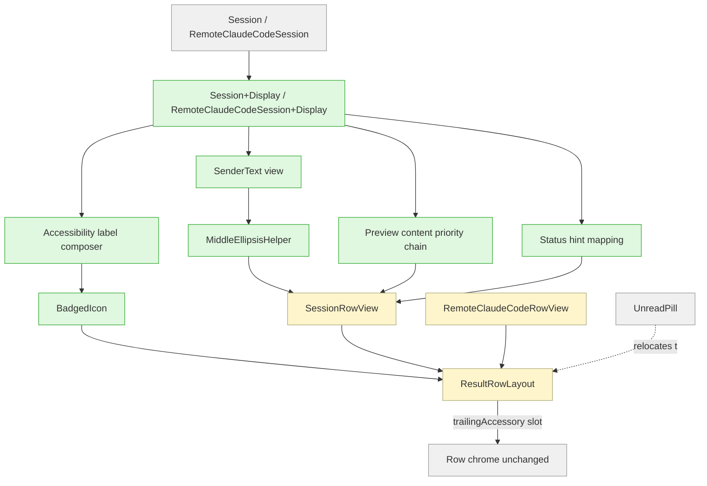

# Plan: Session row UI Gmail-style redesign (Phase 1)

## Working Protocol

- Branch: `julo/row-ui-gmail-redesign`
- Use parallel subagents for independent reads/searches; mark units done as you complete them so a fresh agent can resume
- Build with `swift build` (120s timeout) and run tests with `swift test` (30s timeout). On hang, run `make kill-build` immediately and retry
- Test framework is **Swift Testing** (`import Testing`, `@Suite`, `@Test`, `#expect`) — not XCTest. Match style from `Tests/SeshctlCoreTests/SessionDisplayNameTests.swift` for model-side decision-table tests and `Tests/SeshctlUITests/RemoteClaudeCodeRowViewTests.swift` for UI-side helpers
- All bundle IDs and URI schemes still live in `TerminalApp`; all session actions still go through `SessionAction.execute()`. This redesign is a presentation change — no routing, no detection, no DB schema work
- Run `swift test --enable-code-coverage` once at the end and confirm new helper files clear the **60% line-coverage bar** per AGENTS.md. SwiftUI view-only files (`SessionRowView`, `RemoteClaudeCodeRowView`, `ResultRowLayout`) are exempt
- This plan covers **Phase 1** (badge introduced alongside existing label, layout swap, line-2 redesign). Phase 2 (text-label removal) is a separately tracked follow-up — see "Deferred to Separate Tasks"

### Unit dependency graph

```
Unit 1 (display helpers) ─┬─> Unit 3 (badge primitive — uses a11y label helper)
                          ├─> Unit 5 (SessionRowView refactor)
                          └─> Unit 6 (RemoteClaudeCodeRowView refactor)
Unit 2 (middle-ellipsis)  ─┬─> Unit 5
                          └─> Unit 6
Unit 3 (badge)            ─┬─> Unit 5
                          └─> Unit 6
Unit 4 (RowLayout slot)   ─┬─> Unit 5
                          └─> Unit 6
Unit 5 (SessionRowView)   ───> Unit 6 (mirrors Unit 5's shape)
```

Units 1, 2, 4 are mutually independent and can land in parallel. Unit 3 must follow Unit 1. Units 5/6 land last, with 5 before 6.

## Overview

Replace the existing `[repo · dir · branch]` line-1 / `[Tool: preview]` line-2 layout with a Gmail-inspired `[sender][preview]` line 1 and a `[branch]` line-2 subtitle. The sender column encodes session identity (repo alone when `dir == repo`; `repo · dir-basename` for worktrees and renamed clones), with middle-ellipsis truncation that preserves the disambiguating dir suffix.

On the right side, introduce a `~10pt` corner badge over the host app icon (or globe, for remote rows) that encodes agent kind (`C` orange / `X` green / `G` blue). The existing `claude` / `codex` / `gemini` text label stays in Phase 1 as a recognition safety net while the badge is validated; removing it is gated behind a Phase 2 follow-up.

The `UnreadPill` relocates from line 1 (where it currently sits next to identifiers) to a new trailing-accessory slot in `ResultRowLayout`, immediately before the chevron. The local/cloud/bridged glyph trio (`💻 / ☁️ / 💻☁️`) stays on line 2, prefixed before the branch — preserving current semantics in the new layout.

## Problem Frame

The session list is the primary triage surface in seshctl. The status dot + time label already answer "which sessions need me?" The current row layout under-serves "what is each session actually doing?" — the latest assistant message lives on line 2 while line 1 carries three competing identifiers that are mostly redundant during scanning. The right side spends ~80pt repeating agent identity as text next to an app icon that already conveys context.

This redesign keeps the urgency signals (status dot, time, accent bar) untouched and reorganizes the content axis. Worktree disambiguation moves up to line 1's sender slot so power users with multiple sessions per repo can triage by line 1 alone.

See origin: `.agents/brainstorms/2026-04-28-1700-row-ui-gmail-redesign-requirements.md`.

## Requirements Trace

Phase 1 must satisfy all requirements except R7 (label removal). Mapped from the origin doc:

- **R1.** Fixed sender column with session-identity encoding + middle-ellipsis preserving dir suffix
- **R2.** Drop assistant-side `Claude:`/`Codex:`/`Gemini:` prefix (retain user-side `You:`)
- **R2a.** Preview content rules — first non-empty line, backticks preserved as plain text, render-driven truncation
- **R3.** Line 1 priority chain: `lastReply` → italic `You: <lastAsk>` → status hint
- **R4.** Status hint mapping for all 6 `SessionStatus` values
- **R5.** Line 2 = branch (or directory path when `gitBranch` is nil)
- **R5a.** Local/cloud/bridged glyph trio prefixed on line 2 when `showCloudAffordances`
- **R6.** Line 2 typography: lower-contrast color at the same size; branch retains accent color
- **R7.** *(Phase 2 — deferred to separate task)*
- **R8.** Phase 1 corner badge introduced alongside text label
- **R8a.** Composite icon + badge carries unified `accessibilityLabel` (also fixes the existing "Color.clear placeholder reads as loading" gap from prior reviews)
- **R9.** Globe + orange `C` badge for remote rows; primitive works for both raster app icons and tinted SF Symbols
- **R10.** UnreadPill relocates to right-side trailing-accessory slot, between badge-icon and chevron
- **R11.** Remote-row variant rules (sender from `repoUrl`, preview from `title`, subtitle from `branches[0]` or collapse)
- **R12.** Preserve unchanged: status dot, time label, repo accent bar, chevron, section headers (`TODAY` / `YESTERDAY` / `OLDER` / `Recent` / `Semantic`), inactive-row opacity treatment
- **R12a.** Italic semantics live at the line-1 styling tier; stale-row dimming lives at the row-opacity tier. Both coexist without conflict — a stale row showing R3's italic fallback reads as italic-and-dimmed; a stale row with a real `lastReply` reads as regular-weight-and-dimmed

## Scope Boundaries

- **Out of scope:** changing data captured per session (`lastAsk`, `lastReply`, `gitBranch`, etc. stay as-is)
- **Out of scope:** changing section grouping (`TODAY` / `YESTERDAY` / `OLDER` / `Recent` / `Semantic` buckets)
- **Out of scope:** the row's interaction model — `SessionAction.execute()` and focus/resume routing unchanged
- **Out of scope:** left-side chrome (status dot, time label, repo accent bar)
- **Out of scope:** popover header bar, search, section headers
- **Out of scope:** any change to host-app or agent-kind detection

### Deferred to Separate Tasks

- **Phase 2 — text-label removal (R7).** After Phase 1 ships, the user soaks the design in routine use. If after the soak the badge feels redundant (the text label hasn't been needed during scanning) — or, more rigorously, a self-administered cold-recognition test on a randomized snapshot scores ≥9/10 — open a follow-up PR that removes the text label from `ResultRowLayout` and updates call sites. If the soak is inconclusive or recognition feels weak, redesign the badge before retrying Phase 2. The **badge introduction itself** (the alongside-label addition) is purely additive and rolls back cheaply; the layout swap in Units 5/6 is *not* zero-cost to revert (it deletes `lastMessagePreview` and replaces line 1 / line 2 HStacks), so a Phase 1 rollback specifically means reverting R7's gate, not the whole plan.
- **Sender column width tuning.** Default 180pt is a starting point. After Phase 1 lands, measure repo-name + worktree-suffix distribution against the user's real session DB and adjust the constant if many rows truncate. Either a follow-up tuning PR or a soak-period adjustment.

## Context & Research

### Relevant Code and Patterns

- **`Sources/SeshctlUI/ResultRowLayout.swift`** — generic `<Status: View, Content: View>` row container with `@ViewBuilder` slots and value params (`toolName`, `hostApp`, `hostAppSystemSymbol`, `accentColor`, `onDetail`). Pattern for adding new params is additive-with-default. Lines 57-69 show the NSImage-vs-SF-Symbol if/else where the badge primitive will slot in
- **`Sources/SeshctlUI/SessionRowView.swift`** — current line 1 (lines ~50-78), line 2 (lines ~80-110), `lastMessagePreview` computed prop (lines 115-132) implementing the existing prefix logic
- **`Sources/SeshctlUI/RemoteClaudeCodeRowView.swift`** — current title row (lines 73-97), subtitle row with `cloud.fill` glyph (lines 103-113), `.italic(isStale)` + `.tertiary` color treatment for stale rows (lines 83-84)
- **`Sources/SeshctlUI/Session+Display.swift`** — existing `primaryName`, `nonStandardDirName` computed props. New helpers belong here (sender string, preview-priority chain, status-hint mapping, accessibility-label composition)
- **`Sources/SeshctlUI/DisplayRow.swift`** — `repoShortName(from:)` (lines 73-78) is the canonical repo-from-URL extractor; reuse for remote-row sender
- **`Sources/SeshctlUI/UnreadPill.swift`** — public parameterless `View` (`Text("Unread")` w/ orange background). Relocation does not modify the pill itself — only where it is rendered
- **`Sources/SeshctlUI/HostAppResolver.swift`** — `HostAppInfo` (bundleId/name/icon). Badge primitive composes around `hostApp.icon` (NSImage) or `hostAppSystemSymbol` (SF Symbol)
- **`Sources/SeshctlUI/StatusKind.swift`** — canonical agent-status color vocabulary. Reuse for status-hint copy mapping
- **`Sources/SeshctlCore/Session.swift`** — `lastAsk: String?`, `lastReply: String?`, `gitBranch: String?`, `gitRepoName: String?`, `directory: String`, `status: SessionStatus`. Truncated to 500 chars at write time (Database.swift:251-256)
- **`Sources/SeshctlCore/RemoteClaudeCodeSession.swift`** — `title: String`, `repoUrl: String?`, `branches: [String]`, `unread: Bool`, `lastReadAt: Date?`. `isUnread` computed prop combines API flag with local read state

### Institutional Learnings

- **`ResultRowLayout` regressions are visual** — the `2026-04-21-1500-remote-rows-first-class-r1.md` review noted that fixed-slot changes have caused 20pt right-edge gaps and silent tool-color flattening. Implication: when adding the trailing-accessory slot, visually verify all three callers (`SessionRowView`, `RecallResultRowView`, `RemoteClaudeCodeRowView`)
- **Empty `Color.clear` icon slots read as "loading" to VoiceOver** — same review (Q4). R8a's universal `accessibilityLabel` fixes this gap as a side effect
- **Per-repo color coding (`2026-04-23-0237-per-repo-color-coding.md`) explicitly chose not to extend `ResultRowLayout`** — this redesign reverses that precedent by adding `trailingAccessory`. The reversal is intentional: the unread signal genuinely belongs at the row-chrome layer, not inside the per-row content
- **No middle-ellipsis-around-a-separator primitive exists** — `.truncationMode(.middle)` ellipsizes character-wise, not segment-wise. Plan a custom helper that splits at ` · `

### External References

None used. Local patterns + the brainstorm doc cover the design space.

## Key Technical Decisions

- **Session-identity sender, not repo-only sender.** The brainstorm's central insight: a "sender" column whose values collide across rows defeats the line-1-alone scan goal. Encoding `dir basename` into the sender slot (when distinct) means worktree-heavy users get unique line-1 strings, and middle-ellipsis preserves the disambiguator. Costs a custom truncation helper; gains the success criterion. *(see origin: Cluster A)*
- **Phase 1 / Phase 2 split.** Bundling the badge introduction with the text-label removal would commit to badge legibility before validating it. Splitting the moves means Phase 1 is purely additive (badge alongside label, near-zero rollback cost), and Phase 2 happens only after the badge proves itself. *(see origin: Cluster B)*
- **`trailingAccessory: () -> some View` view-builder slot on `ResultRowLayout`**, not an `isUnread: Bool` flag. Matches the established `@ViewBuilder` pattern; lets the call site decide what trailing accessory means (today: `UnreadPill`; tomorrow: anything else without another API change). Default value is an empty view so existing callers are unaffected
- **Pill outside, between badge-icon and chevron.** Visual weight argues pill closer to chevron; the pill anchors the row's right edge as a focused-attention signal. *(see origin: deferred-to-planning)*
- **Line 2 demoted via lower-contrast color, not smaller font size.** Font-size change hurts long-branch legibility. Color-only demote keeps text readable at the same metric size. *(see origin: deferred-to-planning)*
- **`BadgedIcon` is a generic primitive over `Image`**, not specialized per icon type. Same primitive renders for `Image(nsImage: hostApp.icon)` and `Image(systemName: "globe")`. Background ring (subtle, ~1pt elevation halo) for separation against busy bottom-right icon corners
- **Badge visual language: typographic monogram on a colored circle** (orange `C`, green `X`, blue `G`). Color-blind safe via the letterform; simplest to implement; consistent with brainstorm's depicted design. If recognition fails during soak, the alternative (tinted product marks) becomes the Phase 2 redesign rather than blocking Phase 1
- **Display props live in `Session+Display.swift` (and a new `RemoteClaudeCodeSession+Display.swift`).** Pure functions on the value type, callable from view models or views. Tested model-side via the existing `Tests/SeshctlCoreTests/SessionDisplayNameTests.swift` pattern

## Open Questions

### Resolved During Planning

- **Phase 2 trigger criteria:** the soft criterion ("badge feels redundant during routine use; never finding yourself glancing at the text label") gates the decision; the rigorous fallback is a self-administered cold-recognition test on a randomized snapshot. Single-user soak limits this to a subjective signal — accepted, not pretended away
- **Badge composition over SF Symbol vs NSImage:** single `BadgedIcon<Base: View>` primitive accepts any `View` as base. The base view's intrinsic content (NSImage rendering vs SF Symbol tinting) is opaque to the badge layer
- **`ResultRowLayout` API extension:** add `@ViewBuilder trailingAccessory` slot with `EmptyView` default — additive, non-breaking
- **Pill ordering:** outside (closer to chevron), between badge-icon and chevron
- **Line 2 demote treatment:** lower-contrast color at same metric size
- **Empty-string vs nil semantics:** consolidated in R3 — both nil and zero-length / whitespace-only fall through to next priority
- **`lastAsk` timing:** verified — written by independent `UserPromptSubmit` hook, available before `lastReply`. R3's italic fallback is reachable in real usage

### Deferred to Implementation

- **Sender column width tuning** — 180pt is a working default; revisit after soak. May need a follow-up if real-world repo names skew long
- **Hover/focus state of the badge ring** — the ring color may need to track selection tint to remain visible against highlight backgrounds. Easier to feel out in code than to spec
- **Minimum popover width / Dynamic Type degradation** — at very narrow widths (or large dynamic type), the fixed sender column has to give. Either fix a popover minimum width or define a proportional-shrink rule. Settle by trying it
- **Exact monogram letterforms / circle sizes** — design execution detail. Start with system font at ~7pt monogram on a 10pt filled circle; adjust by eye

## High-Level Technical Design

> *This illustrates the intended approach and is directional guidance for review, not implementation specification. The implementing agent should treat it as context, not code to reproduce.*



Sender + preview shape, **Phase 1** (illustrative, not literal):

```
[ status-dot ] [ time ] [ accent-bar ] [ sender (~180pt) ] [ preview (flex) ] [ tool-label ] [ icon+badge ] [ pill* ] [ chevron ]
                                              \                          /
                                       middle-ellipsis preserving dir suffix

* pill rendered only when isUnread
```

Phase 2 (text-label removed):

```
[ status-dot ] [ time ] [ accent-bar ] [ sender (~180pt) ] [ preview (flex) ] [ icon+badge ] [ pill* ] [ chevron ]
```

Line 2 layout (when `showCloudAffordances` is true):

```
[ glyph(s) ] [ branch (accent) ]
   💻 ☁️       julo/spike-x
```

## Implementation Units

- [ ] **Unit 1: Display helpers — Session + Remote**

  **Goal:** Centralize the new computed display props (sender string, preview-priority chain, status-hint mapping, accessibility-label composition) on the model side so view rewrites in later units are mostly composition.

  **Requirements:** R1, R2, R3, R4, R8a, R11

  **Dependencies:** None.

  **Files:**
  - Modify: `Sources/SeshctlUI/Session+Display.swift`
  - Create: `Sources/SeshctlUI/RemoteClaudeCodeSession+Display.swift`
  - Create: `Tests/SeshctlUITests/SessionDisplayHelpersTests.swift` and `Tests/SeshctlUITests/RemoteSessionDisplayTests.swift` (these helpers live in `SeshctlUI`, so tests must live in the UI test target which already does `@testable import SeshctlUI` — see `Tests/SeshctlUITests/SessionAgeDisplayTests.swift` for the pattern)

  **Approach:**
  - Add `senderDisplay: SenderDisplay` to `Session+Display` returning a struct with `repoPart` and `dirSuffix` (nil when `dir basename == repoName`). The struct lets the rendering layer paint each part with different colors without re-parsing
  - Add `previewContent: PreviewContent` enum with cases `.reply(String)`, `.userPrompt(String)`, `.statusHint(String)`. The view layer maps each case to the right typography (regular / italic-secondary / italic-tertiary)
  - Add `statusHint(for: SessionStatus) -> String` helper with the explicit mapping per R4: `.working → "Working…"`, `.waiting → "Waiting…"`, `.idle → "Idle"`, `.completed → "Done"`, `.canceled → "Canceled"`, `.stale → "Ended"`
  - Add `accessibilityLabel(hostApp:agent:)` static helper composing strings like `"Ghostty, Claude"`, `"Globe, Claude"` (remote)
  - Treat `nil` and zero-length / whitespace-only strings as equivalent (`String?.nonEmpty: String?` extension if not already present)
  - For `RemoteClaudeCodeSession+Display`: provide `senderDisplay` (extracted via `DisplayRow.repoShortName(from:)` from `repoUrl`, fallback `"Remote"`), `previewContent` (always `.reply(title)` since no italic / status-hint path applies), `branchDisplay: String?` (returns `branches.first` if non-empty)

  **Patterns to follow:**
  - Existing `primaryName` / `nonStandardDirName` extension structure in `Session+Display.swift`
  - Existing `DisplayRow.repoShortName(from:)` for URL parsing

  **Test scenarios:**
  - **Happy path** — `senderDisplay` returns `repoPart="seshctl", dirSuffix=nil` when `gitRepoName="seshctl", directory="~/Documents/me/seshctl"`
  - **Worktree** — `senderDisplay` returns `repoPart="seshctl", dirSuffix="seshctl-wt2"` when `directory="~/Documents/me/seshctl-wt2"` and `gitRepoName="seshctl"`
  - **Worktree collision (same dir basename across rows)** — `senderDisplay` returns `repoPart="seshctl", dirSuffix="tmp"` for two different worktrees both named `tmp`; the line-2 branch is the next-level disambiguator
  - **No git context** — `senderDisplay` falls back to dir basename when `gitRepoName` is nil
  - **Preview priority — reply present** — returns `.reply(text)` when `lastReply="hello"`, regardless of `lastAsk`
  - **Preview priority — ask present, no reply** — returns `.userPrompt(text)` when `lastReply=nil, lastAsk="refactor X"`
  - **Preview priority — both empty (nil)** — returns `.statusHint("Working…")` when status `.working`
  - **Preview priority — empty string vs nil** — returns `.userPrompt(ask)` when `lastReply=""` and `lastAsk` is set; returns `.statusHint(...)` when both `""`
  - **Preview priority — whitespace only** — `lastReply="   "` falls through to `lastAsk` or status hint
  - **Status hint — every case** — one assertion per `SessionStatus` (working / waiting / idle / completed / canceled / stale) maps to expected copy
  - **Accessibility label — local** — `accessibilityLabel(hostApp: ghostty, agent: .claude)` returns `"Ghostty, Claude"`
  - **Accessibility label — remote / no host app** — passes `hostApp: nil` → `"Globe, Claude"` (uses agent + base-icon-kind fallback)
  - **Remote sender — repoUrl present** — returns `repoPart` from extracted name, `dirSuffix=nil`
  - **Remote sender — repoUrl nil** — returns `repoPart="Remote"`
  - **Remote branch — non-empty array** — returns `branches.first`
  - **Remote branch — empty array** — returns `nil` (signals line-2 collapse)

  **Verification:**
  - All test scenarios pass with the existing `swift test` workflow
  - `Session+Display.swift` and `RemoteClaudeCodeSession+Display.swift` clear 60% line coverage

- [ ] **Unit 2: Middle-ellipsis truncation helper**

  **Goal:** Provide a reusable view that ellipsizes a `repo · suffix` string by middle-truncating the repo prefix while preserving the suffix in full. Stock SwiftUI cannot do this — `.truncationMode(.middle)` ellipsizes character-wise, ignoring the logical separator.

  **Requirements:** R1

  **Dependencies:** None.

  **Files:**
  - Create: `Sources/SeshctlUI/SenderText.swift`
  - Test: `Tests/SeshctlUITests/SenderTextTests.swift` (test the truncation helper, not the view body)

  **Approach:**
  - Define `SenderText: View` taking a `SenderDisplay` (from Unit 1) and a width budget. Body composes two `Text` views joined by ` · `, separately styled (repo in primary; suffix in `.tertiary` per R6's "lower-contrast color at the same size" rule)
  - **Split the truncation logic into two layers** so the deterministic part can be tested in isolation:
    1. **Pure char-budget helper** — `func chooseTruncation(repoPart: String, dirSuffix: String?, repoBudgetChars: Int, suffixBudgetChars: Int) -> TruncationResult` returning a deterministic struct describing where to ellipsize. Inputs are character budgets, not pixel widths. Table-testable with `#expect`.
    2. **Measurement adapter** — `func widthBudgetToCharBudget(availableWidth: CGFloat, font: NSFont) -> (repoBudget: Int, suffixBudget: Int)` that converts pixels to character budgets using `NSString.size(withAttributes:)` (note: that method lives on `NSString`, not `NSAttributedString` — pass `[.font: nsFont]`). The adapter is smoke-tested only and **exempt from the 60% coverage bar** because text metrics are environmental
  - The view body composes the two: takes available width via `GeometryReader`, calls the adapter, calls the pure helper, renders
  - Strategy: measure the suffix-plus-separator full width first. If that already exceeds `availableWidth`, fall back to tail-truncating the suffix alone (rare: a 30-char-plus dir basename). Otherwise allocate remaining width to the repo prefix and middle-ellipsize it character-wise within that budget
  - Default font: `.system(.body, design: .monospaced, weight: .semibold)` — matches existing line-1 conventions. The view accepts an optional font override so callers (e.g., RecallResultRowView, if it ever uses SenderText) can pass their own
  - Document in the helper file's header comment that `SenderText.swift` is partially exempt from the coverage rule: the pure helper must clear 60%; the measurement adapter is exempt

  **Patterns to follow:**
  - `RepoAccentColor.swift` — uses pure helpers + `Color` returns; same style here
  - Existing tests in `Tests/SeshctlCoreTests/SessionDisplayNameTests.swift` for table-style assertions

  **Test scenarios:**
  - **Happy path — fits comfortably** — short string returned unchanged with no ellipsis
  - **Tail-truncate when no suffix** — `dirSuffix=nil`, repo overflows → tail ellipsis on repo (matches stock `.truncationMode(.tail)`)
  - **Middle-ellipsis preserving suffix** — `repoPart="compound-engineering", dirSuffix="wt-feature-foo"` at narrow width → repo middle-ellipsizes (`comp…ring`), suffix `wt-feature-foo` stays whole
  - **Suffix-only fallback** — degenerate case where suffix alone exceeds the width budget → suffix tail-truncates and repo is dropped (or shown as `…`)
  - **Edge case — very narrow width** — width below the cost of ` · ` plus a single character → returns just `…`
  - **Edge case — exactly fits** — width matches full string → no ellipsis, full string rendered
  - **Empty inputs** — `repoPart=""` or both empty → returns empty string without crashing
  - **Char-budget edge** — `chooseTruncation(repoBudgetChars: 0, suffixBudgetChars: 5, ...)` returns suffix-only (or `…`) without crashing on division/index errors

  **Verification:**
  - All char-budget test scenarios pass deterministically (no AppKit text metrics in the assertions)
  - The pure helper clears 60% line coverage; the measurement adapter is documented as exempt

- [ ] **Unit 3: Badge composition primitive**

  **Goal:** A reusable `BadgedIcon` view that composes a small (~10pt) corner badge over any base image — works uniformly for `Image(nsImage:)` (host app icons) and `Image(systemName:)` (globe for remote). Carries the unified `accessibilityLabel` from R8a.

  **Requirements:** R8, R8a, R9

  **Dependencies:** Unit 1 (uses `accessibilityLabel` helper).

  **Files:**
  - Create: `Sources/SeshctlUI/BadgedIcon.swift`
  - Create: `Sources/SeshctlUI/AgentBadgeSpec.swift` (pure data: `(letter, color)` for each `SessionTool`)
  - Test: `Tests/SeshctlUITests/AgentBadgeSpecTests.swift` and `Tests/SeshctlUITests/BadgedIconA11yTests.swift`

  **Approach:**
  - `AgentBadgeSpec` is a small struct with `letter: String` and `color: Color`. Pure resolver: `static func forAgent(_ tool: SessionTool) -> AgentBadgeSpec` returns `(C, .orange)` / `(X, .green)` / `(G, .blue)`. For remote rows, `forRemote(model: String)` returns the same Claude badge today — but the resolver lets a future codex/gemini-on-claude-ai case route correctly per the brainstorm's R9 note
  - `BadgedIcon` takes:
    - `base: Image` (caller-provided; `Image(nsImage:)` or `Image(systemName:)`)
    - `badge: AgentBadgeSpec`
    - `baseSize: CGFloat = 24`
    - `badgeSize: CGFloat = 10`
    - `accessibilityLabel: String`
  - Body composes `ZStack(alignment: .bottomTrailing)` with the base image at fixed frame and a `BadgeView` sub-view at the corner. `BadgeView` is a `Circle().fill(badge.color)` with a 1pt white halo (or `.background(.windowBackground)`-tinted ring) for separation; centered `Text(badge.letter)` in `.system(size: 7, weight: .bold)`
  - Apply `.accessibilityElement(children: .ignore)` then `.accessibilityLabel(accessibilityLabel)` so VoiceOver reads the composite as a single labeled element rather than two separate unlabeled images
  - Note: Phase 1's caller in `ResultRowLayout` continues to render the existing `toolName` text label too. `BadgedIcon` does not own that label

  **Patterns to follow:**
  - `StatusKind.swift` for color tokens (do not invent new orange/green/blue values; pull from existing palette where possible)
  - Existing decision-table test style in `Tests/SeshctlUITests/RemoteClaudeCodeRowViewTests.swift` for the spec resolver

  **Test scenarios:**
  - **Spec resolver — claude** — `forAgent(.claude)` returns `letter="C", color=<orange>`
  - **Spec resolver — codex** — `forAgent(.codex)` returns `letter="X", color=<green>`
  - **Spec resolver — gemini** — `forAgent(.gemini)` returns `letter="G", color=<blue>`
  - **Spec resolver — remote** — `forRemote(model:)` returns the Claude badge for today's claude.ai sessions
  - **Accessibility label composition — local** — `accessibilityLabel(hostApp:agent:)` from Unit 1 produces `"Ghostty, Claude"` etc.
  - **Accessibility label composition — remote** — same helper produces `"Globe, Claude"` for nil host app
  - **Accessibility label composition — unknown host** — produces sensible string when `hostApp.name` is empty

  **Verification:**
  - 60% line coverage on `AgentBadgeSpec.swift`
  - Manual visual check: badge renders cleanly over (a) Ghostty icon, (b) Terminal.app icon, (c) VS Code icon, (d) globe SF Symbol — no clipping, halo visible against light/dark icon corners
  - VoiceOver test: tabbing onto a row's icon reads `"<host>, <agent>"` not `"image, image"`

- [ ] **Unit 4: `ResultRowLayout` trailing-accessory slot**

  **Goal:** Extend `ResultRowLayout` with an additive trailing-accessory `@ViewBuilder` slot positioned between `hostAppIcon` and the chevron. Default to `EmptyView` so existing callers are unaffected.

  **Requirements:** R10

  **Dependencies:** None (this is a layout API extension; can land before view rewrites use it).

  **Files:**
  - Modify: `Sources/SeshctlUI/ResultRowLayout.swift`
  - Test: `Tests/SeshctlUITests/ResultRowLayoutTests.swift` *(create if missing — currently no tests for this layout exist; only smoke-level decision tests)*

  **Approach:**
  - Add a generic parameter `Trailing: View` and a stored `@ViewBuilder` closure `trailingAccessory: () -> Trailing`. Swift cannot express a default value directly for a generic-parameter closure, so use a **constrained extension** to provide a no-trailing-accessory init for existing callers:

    ```swift
    // Primary memberwise init takes the @ViewBuilder closure.
    // Existing callers compile via the constrained extension below:
    extension ResultRowLayout where Trailing == EmptyView {
        init(/* existing params */) {
            self.init(/* existing */, trailingAccessory: { EmptyView() })
        }
    }
    ```
  - Insert the trailing slot in the right-side HStack between the host-app icon and the chevron button (`ResultRowLayout.swift` lines ~70-89)
  - Reserve a small minimum width (~18pt) for the slot when present; collapse to zero when the slot is empty so non-pill rows don't grow a 20pt right-edge gap (per the institutional learning about prior layout regressions)

  **Patterns to follow:**
  - The existing `<Status: View, Content: View>` generic pattern with `@ViewBuilder` slots — match exactly
  - Additive-with-default for new params (see `accentColor: Color? = nil` precedent)

  **Test scenarios:**
  - **Default — no accessory** — call site that doesn't pass `trailingAccessory` compiles and renders identically to today (smoke / type-check level)
  - **With accessory** — passing `{ UnreadPill() }` renders the pill in the trailing slot
  - **Empty closure** — passing `{ EmptyView() }` collapses the slot to zero width (no 20pt phantom gap)

  **Verification:**
  - `swift build` succeeds with all three current call sites unchanged
  - Visually verify all three callers (`SessionRowView`, `RecallResultRowView`, `RemoteClaudeCodeRowView`) — no right-edge regressions

- [ ] **Unit 5: `SessionRowView` refactor**

  **Goal:** Apply the new layout to local session rows: line 1 sender + preview, line 2 branch + glyph trio, badge composited on host app icon, unread pill in the new trailing slot.

  **Requirements:** R1, R2, R2a, R3, R4, R5, R5a, R6, R8 (Phase 1 — badge alongside label), R8a, R10, R12, R12a

  **Dependencies:** Units 1, 2, 3, 4.

  **Files:**
  - Modify: `Sources/SeshctlUI/SessionRowView.swift`
  - Test: existing `Tests/SeshctlUITests/SessionListViewModelTests.swift` continues to cover the data-shape side; view-only changes are coverage-exempt

  **Approach:**
  - Replace the existing line-1 `HStack` (repo · dir · branch) with `SenderText(senderDisplay)` followed by the preview slot rendered from `previewContent` (Unit 1's enum). Map each case:
    - `.reply(text)` → `Text(text)` regular weight, `.secondary`
    - `.userPrompt(text)` → `Text("You: " + text)` italic, `.secondary` opacity 0.7
    - `.statusHint(text)` → `Text(text)` italic, `.tertiary`
  - Replace the existing line-2 `HStack` with the glyph trio (gated on `showCloudAffordances`) followed by the branch (or directory-path fallback when `gitBranch == nil`) per R5/R5a/R6
  - The existing `lastMessagePreview` computed prop in `SessionRowView` becomes redundant — delete it; routing happens through `Session+Display.previewContent` instead
  - Remove the inline `if isUnread { UnreadPill() }` from line 1; pass `trailingAccessory: { if isUnread { UnreadPill() } else { EmptyView() } }` to `ResultRowLayout`
  - Replace the host app icon site with `BadgedIcon(base: Image(nsImage: hostApp.icon), badge: .forAgent(session.tool), accessibilityLabel: ...)`
  - Continue to pass `toolName` to `ResultRowLayout` — Phase 1 keeps the text label as a recognition safety net
  - Apply `.italic` only via `previewContent` cases — never duplicate the modifier in the view body
  - Inactive-row opacity stays a row-level modifier (existing pattern); does not interact with line-1 styling tier per R12a

  **Patterns to follow:**
  - Current `ResultRowLayout` call site in this file for the unchanged params (`toolName`, `hostApp`, `accentColor`, `onDetail`)
  - Existing italic+tertiary stale styling for `.statusHint` (mirror, do not extend)

  **Test scenarios:**
  - View-only — coverage-exempt per AGENTS.md
  - Manual visual check: side-by-side comparison against pre-refactor screenshot for the four canonical states (reply present / ask only / status hint only / stale)
  - Manual visual check: worktree row shows `repo · wt2` on line 1 and only the branch on line 2

  **Verification:**
  - `swift build` clean
  - Existing `SessionListViewModelTests` and `SessionAgeDisplayTests` pass unchanged
  - Visual match with brainstorm's "Visual Reference" for at least 5 of the 6 example rows

- [ ] **Unit 6: `RemoteClaudeCodeRowView` refactor**

  **Goal:** Apply the same layout shape to remote claude.ai rows, swapping in the remote-specific data sources (title-as-preview, branches[0]-as-subtitle, globe icon).

  **Requirements:** R5a, R8 (Phase 1), R8a, R9, R10, R11, R12

  **Dependencies:** Units 1, 2, 3, 4, 5. Lands after Unit 5 so the SessionRowView pattern is settled and remote can mirror it.

  **Files:**
  - Modify: `Sources/SeshctlUI/RemoteClaudeCodeRowView.swift`
  - Test: existing `Tests/SeshctlUITests/RemoteClaudeCodeRowViewTests.swift` continues to cover the `StatusKind.forRemote` decision logic; new view body is coverage-exempt

  **Approach:**
  - Replace line-1 layout with `SenderText(remoteSenderDisplay)` + title rendered as `.reply(title)` (no italic, no `You:` prefix — remote rows have no conversation chain)
  - Replace line-2 layout: when `branchDisplay != nil`, render the same glyph-trio + branch shape as `SessionRowView` (cloud glyph alone since this is remote-only); when `branches` is empty, collapse line 2 by returning `EmptyView()` from the line-2 builder (single-line row)
  - Replace the host icon site with `BadgedIcon(base: Image(systemName: "globe"), badge: .forRemote(model:), accessibilityLabel: "Globe, Claude")`
  - Move the existing `.italic(isStale)` + `.tertiary` color treatment for stale rows to the row-opacity tier per R12a — not the line-1 styling tier (since R3 italic doesn't apply to remote previews)
  - Move the existing `cloud.fill` glyph that decorates the title to the line-2 prefix per R5a
  - Use `trailingAccessory: { if isUnread { UnreadPill() } else { EmptyView() } }` per Unit 4

  **Patterns to follow:**
  - Whatever shape Unit 5 settled on for `SessionRowView` — mirror exactly so the two views stay structurally aligned
  - `DisplayRow.repoShortName(from:)` for the repoUrl extraction (already encapsulated in Unit 1's `RemoteClaudeCodeSession+Display`)

  **Test scenarios:**
  - Existing `Tests/SeshctlUITests/RemoteClaudeCodeRowViewTests.swift` decision-table tests continue to pass unchanged
  - Manual visual check: remote row sender shows extracted repo (or `"Remote"` for nil repoUrl); preview shows title; line 2 shows `☁️ <branch>` or collapses when no branch
  - Manual visual check: remote row right side shows `[globe + C-badge]`, with text label `claude.ai` still present (Phase 1)

  **Verification:**
  - `swift build` clean
  - Existing remote-row tests pass unchanged
  - Bridged session (renders as both a local row and a remote row in different sections) shows `💻 ☁️ <branch>` on the local row's line 2 and `☁️ <branch>` on the remote row's line 2

## System-Wide Impact

- **Interaction graph:** `SessionAction.execute()`, `TerminalController`, `HostAppResolver`, and the session-detection / hook paths all stay untouched. The only chrome-level wiring change is `ResultRowLayout`'s new `trailingAccessory` slot, which propagates to all three callers (`SessionRowView`, `RecallResultRowView`, `RemoteClaudeCodeRowView`)
- **Error propagation:** N/A — pure presentation change, no new failure modes in the data layer
- **State lifecycle risks:** The `lastMessagePreview` deletion in Unit 5 removes a piece of view-local state that other callers may have relied on. Confirm no other view imports it before deletion
- **API surface parity:** `RecallResultRowView` is the third caller of `ResultRowLayout`. Unit 4's additive default keeps recall rows unchanged. Spot-check the recall popover after Unit 4 lands
- **Integration coverage:** Bridged sessions surface in two different views (local row + remote row). Verify both render coherently with the new layout — different sections should show consistent glyph trios per R5a
- **Unchanged invariants:** Status dot color semantics, time formatting, repo accent bar, section grouping (`TODAY` / `YESTERDAY` / `OLDER` / `Recent` / `Semantic`), `SessionAction.execute()` routing, `TerminalController` AppleScript generation, host-app and agent-kind detection paths, `Session` and `RemoteClaudeCodeSession` schema, hook write paths

## Risks & Dependencies

| Risk | Mitigation |
|------|------------|
| Middle-ellipsis helper is novel SwiftUI code; could mis-measure under exotic fonts or Dynamic Type | Pure function with table-driven tests; visual regression check after Unit 2; Dynamic Type test pass before Phase 1 ship |
| `BadgedIcon` ZStack composition over NSImage may render poorly on icons with transparent / busy bottom-right corners | 1pt halo ring around the badge; manual check across the canonical host app set (Ghostty, Terminal, VS Code, Cursor, iTerm2, Warp, cmux, globe) before Phase 1 ship |
| `ResultRowLayout` trailing-accessory addition causes a 20pt right-edge gap regression in `RecallResultRowView` (per prior review's institutional learning) | Default trailing slot to `EmptyView` with zero width; visually verify all three callers in Unit 4's verification step |
| Phase 1 ships, badge fails legibility soak — Phase 2 deferred indefinitely | Acceptable: the badge addition itself (R8) is alongside the existing label, so the badge regresses nothing if it's illegible. Phase 2 is the gated step. Confirmation-bias risk on a single-user soak is a known cost of N=1 dogfooding |
| Unit 5/6 view rewrites diverge structurally, breaking the "coherent variant" success criterion | Unit 6 explicitly mirrors Unit 5's shape; review the two side-by-side before Unit 6 lands |
| Worktree disambiguator `dir basename` collides when multiple worktrees of the same repo share the same dir name shape (e.g., two `tmp` dirs) | Edge case: `senderDisplay` shows `repo · tmp` for both. Acceptable — branch on line 2 is the next-level disambiguator. Document in `senderDisplay` doc comment so callers know the contract |

## Documentation / Operational Notes

- **README compatibility tables** at the repo root list LLM tool and terminal app support. This redesign doesn't change support, so no table updates needed
- **No DB migration** — schema unchanged
- **No hooks change** — Claude Code / Codex hook contracts unchanged
- **Design language note** — once Unit 3 lands, `AgentBadgeSpec` becomes the canonical place to add new agents. Document the resolver in a comment so future agent additions know to register a badge
- **Branch:** `julo/row-ui-gmail-redesign`. Phase 2 will land on a separate branch (`julo/row-ui-phase-2-label-removal` or similar) after the soak

## Sources & References

- **Origin document:** [.agents/brainstorms/2026-04-28-1700-row-ui-gmail-redesign-requirements.md](.agents/brainstorms/2026-04-28-1700-row-ui-gmail-redesign-requirements.md)
- **Prior layout review (institutional learning):** `.agents/reviews/2026-04-21-1500-remote-rows-first-class-r1.md`
- **Prior decision NOT to extend `ResultRowLayout` (knowingly reversed here):** `.agents/plans/2026-04-23-0237-per-repo-color-coding.md`
- **Project rules:** `AGENTS.md` (test framework, coverage rule, build/test timeouts), `~/.agents/AGENTS.md` (branch prefix, plan location)
- **Related code clusters:** `Sources/SeshctlUI/{ResultRowLayout,SessionRowView,RemoteClaudeCodeRowView,Session+Display,DisplayRow,UnreadPill,HostAppResolver,StatusKind}.swift`; `Sources/SeshctlCore/{Session,RemoteClaudeCodeSession}.swift`
