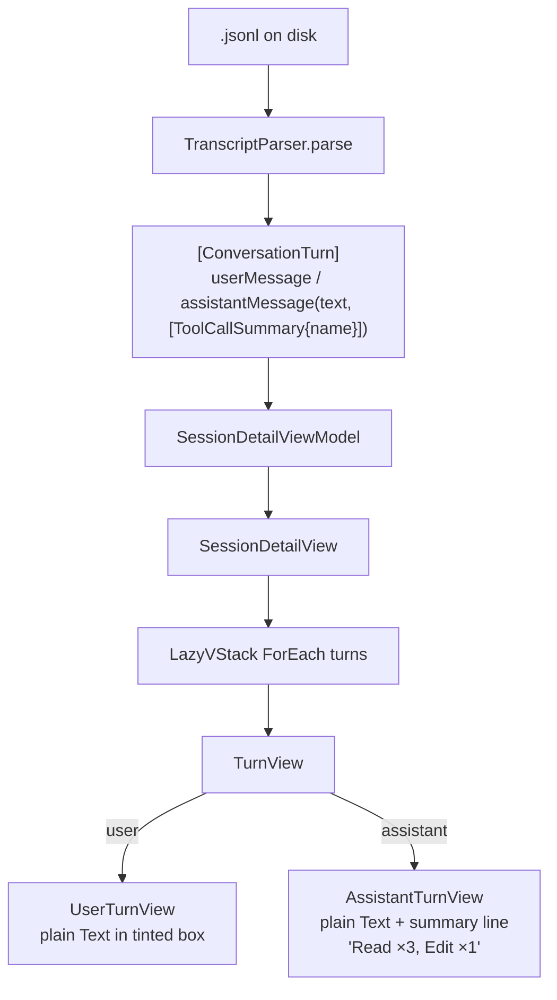
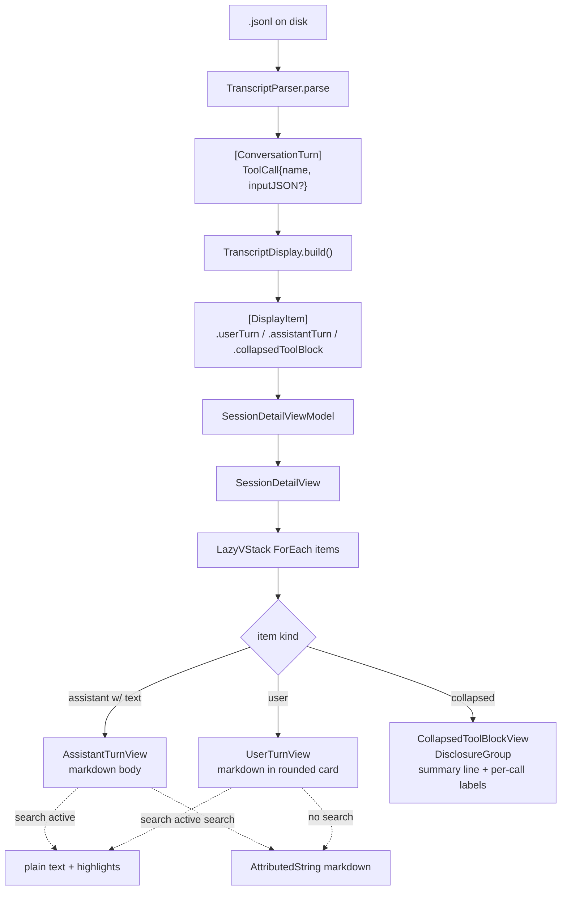

# Plan: Transcript Detail View Revamp

## Working Protocol
- Use parallel subagents for independent file edits when steps don't touch the same file.
- Mark steps done as you complete them — a fresh agent should be able to find where to resume.
- Use `make test` (timeout 30s) after each step before moving on. Run `make kill-build` if SwiftPM hangs.
- Test coverage: any new logic in `Sources/` must have tests. Run `swift test --enable-code-coverage` after the test step and confirm modified files stay above 60% line coverage.
- If blocked, document the blocker here before stopping.

## Overview
Revamp the session detail view's transcript rendering: render message bodies as markdown (built-in `AttributedString(markdown:)`), polish the user-prompt card, and collapse contiguous tool-call-only assistant turns into a single expandable block summarized as `"N tool calls, M messages, K subagents"`. Capture tool-call input args during parsing so the expanded block shows useful per-call labels (e.g. `Read /path/to/file.swift`) instead of bare tool names.

## User Experience

The flow when reading a session transcript:

1. Header (session name, dir, branch, tool) — unchanged.
2. **User prompt card.** A rounded card with subtle accent tint (today's color, `Color.accentColor.opacity(0.06)`) — same hue, just rounded corners and a slight horizontal inset so it reads as a distinct card. Contents render as markdown.
3. **Assistant text turns** that contain prose render inline with markdown formatting (bold, italic, inline code, links, headings rendered as bold). No background, just the existing `Claude` header label.
4. **Collapsed tool-work block.** Whenever there is a contiguous run of assistant turns that contain *no* prose (only tool calls), they collapse into one disclosure row:
   - Collapsed: a single line `> N tool calls, M messages[, K subagents]` in tertiary monospaced caption with a chevron. Subagent count is hidden when zero.
   - Expanded: an indented list of per-call labels, one per line, in chronological order. Each line: `Read /path/to/file.swift`, `Bash: git status`, `Task: Investigate the auth bug`, etc. No tool result content (out of scope for this pass).
5. **Search behavior.** While search is active, message bodies render as plain text with the existing highlighting (so existing search-range navigation keeps working). When no search query is active, bodies render as markdown. The toggle is per-render and invisible to the user.
6. Keyboard nav (`j/k/^f/^b/G/gg`) keeps working. The collapsed block is one focusable row; pressing Enter or Space (or clicking the chevron) toggles its expansion. Default state: collapsed.

## Architecture

### Current

The parser currently throws away `tool_use.input` and filters out `tool_result` blocks entirely. Rendering is plain monospaced text with no markdown and no per-call detail.

### Proposed

**Runtime walkthrough.** When a session is opened, `TranscriptParser.parse()` runs once on disk JSONL (no change to where/when this happens), now also serializing each tool call's `input` dict back to a JSON string and storing it on `ToolCall`. The parsed `[ConversationTurn]` is fed into a new pure function `TranscriptDisplay.build([ConversationTurn]) -> [DisplayItem]` that walks the array and folds contiguous assistant turns whose `text` is empty into `.collapsedToolBlock` items, computing aggregate counts (tool calls, messages, subagents-where-name-is-Task). All of this happens once on load and is held in memory on `SessionDetailViewModel`. The view layer renders directly from `[DisplayItem]` via a `LazyVStack`, so per-row work is minimal. Markdown parsing happens lazily inside each row's `body` (`AttributedString(markdown:)` is fast — single-message scope) and is skipped when `viewModel.isSearchActive` is true so the existing index-based highlighting can run on the raw string. Collapsed-block expansion is local view state — flipping it doesn't re-parse anything. State persists on disk only as the session DB row; expansion state is per-instance and resets when the detail view is reopened.

## Current State

Relevant files (all read-only context for the plan):

- `Sources/SeshctlCore/ConversationTurn.swift` — `ConversationTurn` enum, `ToolCallSummary { toolName }`, `toolCallSummary` computed string `"Read ×3, Edit ×1"`.
- `Sources/SeshctlCore/TranscriptParser.swift` — Claude + Codex JSONL parsers; `extractAssistantContent` discards `tool_use.input`; `extractUserText` filters out tool_result-only user messages.
- `Sources/SeshctlUI/TurnView.swift` — `UserTurnView`, `AssistantTurnView`, `TurnView` dispatcher, `highlightedText()` helper that builds an `AttributedString` from raw text with case-insensitive query highlights.
- `Sources/SeshctlUI/SessionDetailView.swift` — top-level view; LazyVStack + vim keybindings + scroll mgmt + search bar.
- `Sources/SeshctlUI/SessionDetailViewModel.swift` — loads transcript, owns search state and match navigation.
- `Sources/SeshctlUI/RoleColors.swift` — `Color.assistantPurple`.
- `Tests/SeshctlCoreTests/TranscriptParserTests.swift` — existing parser fixtures (~30 tests).
- `Tests/SeshctlUITests/SessionDetailViewModelTests.swift` — VM tests (~25 tests, including search nav).

No existing markdown infra, no `DisclosureGroup` usage anywhere, no shared card style. We add minimal new infra and reuse the existing `highlightedText()` for the search-active path.

## Proposed Changes

### Strategy

1. **Extend `ToolCallSummary`** with `inputJSON: String?` (raw serialized JSON of the tool's `input`). Add a non-stored `displayLabel: String` computed via a small switch over known tool names (Read/Write/Edit/Bash/Grep/Glob/Task/Skill/etc.) that pulls a single key out of the parsed JSON to make a one-line label, falling back to `"\(toolName)"` when shape is unknown.
2. **Update both parsers** (`extractAssistantContent` and the Codex `response_item.message`/`function_call`/`event_msg` paths) to capture `input` and serialize it.
3. **Add `TranscriptDisplay`** to `SeshctlCore` — a pure function that takes `[ConversationTurn]` and returns `[DisplayItem]` collapsing contiguous text-empty assistant turns into a single block. `DisplayItem` carries the source turns plus aggregate counts.
4. **Render markdown** via `AttributedString(markdown: …, options: AttributedString.MarkdownParsingOptions(allowsExtendedAttributes: false, interpretedSyntax: .inlineOnlyPreservingWhitespace, failurePolicy: .returnPartiallyParsedIfPossible))`. Wrap in a helper `markdownAttributed(_:) -> AttributedString` in a new `MarkdownText.swift` so it's testable and reusable.
5. **Refine `UserTurnView`** — keep `Color.accentColor.opacity(0.06)` background, wrap in `RoundedRectangle(cornerRadius: 8)`, add a small horizontal inset (~4pt) so it reads as a card rather than full-width banner. Markdown render in idle, plain in search-active.
6. **Add `CollapsedToolBlockView`** — `DisclosureGroup` with the summary line as label and a per-call list as content. Indented, monospaced caption, no background. State stored in local `@State var expanded = false`.
7. **Replace** `SessionDetailView`'s direct `ForEach(turns)` with `ForEach(displayItems)` and a small switch dispatching to `UserTurnView` / `AssistantTurnView` / `CollapsedToolBlockView`. Existing scroll-target IDs continue to use the underlying `ConversationTurn.id`s — for a collapsed block, the id is the first turn's id.
8. **Search interaction** — `viewModel.isSearchActive` already exists. Pass it down to the row views. When active, take the raw-text highlight path (current behavior). When inactive, render markdown.

### Complexity Assessment

**Medium.** ~5-7 files changed plus 2 new files (`TranscriptDisplay.swift`, `MarkdownText.swift`, `CollapsedToolBlockView.swift`). Touches a well-tested core type (`ToolCallSummary`) and the parser, so existing tests guard against regressions; the field added is `Optional` with a default so all current callers and fixtures keep working. Two tricky parts: (1) keeping search's index-based highlight ranges valid — solved by rendering plain text when search is active; (2) Codex's three different tool-call code paths all need the same input-capture treatment — easy but easy to miss one.

## Impact Analysis

- **New files**:
  - `Sources/SeshctlCore/TranscriptDisplay.swift` — collapse logic + `DisplayItem` enum
  - `Sources/SeshctlUI/MarkdownText.swift` — markdown helper + search-aware text view
  - `Sources/SeshctlUI/CollapsedToolBlockView.swift` — disclosure block view
  - `Tests/SeshctlCoreTests/TranscriptDisplayTests.swift`
  - `Tests/SeshctlUITests/MarkdownTextTests.swift` (helper tests; view rendering not unit-tested)

- **Modified files**:
  - `Sources/SeshctlCore/ConversationTurn.swift` — add `inputJSON: String?` to `ToolCallSummary`, add `displayLabel` computed
  - `Sources/SeshctlCore/TranscriptParser.swift` — capture `input` in 3 spots (Claude `extractAssistantContent`, Codex `tool_use`/`tool_call`, Codex `function_call`)
  - `Sources/SeshctlUI/TurnView.swift` — markdown rendering + rounded user card
  - `Sources/SeshctlUI/SessionDetailView.swift` — drive off `[DisplayItem]` instead of `[ConversationTurn]`
  - `Sources/SeshctlUI/SessionDetailViewModel.swift` — expose `displayItems: [DisplayItem]` derived from `turns`; preserve existing `turns` for search match math
  - `Tests/SeshctlCoreTests/TranscriptParserTests.swift` — assert input is captured for tool calls
  - `Tests/SeshctlUITests/SessionDetailViewModelTests.swift` — add coverage for `displayItems` derivation

- **Dependencies**: No new packages. `AttributedString(markdown:)` is in Foundation since macOS 12; the app already targets later.

- **Reuse / similar modules**:
  - Reuse existing `highlightedText()` for the search-active path.
  - Reuse existing `Color.accentColor.opacity(0.06)` and 16/10 padding pattern for the user card — just wrap with `RoundedRectangle`.
  - Reuse existing `SessionDetailViewModel.isSearchActive` to flip the markdown / plain-text path.
  - The existing `toolCallSummary` computed (`"Read ×3, Edit ×1"`) is no longer used by the assistant header, but keep it on `ConversationTurn` — it's covered by tests and may have other callers (verify before deleting).

## Key Decisions

- **Inputs only, not outputs.** Parser keeps filtering `tool_result` blocks. Expanded view shows what was *called*, not what came back. (User decision.)
- **Built-in markdown, not swift-markdown-ui.** Accept the inline-only limitation: bold, italic, inline code, links, and headings (rendered as inline bold) work; fenced code blocks render as-is with their backticks visible. Worth revisiting if users ask for richer code-block rendering. (User decision.)
- **Hybrid grouping**, not full between-prompts collapse. Assistant turns with prose stay visible inline; only contiguous tool-call-only turns fold. (User decision.)
- **Refine existing user-box style**, no new prominent dark card. Same accent tint, just rounded + inset. (User decision.)
- **`Task` is the subagent indicator.** Counts in the collapsed line only show "K subagents" when `K > 0` and `K` = number of tool calls with `toolName == "Task"`.

## Implementation Steps

### Step 1: Extend `ToolCallSummary` with input capture
- [x] In `Sources/SeshctlCore/ConversationTurn.swift`, add `public let inputJSON: String?` to `ToolCallSummary`, default-nil in initializer for back-compat.
- [x] Add `public var displayLabel: String { … }` switching on `toolName` for Read/Write/Edit/Bash/Grep/Glob/Task; for unknown tools fall back to bare `toolName`. Parse `inputJSON` lazily inside the switch with `JSONSerialization`.
- [x] Truncate any free-text fields in labels to ~80 chars with ellipsis.

### Step 2: Capture inputs in parsers
- [x] In `TranscriptParser.extractAssistantContent`, when a `tool_use` block is seen, serialize `block["input"]` (if present and a `[String: Any]`) to a JSON string via `JSONSerialization.data(withJSONObject:)`.
- [x] Mirror the change in Codex paths: `parseCodex`'s `tool_use`/`tool_call` block branch and `function_call` payload branch — both have an `input`/`arguments` field.
- [x] When serialization fails or input is absent, store `nil`.

### Step 3: Add `TranscriptDisplay` collapsing
- [x] Create `Sources/SeshctlCore/TranscriptDisplay.swift` with:
  - `public enum DisplayItem: Sendable, Equatable, Identifiable`
    - `.userTurn(ConversationTurn)`
    - `.assistantTurn(ConversationTurn)` — used when the turn has non-empty text
    - `.collapsedToolBlock(turns: [ConversationTurn], counts: BlockCounts)`
  - `public struct BlockCounts: Sendable, Equatable { toolCalls: Int; messages: Int; subagents: Int }`
  - `public static func build(_ turns: [ConversationTurn]) -> [DisplayItem]` — walks the input; user turns pass through; assistant turns with `!text.isEmpty` pass through as `.assistantTurn`; runs of assistant turns with `text.isEmpty && !toolCalls.isEmpty` fold into one `.collapsedToolBlock`.
  - `id`: for `.collapsedToolBlock`, derive from first turn's id with a `"block-"` prefix so it's distinguishable from a single-turn id.

### Step 4: Add markdown helper
- [x] Create `Sources/SeshctlUI/MarkdownText.swift` with a free function `markdownAttributed(_ text: String) -> AttributedString` using `.inlineOnlyPreservingWhitespace`, `.returnPartiallyParsedIfPossible`. On parse failure, return `AttributedString(text)`.
- [x] Add a small wrapper view `MessageBodyText(text:, isSearchActive:, query:, currentMatchRange:)` that picks markdown vs. existing `highlightedText` path. Keep `.font(.system(.body, design: .monospaced))` and `.textSelection(.enabled)` outside the helper so callers control styling.

### Step 5: Refine `UserTurnView` + add `CollapsedToolBlockView`
- [x] In `Sources/SeshctlUI/TurnView.swift`, change `UserTurnView` background to `RoundedRectangle(cornerRadius: 8).fill(Color.accentColor.opacity(0.06))`, add `.padding(.horizontal, 4)` outside the existing 16/10 inner padding so the card insets slightly from the panel edges. Switch its body text to `MessageBodyText`.
- [x] In `AssistantTurnView`, drop the now-unused `toolCallSummary` line (collapsing handles it elsewhere). Switch body to `MessageBodyText`. Header label stays.
- [x] Create `Sources/SeshctlUI/CollapsedToolBlockView.swift` with a `DisclosureGroup` whose label is the summary line (`"\(N) tool calls, \(M) messages[, \(K) subagents]"`, monospaced caption, tertiary) and whose content is a `VStack` of `Text(call.displayLabel)` rows for each tool call across all grouped turns, indented and tertiary-styled. Default `@State var expanded = false`.

### Step 6: Wire `SessionDetailViewModel` + `SessionDetailView` to `[DisplayItem]`
- [x] In `SessionDetailViewModel`, add `var displayItems: [DisplayItem]` derived from `turns` after parsing (rebuild whenever `turns` is reassigned).
- [x] Keep `turns` and search-match logic as-is — search still walks `turns` so match ranges stay correct.
- [x] In `SessionDetailView`, replace the `ForEach(viewModel.turns)` with `ForEach(viewModel.displayItems)`; switch dispatch to the three views.
- [x] When a search match's containing turn is inside a `.collapsedToolBlock`, decide the expand-on-match behavior: simplest first pass is to **not** auto-expand — search hits in collapsed tool labels are a non-goal for v1 since labels carry only call metadata. Document this in the test plan.

### Step 7: Write Tests
- [ ] `Tests/SeshctlCoreTests/TranscriptParserTests.swift` — add cases: tool_use with simple `input` round-trips into `inputJSON`; tool_use with no `input` yields `inputJSON == nil`; Codex `function_call` payload preserves `arguments`/`input`.
- [ ] New `Tests/SeshctlCoreTests/TranscriptDisplayTests.swift` — cases:
  - User turns pass through unchanged
  - Single text-bearing assistant turn → `.assistantTurn`
  - Two contiguous text-empty assistant turns → one `.collapsedToolBlock` with `messages == 2`
  - Mixed sequence: user → tool-only → tool-only → text → user — yields `[user, block(2), text, user]`
  - `BlockCounts.subagents` counts only `Task`-named tool calls
  - `displayLabel` per known tool: Read/Write/Edit get path, Bash gets command preview, Task gets description, unknown tool falls back to name
- [ ] New `Tests/SeshctlUITests/MarkdownTextTests.swift` — `markdownAttributed` parses bold/italic/inline-code/link; on malformed input falls back to plain `AttributedString(text)`.
- [ ] `Tests/SeshctlUITests/SessionDetailViewModelTests.swift` — add: `displayItems` is rebuilt when `turns` is set; preserves user/assistant ordering; collapses correctly across an end-to-end fixture.
- [ ] Run `swift test --enable-code-coverage` and confirm `TranscriptParser.swift`, `TranscriptDisplay.swift`, `ConversationTurn.swift`, `MarkdownText.swift` all sit ≥60%.

## Acceptance Criteria
- [ ] [test] `TranscriptParser` captures tool input JSON for both Claude and Codex `tool_use`/`function_call` paths
- [ ] [test] `ToolCallSummary.displayLabel` returns sensible labels for Read, Write, Edit, Bash, Grep, Glob, Task; unknown tools fall back to bare name
- [ ] [test] `TranscriptDisplay.build` collapses contiguous text-empty assistant turns into one block; text-bearing turns remain individual; user turns pass through
- [ ] [test] `BlockCounts` totals tool calls, message count, and Task-only subagent count correctly
- [ ] [test] `markdownAttributed` parses inline markdown and returns plain `AttributedString` on malformed input
- [ ] [test] `SessionDetailViewModel.displayItems` rebuilds when turns change and stays in sync with `turns`
- [ ] [test-manual] Open a real session in the app: user prompts render in a rounded accent-tinted card with markdown formatting visible (bold/italic where used)
- [ ] [test-manual] Collapsed tool block shows correct counts and expands to show per-call labels (`Read /path`, `Bash: …`, `Task: …`)
- [ ] [test-manual] Activating search switches body text to plain monospaced with existing yellow/orange highlights, and `n`/`N` navigation still jumps between matches
- [ ] [test-manual] Vim keybindings (`j/k/^f/^b/G/gg`) keep working with the new mixed-row layout

## Edge Cases
- **A user turn between two tool-only assistant turns** — turns don't fold across user turns. Each tool-only run is its own block.
- **Single tool-only assistant turn surrounded by text-bearing turns** — still wraps in a `.collapsedToolBlock` (one-element block) for visual consistency with multi-turn blocks; counts read `1 tool call, 1 message`.
- **Tool call with no `input` field** (rare) — `displayLabel` returns the bare tool name.
- **Markdown that contains characters that look like syntax but aren't intended** (e.g. `*` in a sentence) — `AttributedString(markdown:)` is conservative; on parse failure we fall back to plain text. Verified in tests.
- **Search query inside a collapsed tool label** — out of scope for v1: matches are computed on the underlying `turns`, which include tool_use contents only as JSON we no longer expose. If a user searches for a tool name, the existing match logic still finds it in the assistant message text where applicable; collapsed labels themselves are not searched.
- **Very long sessions** — `LazyVStack` already lazily renders rows; markdown parsing is per-row body so off-screen rows don't pay the cost.
