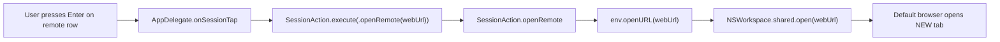
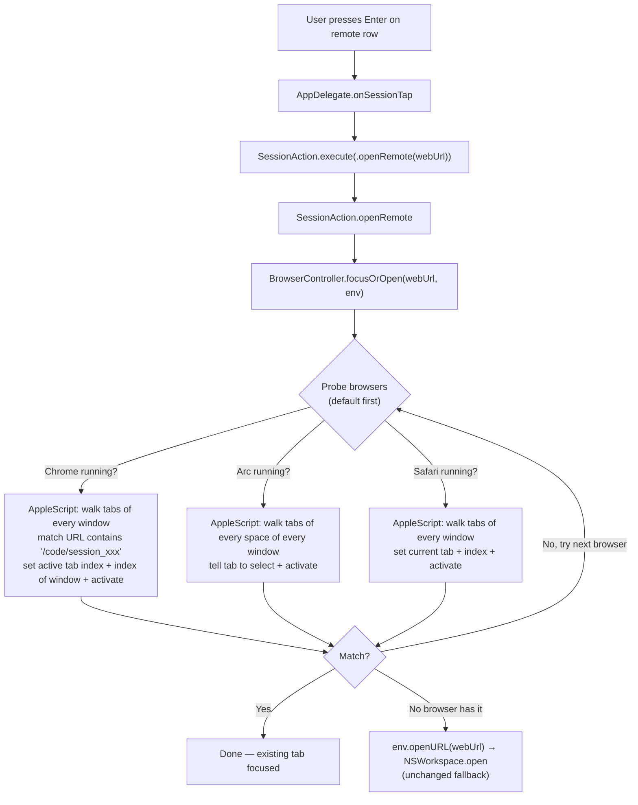

# Plan: Focus existing browser tab for remote Claude sessions

## Context

Today, when the user activates a row for a remote Claude session (a `claude.ai/code/session_<id>` session) in seshctl, `SessionAction.openRemote` calls `env.openURL(webUrl)` → `NSWorkspace.shared.open(webUrl)`. macOS hands the URL to the default browser, which **always opens a new tab** even if the user already has that very session open in another tab. The result is duplicate tabs and a workflow that doesn't match how Enter behaves for local terminal sessions (which focuses the existing window/tab via AppleScript).

The user asked whether a Chrome extension could solve this. After investigation, **a Chrome extension is not necessary** — Chrome, Arc, and Safari all expose enough AppleScript to iterate tabs, read each tab's URL, and focus a specific tab + raise its window. This mirrors the existing AppleScript focus pattern seshctl already uses for Terminal.app, iTerm2, and Ghostty.

This plan: implement a small `BrowserController` that, given a remote session's `webUrl`, probes running browsers in order, focuses the matching tab if one exists, and falls back to today's `NSWorkspace.open` behavior otherwise.

## Key Decisions (from clarification)

- **Approach: AppleScript only.** No Chrome extension, no native messaging host. Mirror seshctl's existing Pattern 1 (AppleScript focus).
- **Fallback when no tab matches: open in the default browser** via `NSWorkspace.open` (today's behavior). This preserves the user's choice of default when no anchor exists.
- **v1 browsers: Chrome, Arc, Safari.** Three distinct AppleScript codepaths because Arc walks `spaces` and uses `select`, Safari uses `current tab`, Chrome uses `active tab index`. Other Chromium browsers (Brave, Edge) are deferred — they would share Chrome's dictionary but each needs a separate bundle ID + AppleScript trust.

## Working Protocol

- Use parallel subagents for independent tasks (reading, searching, implementing across files)
- Mark steps done as you complete them — a fresh agent should be able to find where to resume
- Run tests after each step before moving on (`make test` or targeted `swift test --filter BrowserControllerTests`); use the 30s test timeout from `AGENTS.md`
- If blocked on Arc-specific scripting (Little Arc, spaces), document the gap inline and continue with Chrome + Safari rather than holding the whole feature

## User Experience

1. User opens seshctl, sees a remote session row in the list (e.g. "agent build experiment" hosted at `https://claude.ai/code/session_abc123…`).
2. User presses Enter (or clicks the row).
3. seshctl checks running browsers in order — default browser first, then the others.
   - For each running browser, run a fast AppleScript that walks all tabs and matches the session's `cse_<UUID>` against the tab URL.
   - First match wins: that tab becomes active, its window is raised, the browser activates.
4. If no running browser has the tab open, seshctl hands the URL to `NSWorkspace.open` (current behavior), which opens a new tab in the default browser.
5. The seshctl panel dismisses regardless (matches today's behavior).

No new UI surface, no settings, no buttons — Enter just gets smarter.

## Architecture

### Current

`webUrl` is computed at `Sources/SeshctlCore/RemoteClaudeCodeSession.swift:51-54` as
`https://claude.ai/code/session_<id-without-cse-prefix>`. There is no browser-side awareness — macOS just gets a URL.

### Proposed

Runtime characteristics:
- **In memory**: only the `URL` (or its session-id substring) is held while the AppleScript runs.
- **No disk persistence**: nothing is written or read from the seshctl DB. No tab→session mapping cache.
- **Network**: none.
- **Cost**: each AppleScript invocation is ~50–200 ms (one `osascript` exec per browser, terminating on first match within that browser). With three browsers we cap probing at three sequential AppleScripts in the worst case where none match. We short-circuit on the first hit.
- **Browser launching**: scripts use `if application "X" is running then tell application "X"…` so probing never launches a quiescent browser. We only AppleScript browsers that are already running (per `NSRunningApplication.runningApplications(withBundleIdentifier:)`).
- **Permissions**: macOS will prompt the user once per (seshctl ↔ each browser) for Automation/AppleEvents access via TCC. This is the same prompt model used today for Terminal/iTerm2/Ghostty.

### Matching strategy

The `webUrl` for a remote session is `https://claude.ai/code/session_<UUID>`. Tabs may have query strings, fragments, or post-redirect paths, so match on the substring `/code/session_<UUID>` rather than full URL equality. The UUID portion is sufficiently unique that substring matching is safe.

## Current State

Files relevant to this change:

- `Sources/SeshctlUI/SessionAction.swift:167-175` — `openRemote(URL)` is the dispatch point. Currently a 3-line method that dismisses the panel and calls `env.openURL`.
- `Sources/SeshctlUI/TerminalController.swift` — established pattern for AppleScript focus. Specifically:
  - `escapeForAppleScript(_ s: String) -> String` — security helper that must be reused for any URL/string interpolated into AppleScript.
  - `buildFocusScript(...)` and `runOSAScript(...)` — patterns for building scripts and invoking `osascript`.
  - The `if not running` guard pattern used by Ghostty / Warp scripts.
- `Sources/SeshctlCore/TerminalApp.swift` — registry pattern for app metadata (bundle ID, display name, capabilities). Browsers don't fit here (they aren't terminals), so a parallel registry is warranted.
- `Sources/SeshctlCore/RemoteClaudeCodeSession.swift:51-54` — `webUrl` definition; the source of truth for what we're matching.
- `Sources/SeshctlApp/AppDelegate.swift:456` — `target = .openRemote(remote.webUrl)` is the call site that produces the action target. No change here.
- `Tests/SeshctlUITests/TerminalControllerTests.swift:548-631` — template for AppleScript-generation tests (string assertions, escaping checks).
- `README.md` "Compatibility" table — must be updated per `AGENTS.md` rules when adding browser/tool support.

## Proposed Changes

Add a `BrowserController` that owns browser-tab focusing, paired with a `BrowserApp` registry that mirrors `TerminalApp`. Wire it into `SessionAction.openRemote` so Enter on a remote row tries focus before falling back to `NSWorkspace.open`.

Why this shape:
- **Parallel `BrowserApp` enum** (rather than adding browser cases to `TerminalApp`): browsers aren't terminals — they don't host shell sessions and don't support most TerminalApp capabilities. Folding them in would add capability flags (`supportsBrowserTabFocus`) that no terminal would ever satisfy. A separate enum keeps each registry tight and exhaustive.
- **`BrowserController` in `SeshctlUI/`** alongside `TerminalController`: same layer (UI-side macOS automation), same execution-environment dependency, same `osascript` invocation pattern.
- **Reuse `TerminalController.escapeForAppleScript`** rather than duplicating: it's a security primitive, must not fork. (Project rule from `AGENTS.md`.) If access scoping is awkward, lift it to a small `AppleScriptEscaping` utility shared by both controllers.

### Complexity Assessment

**Medium.** Concretely:
- 1 new core file (`BrowserApp.swift`, ~40 lines)
- 1 new UI file (`BrowserController.swift`, ~200 lines — three AppleScript builders + dispatcher + fallback)
- 1 modified UI file (`SessionAction.swift`, ~5 line diff in `openRemote`)
- 1 maybe-modified file (`TerminalController.swift`, only if we lift `escapeForAppleScript` to a shared util)
- 1 new test file (`BrowserControllerTests.swift`)
- README compatibility table update

The pattern is well-established (mirrors existing AppleScript focus for terminals). Risk is concentrated in the three AppleScript bodies — Arc in particular has documented edge cases (Little Arc popovers, archived spaces) that can't be fully exercised in unit tests and need a manual smoke. No regression risk to local-session focus paths because `BrowserController` is reached only via the existing `.openRemote` action target.

## Impact Analysis

- **New Files**:
  - `Sources/SeshctlCore/BrowserApp.swift` — enum with `chrome / arc / safari` cases. Properties: `bundleId`, `displayName`. (Optionally `applicationName` for AppleScript `tell application "<name>"` if bundle-ID-based `tell application id "<id>"` doesn't suffice.)
  - `Sources/SeshctlUI/BrowserController.swift` — `focusOrOpen(url:env:)` entry point + per-browser `buildFocusScript(BrowserApp, sessionMatcher: String)` + dispatcher that probes running browsers.
  - `Tests/SeshctlUITests/BrowserControllerTests.swift` — AppleScript-generation tests + dispatch tests with a mocked env.
- **Modified Files**:
  - `Sources/SeshctlUI/SessionAction.swift` — `openRemote` swaps `env.openURL(url)` for `BrowserController.focusOrOpen(url:env:)`. The fallback inside `BrowserController` calls `env.openURL`, preserving current behavior.
  - `Sources/SeshctlUI/TerminalController.swift` — only if we lift `escapeForAppleScript` to a shared helper. Otherwise unchanged.
  - `README.md` — add a Browsers row/section to the Compatibility tables (per `AGENTS.md` instruction to keep them current).
- **Dependencies**:
  - Relies on macOS AppleScript / AppleEvents (already a project-wide dependency).
  - Relies on `NSRunningApplication.runningApplications(withBundleIdentifier:)` for the running-check.
  - First-run TCC prompts for each browser (one-time per browser, per machine).
- **Similar Modules to Reuse**:
  - `TerminalController.escapeForAppleScript` — REUSE. Don't duplicate.
  - `TerminalController.runOSAScript` (or its equivalent) — pattern to emulate; consider lifting if the implementation is reusable verbatim.
  - The "if running then tell" guard pattern from existing Warp/Ghostty scripts.

## Implementation Steps

### Step 1: Add `BrowserApp` registry
- [x] Create `Sources/SeshctlCore/BrowserApp.swift` with enum cases `chrome`, `arc`, `safari`
- [x] Properties: `bundleId` (`com.google.Chrome`, `company.thebrowser.Browser`, `com.apple.Safari`), `displayName`, `applicationName` (used by `tell application "<name>"`)
- [x] `static var allCases: [BrowserApp]` already provided by `CaseIterable`
- [x] Add a static helper `BrowserApp.defaultBrowser() -> BrowserApp?` that uses `LSCopyDefaultApplicationURLForURL` (or `NSWorkspace.urlForApplication(toOpen:)`) on `https://claude.ai/` and matches the bundle ID. Returns `nil` if the default isn't one of our supported browsers.

### Step 2: Lift `escapeForAppleScript` to a shared helper (only if needed)
- [x] Decide: keep as `TerminalController.escapeForAppleScript` (internal) or extract to `Sources/SeshctlUI/AppleScriptEscaping.swift` so `BrowserController` can use it without breaking encapsulation
- [ ] If lifted: update `TerminalController` to call the new helper; ensure all existing tests still pass
- _Decision: skipped the lift. `BrowserController` and `TerminalController` live in the same `SeshctlUI` module, so `BrowserController` calls `TerminalController.escapeForAppleScript` directly via internal access. No churn needed._

### Step 3: Implement `BrowserController`
- [x] Create `Sources/SeshctlUI/BrowserController.swift`
- [x] Public API: `static func focusOrOpen(url: URL, env: ExecutionEnvironment)` — fire-and-forget, no return value
- [x] Internal: `static func tryFocusInBrowser(_ app: BrowserApp, matcher: String, env: ExecutionEnvironment) -> Bool` — runs AppleScript, returns whether a tab was focused
- [x] Internal: `static func buildFocusScript(for: BrowserApp, matcher: String) -> String` — produces the per-browser AppleScript using escaped matcher
- [x] Internal: `static func deriveMatcher(from url: URL) -> String` — extracts `/code/session_<UUID>` substring from the input URL (handle missing suffix by falling back to `url.path`)
- [x] Probe order in `focusOrOpen`:
  1. Default browser (if it's one of `BrowserApp.allCases`) and currently running
  2. Remaining `BrowserApp.allCases` that are currently running
  3. If no match anywhere, call `env.openURL(url)` for the existing NSWorkspace fallback
- [x] Use `NSRunningApplication.runningApplications(withBundleIdentifier: app.bundleId)` to skip non-running browsers without invoking AppleScript
- [x] Each AppleScript wraps body in `if application "<name>" is running then tell application "<name>" … end tell`. Return `"found"` or empty; treat empty stdout as "not found"
- [x] All matcher strings must go through the AppleScript escape helper

### Step 4: AppleScript bodies (per browser)
- [x] **Chrome**: `repeat with w from 1 to count of windows / repeat with i from 1 to count of tabs of window w / if URL of tab i of window w contains <matcher> then set active tab index of window w to i / set index of window w to 1 / activate / return "found"`
- [x] **Arc**: walk `tabs of every space of every window`; on match, `tell theTab to select`, then `set index of window w to 1` (if writable; otherwise rely on `select` + `activate`); `activate`; `return "found"`. Test against Little Arc popovers and archived spaces during smoke
- [x] **Safari**: walk `tabs of every window`; on match, `set current tab of window w to theTab / set index of window w to 1 / activate / return "found"`
- [ ] Confirm each script returns quickly (<200 ms) on a window with ~30 tabs during smoke test

### Step 5: Wire into `SessionAction`
- [x] In `Sources/SeshctlUI/SessionAction.swift:167-175`, replace `env.openURL(url)` in `openRemote` with `BrowserController.focusOrOpen(url: url, env: env)`
- [x] Keep `dismiss()` ordering and the mark-read FIXME unchanged
- [x] Verify the existing `openRemote` callsite in `AppDelegate.swift:456` is unchanged (it just builds the action target)

### Step 6: Tests
- [x] Create `Tests/SeshctlUITests/BrowserControllerTests.swift`
- [x] Test: `deriveMatcher` extracts `/code/session_<UUID>` from a typical `webUrl`
- [x] Test: `deriveMatcher` falls back gracefully for a URL without the canonical suffix
- [x] Test: `buildFocusScript(for: .chrome, matcher:)` contains expected Chrome-specific commands (`active tab index`, `set index of window`, `activate`) and the matcher is properly escaped (try a malicious matcher with `"` and backslash to confirm escaping)
- [x] Test: same for `.arc` (must contain `spaces`, `select`)
- [x] Test: same for `.safari` (must contain `current tab`)
- [x] Test: `focusOrOpen` with no browsers running → ends in `env.openURL` call (mock env, assert `openURL` was invoked)
- [x] Test: `focusOrOpen` with a stubbed running-browser + AppleScript-success path → does NOT call `env.openURL`
- [x] Test: probe order — default browser is queried first; non-running browsers are skipped (mock running-app set)

### Step 7: Docs & compatibility table
- [ ] Update `README.md` Compatibility tables to list Chrome / Arc / Safari support for "focus existing remote-session tab"
- [ ] Add a short paragraph to `AGENTS.md` (project) under "Adding Terminal App Support" or in a new "Browsers" section explaining that browsers go through `BrowserController`, NOT `TerminalController`, and that all browser bundle IDs / display names live in `BrowserApp`

### Step 8: Manual smoke
- [ ] Run `make install`. Open one remote session in Chrome. Open another in Arc. Open a third in Safari.
- [ ] In seshctl, press Enter on each remote row. Confirm the existing tab is focused (no new tabs created)
- [ ] Press Enter on a remote row whose tab is closed. Confirm fallback opens a new tab in the default browser
- [ ] First-run: confirm macOS TCC prompts appear and seshctl recovers gracefully on user-deny (falls back to NSWorkspace.open)
- [ ] Arc-specific: test with one tab in an archived space and one in Little Arc; document any failures and decide whether to handle in v1

## Acceptance Criteria

- [ ] [test] Pressing Enter on a remote row whose `webUrl` matches a tab in a running supported browser activates that tab and raises its window (verified via mocked env + asserting on AppleScript output script string + return value)
- [ ] [test] When no running browser has the tab, `BrowserController.focusOrOpen` falls back to `env.openURL` (verified via mocked env)
- [ ] [test] Probe order respects default-browser-first; non-running browsers are skipped
- [ ] [test] Matcher strings are escaped before interpolation into AppleScript (negative test with quote/backslash)
- [ ] [test] `BrowserApp.defaultBrowser()` returns the correct case for known bundle IDs and `nil` for unknown
- [ ] [test-manual] Chrome: existing tab focuses, no duplicate created (smoke)
- [ ] [test-manual] Arc: existing tab focuses across normal windows + spaces (smoke)
- [ ] [test-manual] Safari: existing tab focuses (smoke)
- [ ] [test-manual] First-run TCC denial path: user denies Automation prompt → seshctl still opens the URL via NSWorkspace fallback, no crash
- [ ] [test-manual] README compatibility tables list Chrome / Arc / Safari with current support status

## Edge Cases

- **Multiple tabs match (e.g., user opened the same session twice)**: focus the first match; do not close the duplicate. Acceptable for v1.
- **Tab is in a different window than the frontmost window of that browser**: handled by `set index of window w to 1` (Chrome/Safari) and `select` + `activate` (Arc).
- **Tab is in a hidden/minimized window**: AppleScript's `set index of window` should un-minimize on activation; verify in smoke.
- **Browser is running but has zero windows** (e.g., Chrome menu-bar-only state): script returns no match, we fall through to next browser — fine.
- **Default browser is not one of our supported three** (e.g., user defaults to Brave): `defaultBrowser()` returns `nil`, we just probe Chrome/Arc/Safari in their declared order, and the fallback `NSWorkspace.open` still uses the system default. No regression.
- **`webUrl` constructed from a malformed `id`** (not `cse_<UUID>`): `deriveMatcher` falls back to `url.path`. Worst case: no tab matches → fallback opens a new tab. No crash.
- **Arc's Little Arc popover windows / archived spaces**: known dictionary edge cases. May not be reachable in v1; smoke-test and document in README compatibility section if any case is broken.
- **AppleScript / TCC permission denied**: `osascript` returns nonzero exit; we treat that the same as "not found" and fall through. User sees the tab open in default browser as before.
