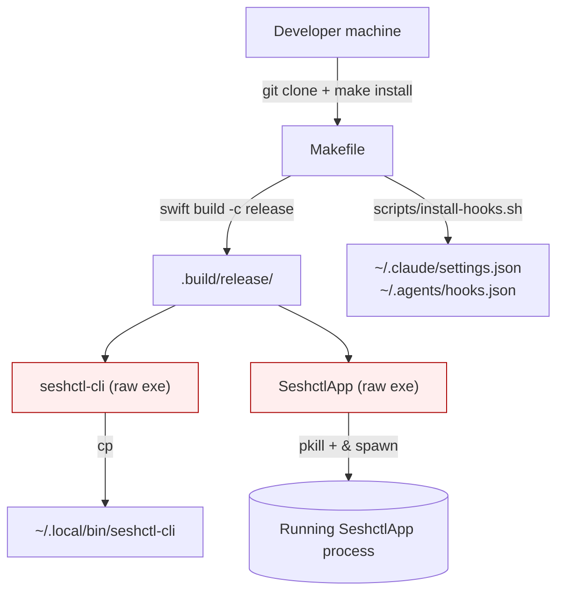
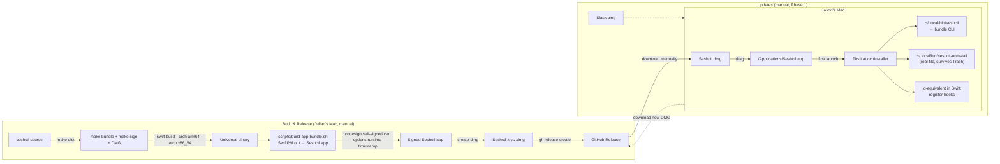
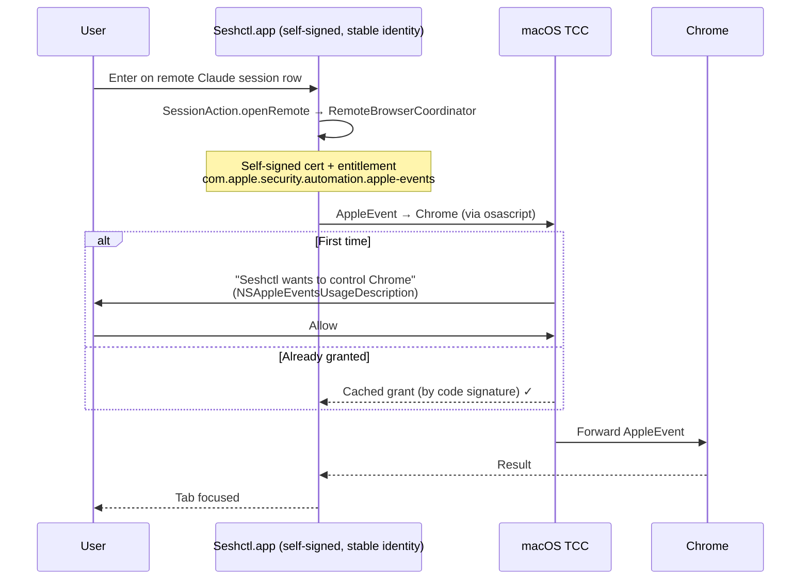

# Plan: Turn Seshctl Into a Real Distributable macOS App (Phase 1)

## Context

Two motivations are converging on the same answer:

1. **Jason wants easier ingestion of updates.** Today the only install path is `git clone && make install`, which requires a Swift toolchain. He should be able to download a `.dmg`, drag it to `/Applications`, and run it — no toolchain, no source, no `make`.

2. **The TCC perf concession from PR #33.** The remote-browser-tab focus flow uses `osascript` and pays both subprocess overhead (~50–100 ms per call) and re-prompts on TCC permission across rebuilds. The PR explicitly tried in-process `NSAppleScript` and reverted. The root cause is that seshctl today is built and run as an unsigned raw executable with an unstable signing identity — TCC can't cache grants reliably across `make install` invocations because the binary's code signature changes each rebuild.

A signed `.app` bundle with a stable code-signing identity solves both: TCC caches Automation grants permanently per (app, target-app), and Jason gets a normal "drag to /Applications" install experience.

### Why this plan is scoped to "Phase 1" only

The original draft of this plan included Sparkle 2 auto-updates and a GitHub Actions release pipeline. We're deferring those to **Phase 2** and **Phase 3** for risk-management reasons:

- **Phase 1 alone delivers both motivating wins.** Jason gets a `.dmg` he can install (vs. a Swift toolchain). The TCC perf concession is fixed by signing alone — Sparkle isn't needed for that.
- **Sparkle, EdDSA keys, gh-pages, appcast.xml, and CI on macOS runners are all unfamiliar territory.** Bundling them with the bundle-and-signing work makes the ship-to-Jason critical path much riskier.
- **Manual updates work fine for Jason.** New version → Slack message → he downloads the new DMG. No auto-update is a small UX cost; it's much better than the status quo (`git pull && make install`).
- **Phase 2 (Sparkle) and Phase 3 (CI) become small focused plans later** once Phase 1 is validated and we know exactly what we're automating.

We're also choosing **self-signed (Stage 1A) → Developer ID (Stage 1B)** instead of enrolling in Apple Developer ($99/yr) up front. Self-signing already gets us TCC persistence; notarization is a small layer on top once enrolled. Stage 1B is out of scope for this plan but described briefly in Future Phases.

### Roadmap at a glance

> **Phase 1 (this plan)** → bundle + self-sign + first-launch installer + manual `make dist` releases
> **Phase 1B** → enroll in Apple Developer Program, swap to Developer ID + notarytool
> **Phase 2** → Sparkle 2 auto-updates over GitHub Releases / Pages
> **Phase 3** → GitHub Actions release pipeline (only if release cadence justifies it)

Phases 1B / 2 / 3 are spelled out in detail at the end of this document under "Future Phases". As part of Phase 1 we will also:
- Add a "Roadmap" subsection to `README.md` so these deferred phases are visible to anyone reading the repo (not just buried in this plan file).
- File a Linear ticket for each of Phase 1B, Phase 2, Phase 3 so they appear in our backlog rather than only in markdown.

## Working Protocol
- Use parallel subagents for independent work (writing the bundle assembly script, porting hook installer to Swift, drafting the standalone uninstaller, writing tests).
- Mark steps done as you complete them — a fresh agent should be able to find where to resume.
- Run `swift build` (timeout 120s) and `swift test` (timeout 30s) after each step before moving on. If anything hangs, run `make kill-build`.
- All `linearis` calls go through subagents (per AGENTS.md).
- All branches prefixed with `julo/`.
- If blocked, document the blocker here before stopping.

## Overview

Convert seshctl from a SwiftPM-built pair of raw executables into a properly bundled, self-signed macOS `.app` with the CLI inside it, hardened runtime + `NSAppleEventsUsageDescription` for persistent TCC grants, and a first-launch installer that wires the CLI symlink and Claude/Codex hooks. Add a `make dist` target that produces a signed DMG locally; releases are pushed manually via `gh release create`. Keep the existing `make install` working unchanged for dev iteration.

## User Experience

### Jason (the target user) — first install

1. Goes to `https://github.com/julo15/seshctl/releases/latest`, downloads `Seshctl.dmg`.
2. Opens the DMG, drags `Seshctl.app` to `/Applications`.
3. Double-clicks. Because we're self-signed (Stage 1A), Gatekeeper shows "cannot verify developer." He right-clicks → Open. README has a one-line note explaining this.
4. App launches with a one-screen welcome panel: "Set up seshctl on this Mac?" with a single **Install** button and a checklist of what will happen:
   - Symlink `~/.local/bin/seshctl` → app's bundled CLI
   - Drop a standalone `~/.local/bin/seshctl-uninstall` cleanup script (bundle-independent)
   - Register Claude Code hooks in `~/.claude/settings.json`
   - Register Codex hooks in `~/.agents/hooks.json` (sets `codex_hooks = true` in `~/.agents/config.toml`)
5. He clicks **Install**. The app does the work, shows ✅ for each line, and reveals the standard floating panel.
6. On first session focus to a browser/terminal, macOS shows the standard "Seshctl wants to control Chrome" prompt with the message from `NSAppleEventsUsageDescription`. He clicks Allow. **This grant persists permanently** because the self-signed cert produces a stable code signature.

### Jason — updates

1. Julian Slacks Jason: "new seshctl release, grab it from `github.com/julo15/seshctl/releases`."
2. Jason downloads the new DMG, drags to `/Applications`, replaces the existing `Seshctl.app`. macOS keeps the TCC grants (same code signature). Hooks already point at the symlink, which the new bundle re-targets on first launch (idempotent).
3. Done. No re-prompts, no re-install of hooks (idempotent installer detects existing state and updates it).

This is the manual-update story for Phase 1. Phase 2 will replace the Slack ping + manual download with Sparkle's silent background updates.

### Uninstall flow

Three ways out, all idempotent:

**Path A — clean (recommended):** From the app menu, "Uninstall Seshctl" (or run `seshctl uninstall` in a terminal). Removes the CLI symlink, both hook configs' seshctl entries, the standalone uninstaller, `~/.local/share/seshctl/`, the marker file. Then drags itself to Trash (or asks the user to).

**Path B — bundle deleted but uninstaller survived:** User drags `Seshctl.app` to Trash without running uninstall first. Then runs `seshctl-uninstall` in a terminal (the standalone copy in `~/.local/bin/` survives because it's a real file, not a symlink into the bundle). Same cleanup as path A.

**Path C — drag-to-trash and forget (defensive fallback):** User does nothing. Hook scripts in `~/.local/share/seshctl/hooks/` are defensive: each one checks `command -v seshctl` and exits 0 if not found. After 5 consecutive misses, hooks self-clean (remove their own entries from `settings.json` / `hooks.json` and delete `~/.local/share/seshctl/`).

### Developer (Julian)

- `make install` — unchanged. Fast unsigned dev iteration: raw exe in `.build/release/`, dropped in `~/.local/bin/`, app launched with `&`. Same as today.
- `make bundle` (new) — assembles `dist/Seshctl.app` from SwiftPM build output. No signing.
- `make sign` (new) — signs `dist/Seshctl.app` with the self-signed cert.
- `make dist` (new) — `bundle` + `sign` + DMG creation via `create-dmg`. Output: `dist/Seshctl-<version>.dmg`.
- Release: `gh release create v0.1.0 dist/Seshctl-0.1.0.dmg --notes-file CHANGELOG.md` — one command from your Mac.

## Architecture

### Current



Today's pain points: no bundle, no Info.plist, no code signature, no LaunchAgent, no update channel. Each rebuild produces a fresh ad-hoc signature, so TCC grants don't persist.

### Proposed (Phase 1)



### Runtime data flow when Jason clicks a remote session (the TCC win)



The grant persists across:
- App restarts (same code sig)
- Re-installs of the same DMG
- Reboots
- New DMG installs (as long as Julian uses the same self-signed cert across builds)

The grant is invalidated only if the signing identity changes — i.e. Stage 1A → Stage 1B (Developer ID) will trigger a one-time re-prompt per browser/terminal.

### What's in memory vs. on disk

| Where | What |
|---|---|
| `/Applications/Seshctl.app` | The full bundle: CLI binary, GUI binary, Info.plist, entitlements |
| `~/.local/bin/seshctl` | Symlink → `/Applications/Seshctl.app/Contents/MacOS/seshctl-cli` |
| `~/.local/bin/seshctl-uninstall` | Real file (not symlink) — standalone cleanup script |
| `~/.local/share/seshctl/seshctl.db` | Existing SQLite DB (unchanged) |
| `~/.local/share/seshctl/hooks/` | Hook shell scripts with defensive `command -v` guards |
| `~/.claude/settings.json`, `~/.agents/hooks.json` | Hook registrations pointing at `seshctl` (the symlink) |
| `~/Library/Application Support/Seshctl/installed-v1.json` | Marker file (bundle path, version, timestamp) |
| TCC database | Per-target Automation grants, keyed by Seshctl's code signature |

## Current State

Key files (verified during exploration):

- `/Users/julianlo/Documents/me/seshctl/Package.swift` — SwiftPM products: `seshctl-cli` and `SeshctlApp` executables, `SeshctlCore` and `SeshctlUI` libraries.
- `/Users/julianlo/Documents/me/seshctl/Makefile` — install/uninstall targets at lines 65-119; no signing or bundle assembly.
- `/Users/julianlo/Documents/me/seshctl/scripts/install-hooks.sh` — bash + `jq` script that upserts hook entries into `~/.claude/settings.json` and `~/.agents/hooks.json`. Wraps `scripts/install-codex-hooks.sh`.
- `/Users/julianlo/Documents/me/seshctl/Sources/SeshctlApp/AppDelegate.swift` — `applicationDidFinishLaunching` sets `.accessory` activation policy, opens DB, registers `Cmd+Shift+S` global hotkey, shows floating panel.
- `/Users/julianlo/Documents/me/seshctl/Sources/seshctl-cli/SeshctlCLI.swift` — has `Install` and `Uninstall` subcommands already (good — we'll reuse the install logic from Swift).
- `/Users/julianlo/Documents/me/seshctl/Sources/SeshctlUI/RemoteBrowserCoordinator.swift` and `BrowserController.swift` — call `osascript` via `TerminalController.runAppleScriptCapturingOutput`.
- `/Users/julianlo/Documents/me/seshctl/Sources/SeshctlUI/TerminalController.swift` lines 105-122 — `runAppleScriptCapturingOutput` spawns `/usr/bin/osascript`. PR #33 noted ~50-100 ms overhead per call.
- `/Users/julianlo/Documents/me/seshctl/.agents/plans/2026-05-06-1433-focus-remote-browser-tab.md` line 79: explicit TCC concession note.
- `/Users/julianlo/Documents/me/seshctl/README.md` lines 13-23 (install instructions) and 120-122 (TCC note).

No `Info.plist`, no `.entitlements`, no `codesign` invocations exist today.

## Proposed Changes

### Strategy

**Three concentric layers**, ordered so each layer is independently shippable and testable:

1. **App bundle assembly** — script that takes SwiftPM build output and produces `Seshctl.app` with `Info.plist`, entitlements, embedded CLI, and `Resources/`. New `make bundle` target. No signing yet — just verify the bundle launches and the floating panel works.

2. **Self-signing & hardened runtime** — generate a self-signed cert (`Seshctl Self-Signed CA` in login keychain), document the cert thumbprint in `docs/signing.md` and check the public cert PEM into the repo. New `make sign` target. Verify TCC grants persist across rebuilds with the same cert.

3. **First-launch installer in Swift** — port `scripts/install-hooks.sh` to a Swift type `FirstLaunchInstaller` that runs from `AppDelegate.applicationDidFinishLaunching` if a marker file is missing. Idempotent. Drops the CLI symlink, the standalone uninstaller, both hook configs, and the Codex feature flag. Existing CLI `Install`/`Uninstall` subcommands stay as the dev/CI entry point and call the same shared logic.

Final layer: **DMG packaging + manual release** — `make dist` runs all three layers + `create-dmg`. Release with `gh release create`. No CI in Phase 1.

### Complexity Assessment

**Medium.** Net-new infrastructure but scoped:
- macOS code signing (nested signing order, hardened runtime, entitlements inheritance) — well-documented, one careful pass.
- Bundle assembly + Info.plist authoring — mechanical.
- Swift port of hook installer — straightforward (it's just JSON edits + a symlink + a TOML toggle).
- TCC cache semantics — empirical; need to verify on a clean Mac state. Plan includes an explicit smoke test.
- DMG creation via `create-dmg` — well-trodden pattern.

Touched files: ~8 new (scripts, plists, FirstLaunchInstaller.swift, tests, docs), ~5 modified (AppDelegate, Package.swift, Makefile, README, AGENTS.md). **Estimated 3-5 days of focused work.** Highest-risk item: empirically verifying TCC persistence with self-signed cert.

## Impact Analysis

### New Files
- `Resources/Info.plist` — bundle metadata, LSUIElement, NSAppleEventsUsageDescription, CFBundleVersion
- `Resources/Seshctl.entitlements` — `com.apple.security.automation.apple-events`, hardened runtime exceptions
- `Resources/SeshctlCLI.entitlements` — minimal entitlements for the bundled CLI (no Automation needed)
- `scripts/build-app-bundle.sh` — assembles `Seshctl.app` from SwiftPM output
- `scripts/sign-app.sh` — signs nested-then-outer, produces signed `.app`
- `scripts/make-dmg.sh` — wraps `create-dmg` with consistent options/styling
- `scripts/generate-self-signed-cert.sh` — one-time helper for devs to reproduce the self-signed identity
- `scripts/seshctl-uninstall.sh` — standalone bundle-independent cleanup script
- `Sources/SeshctlCore/FirstLaunchInstaller.swift` — Swift port of hook install logic
- `Tests/SeshctlCoreTests/FirstLaunchInstallerTests.swift` — unit tests
- `docs/signing.md` — explains self-signed setup, how to verify the cert, future Developer ID upgrade
- `docs/release.md` — step-by-step "how to cut a release" doc (manual: `make dist && gh release create ...`)

### Modified Files
- `Sources/SeshctlApp/AppDelegate.swift` — run `FirstLaunchInstaller` on launch if marker missing; add "Uninstall Seshctl…" menu/panel entry
- `Sources/seshctl-cli/SeshctlCLI.swift` — `Install` and `Uninstall` subcommands delegate to the shared `FirstLaunchInstaller`
- `Makefile` — add `bundle`, `sign`, `dist` targets; keep `install` flow unchanged
- `README.md` — new "Install" section pointing at GitHub Releases, "Build from source" demoted, TCC section updated, stage-1A right-click-to-open note, "Updating" note explaining manual download for Phase 1
- `AGENTS.md` — document the new build/release flow, the `dist` target, the self-signed cert location

### Dependencies
- **`create-dmg`** — Homebrew (`brew install create-dmg`). Document in `docs/release.md`.
- No new SwiftPM deps in Phase 1 (Sparkle deferred).
- No GitHub Actions, no GitHub Pages, no gh-pages branch.

### Similar Modules (reuse audit)
- **Hook installation logic** — `scripts/install-hooks.sh` and `scripts/install-codex-hooks.sh` are the source of truth today. Strategy: port their semantics to `FirstLaunchInstaller.swift` AND have the bash scripts shell out to `seshctl-cli install` so there's one canonical implementation. Test the Swift port against fixtures.
- **CLI `Install` / `Uninstall` subcommands** in `Sources/seshctl-cli/SeshctlCLI.swift` already exist — these are exactly the right place to put the shared install logic. The new `FirstLaunchInstaller.swift` lives in `SeshctlCore` and is called from BOTH the CLI subcommand AND `AppDelegate.applicationDidFinishLaunching`.
- **`TerminalController.escapeForAppleScript`** — keep using for any AppleScript generation.
- **Database init** — already shared between `AppDelegate` and `SeshctlCLI`. No change.

## Key Decisions

1. **Phase 1 only.** Sparkle, EdDSA, gh-pages, appcast.xml, GitHub Actions all deferred to future phases. Scope reduction for risk management.
2. **Self-signed Stage 1A, Developer ID Stage 1B (deferred).** Cost-deferred ($99/yr). Trade-off: Jason gets a one-time right-click-to-open. Documented in README.
3. **CLI inside the bundle, symlink at `~/.local/bin/seshctl`.** Bundle is the source of truth. Drops the `-cli` suffix for ergonomics. Hooks reference the symlink path so they survive bundle relocation.
4. **Auto-install hooks on first launch** with a one-screen welcome panel showing what files will be touched. CLI `seshctl install` remains for headless setup.
5. **Keep `make install` for dev iteration.** Two flows: dev (fast, unsigned, raw exe) and dist (signed, bundled, DMG). Different code paths, same Swift sources.
6. **Manual release with `gh release create`.** No CI. Slack-ping Jason when there's a new version.
7. **Don't migrate to in-process `NSAppleScript` in this plan.** Follow-up — verify TCC persistence works with self-signed osascript first; do the NSAppleScript switch as a separate small PR.
8. **Three-layered uninstall.** Hook scripts defensive (`command -v seshctl || exit 0`), standalone `seshctl-uninstall` survives bundle deletion, hook self-clean after 5 misses.

## Implementation Steps

### Step 1: App bundle assembly (no signing)
- [x] Create `Resources/Info.plist` with `CFBundleIdentifier=app.seshctl.Seshctl`, `LSUIElement=true`, `NSAppleEventsUsageDescription="Seshctl uses AppleScript to focus your terminal and browser tabs when you switch sessions."`, `CFBundleVersion=1`, `CFBundleShortVersionString="0.1.0"`.
- [x] Create `Resources/Seshctl.entitlements` with `com.apple.security.automation.apple-events=true`.
- [x] Create `Resources/SeshctlCLI.entitlements` (minimal — no Automation; CLI uses DB only).
- [x] Write `scripts/build-app-bundle.sh` that: runs `swift build -c release --arch arm64 --arch x86_64`, creates `dist/Seshctl.app/Contents/{MacOS,Resources}`, copies `SeshctlApp` and `seshctl-cli` into `MacOS/`, copies `Info.plist` into `Contents/`, copies any icon (placeholder for now).
- [x] Add `make bundle` target invoking the script.
- [x] Verify `open dist/Seshctl.app` launches the floating panel.

### Step 2: Self-signing infrastructure
- [x] Write `scripts/generate-self-signed-cert.sh` to create a code-signing cert in the login keychain (using `security` + a temp cert config); print the cert SHA-1 thumbprint.
- [x] Document in `docs/signing.md`: how to run the script, where the cert lives, expected thumbprint format, how to back it up. Commit the public cert PEM to the repo for verification.
- [x] Write `scripts/sign-app.sh` that signs in correct order: `seshctl-cli` (with `SeshctlCLI.entitlements`) → `Seshctl.app` (with `Seshctl.entitlements`), each with `--options runtime --timestamp`.
- [x] Add `make sign` target.
- [x] Verify `codesign -dv --verbose=4 dist/Seshctl.app` shows the expected identity, and `codesign --verify --deep --strict --verbose=2` passes.
- [ ] **TCC persistence smoke test:** install signed app, grant Chrome Automation, restart Mac, run app, verify no re-prompt. Then rebuild with same cert, verify still no re-prompt. (manual — see docs/signing.md)

### Step 3: FirstLaunchInstaller in Swift
- [x] Create `Sources/SeshctlCore/FirstLaunchInstaller.swift` with `func install(bundlePath: URL) throws -> InstallResult` that:
  - [x] (a) symlinks `~/.local/bin/seshctl` → `bundlePath/Contents/MacOS/seshctl-cli` (creating `~/.local/bin` if needed)
  - [x] (b) copies the standalone `seshctl-uninstall` shell script to `~/.local/bin/seshctl-uninstall` as a real file (not symlink) so it survives bundle deletion
  - [x] (c) writes hook scripts to `~/.local/share/seshctl/hooks/` with the defensive `command -v seshctl-cli >/dev/null 2>&1 || exit 0` guard at the top
  - [x] (d) registers Claude Code hooks in `~/.claude/settings.json` (port the `jq` upserts in `scripts/install-hooks.sh` to Swift `JSONSerialization`)
  - [x] (e) registers Codex hooks in `~/.agents/hooks.json`
  - [x] (f) sets `codex_hooks = true` in `~/.agents/config.toml` (simple line-edit if line absent or false)
  - [x] (g) writes a marker file `~/Library/Application Support/Seshctl/installed-v1.json` recording bundle path, version, and timestamp. Idempotent.
- [x] Create the standalone uninstaller script `scripts/seshctl-uninstall.sh` that performs full cleanup using only `jq` + shell (no dependency on the bundle being present): removes `~/.local/bin/seshctl` symlink, removes seshctl-tagged entries from `~/.claude/settings.json` and `~/.agents/hooks.json`, removes `~/.local/share/seshctl/hooks/`, removes `~/Library/Application Support/Seshctl/`, removes itself last. Preserves unrelated hook entries. (Embedded byte-for-byte in `FirstLaunchInstaller.uninstallerScriptContents` so the bundle can drop it in `~/.local/bin/`. A test in Step 6 will verify the two copies stay in sync.)
- [x] Add a self-clean check inside the hook scripts: track misses in `~/Library/Application Support/Seshctl/hook-misses.json`; on 5th consecutive miss, invoke `seshctl-uninstall` and exit 0. (Implemented as a guard prepended to each hook by `FirstLaunchInstaller` at install time — repo `hooks/*.sh` are kept clean as templates.)
- [x] Mirror an `uninstall(...)` function in `FirstLaunchInstaller` (so the in-app "Uninstall" menu and `seshctl uninstall` CLI command share the logic).
- [x] Update `Sources/seshctl-cli/SeshctlCLI.swift` `Install` and `Uninstall` subcommands to call the new shared functions instead of duplicating logic. (Added a `--full` flag to both for the bundle-installer path; `--claude / --codex / --all` keep their existing behavior.)
- [x] Update `Sources/SeshctlApp/AppDelegate.swift`: in `applicationDidFinishLaunching`, check the marker file; if missing, present the welcome panel; on Install click, call `FirstLaunchInstaller.install(bundleURL: Bundle.main.bundleURL)`. Note: the in-app "Uninstall Seshctl…" menu item was deferred per the prompt's "choose the simpler path" guidance — uninstall is via `seshctl uninstall --full` from a terminal. README will document this in Step 5.
- [x] Have `scripts/install-hooks.sh` and `scripts/install-codex-hooks.sh` delegate to `seshctl-cli install` to eliminate duplicated logic. (`Makefile`'s `install-hooks` target now depends on `build-release`.)

### Step 4: DMG packaging + release docs
- [x] Add `create-dmg` install instructions to `docs/release.md` (`brew install create-dmg`).
- [x] Write `scripts/make-dmg.sh` that takes `dist/Seshctl.app` and produces `dist/Seshctl-<version>.dmg` with a basic styled DMG (background, /Applications symlink, drag-to-install layout). (No background image yet — flag omitted; will add when art exists.)
- [x] Add `make dist` target running `bundle && sign && make-dmg`.
- [x] Write `docs/release.md` describing the manual release flow:
  ```
  make dist
  gh release create v$VERSION dist/Seshctl-$VERSION.dmg \
    --title "Seshctl $VERSION" \
    --notes-file CHANGELOG.md
  # Slack Jason
  ```
- [x] Verify locally: ran `make dist`, confirmed `dist/Seshctl-0.1.0.dmg` builds, `hdiutil verify` passes, mounting shows `Seshctl.app` + `/Applications` symlink. (Drag-to-install + welcome-panel manual verification deferred to Step 7 per the plan's split.)

### Step 5: README + AGENTS.md updates + roadmap visibility
- [ ] Rewrite README "Install" section: primary path is "Download from Releases" with the right-click-to-open note (and a link to "this will go away in Stage 1B once we enroll in Apple Developer Program"); "Build from source" demoted to a "For developers" subsection.
- [ ] Update README compatibility / TCC section: grants now persist permanently per signed identity.
- [ ] Add "Updating" subsection: download new DMG, drag to /Applications, replace. **Note explicitly that Phase 2 will replace this with auto-updates** (so the limitation is visible, not silent).
- [ ] Add "Uninstalling" subsection covering paths A/B/C.
- [ ] Add a new "Roadmap" subsection to `README.md` listing Phase 1B (Developer ID + notarization), Phase 2 (Sparkle auto-updates), Phase 3 (CI) with a one-line description and "Tracking: LIN-XYZ" link to each Linear ticket once filed.
- [ ] Update `AGENTS.md` with new Make targets (`bundle`, `sign`, `dist`), the rule that `Resources/Info.plist` is the source of truth for bundle metadata, the cert location pointer, **and a forward note that Phase 2 will add Sparkle (so future agents don't re-introduce manual update infrastructure as a "missing feature")**.
- [ ] File three Linear tickets via `linearis issues create` (in a subagent — see AGENTS.md's Linear rules). One for each future phase. Each ticket links back to this plan and copies the corresponding "Future Phases" subsection as its description. Capture the Linear IDs in the README Roadmap section.

### Step 6: Write Tests
- [ ] Create `Tests/SeshctlCoreTests/FirstLaunchInstallerTests.swift` — set up a temp HOME, run install/uninstall, verify symlink target, verify standalone uninstaller is a real file (not symlink), verify JSON contents of `settings.json` and `hooks.json` match expected fixtures, verify `config.toml` mutation, verify idempotency by running install twice.
- [ ] Test: install over a fresh state — all expected files created/modified correctly.
- [ ] Test: install over already-installed state — no duplicate hook entries, marker file updated.
- [ ] Test: install with existing unrelated entries in `settings.json` — preserves them.
- [ ] Test: uninstall removes only seshctl-managed entries, preserves user's other hooks.
- [ ] Test: symlink creation handles existing file/symlink at target (overwrite cleanly).
- [ ] Test: relative-vs-absolute bundle path handling.
- [ ] Test: hook script has the `command -v seshctl || exit 0` defensive guard at the top.
- [ ] Test: standalone `seshctl-uninstall` script (run as a shell script in a temp HOME) produces same final state as `FirstLaunchInstaller.uninstall(...)`.
- [ ] Test: hook self-clean kicks in on 5th consecutive miss, removes settings entries, doesn't fire on 4th.
- [ ] Add a test that validates `Resources/Info.plist` parses and contains all required keys.
- [ ] Run `swift test --enable-code-coverage` and verify `FirstLaunchInstaller.swift` has ≥80% line coverage.

### Step 7: End-to-end verification on a clean machine state
- [ ] Run `make dist` locally, mount the DMG, drag to /Applications, double-click, right-click → Open, click Install in welcome panel.
- [ ] Verify `~/.local/bin/seshctl` exists and is a symlink into the bundle.
- [ ] Verify `~/.local/bin/seshctl-uninstall` exists as a real file.
- [ ] Verify `~/.claude/settings.json` and `~/.agents/hooks.json` contain seshctl hook entries.
- [ ] Trigger a remote Claude session focus, grant TCC for Chrome, restart the Mac, repeat — verify no re-prompt.
- [ ] Bump `CFBundleVersion` to 2, run `make dist`, drag the new DMG over the old install — verify TCC grants survive (same cert), hooks update idempotently.
- [ ] Run `seshctl uninstall` and verify all four state areas are cleaned up.
- [ ] Drag-to-Trash without prior uninstall: hook scripts no-op cleanly; run `seshctl-uninstall` from terminal, confirm full cleanup.

## Acceptance Criteria

- [ ] [test] `FirstLaunchInstallerTests` covers install, uninstall, idempotency, and existing-entry preservation; all passing
- [ ] [test] `Info.plist` validation test passes (all required keys present, expected types)
- [ ] [test] Hook script test verifies the `command -v seshctl || exit 0` defensive guard is present
- [ ] [test] Standalone `seshctl-uninstall.sh` produces same final state as `FirstLaunchInstaller.uninstall(...)`
- [ ] [test-manual] Jason-equivalent flow: download DMG from a draft Release → drag to /Applications → right-click Open → click Install in welcome → use a remote Claude session → grant Chrome Automation once → close and re-open the app → confirm no re-prompt on Chrome focus
- [ ] [test-manual] TCC grant persists across rebuilds (sign with same self-signed cert, replace bundle, focus a previously-granted browser, no prompt)
- [ ] [test-manual] `make install` (dev flow) still works unchanged on a clean checkout
- [ ] [test-manual] `seshctl uninstall` cleanly removes symlink, hook entries (only seshctl's), and marker file; doesn't touch unrelated hooks
- [ ] [test-manual] Drag-to-Trash without prior uninstall: hook scripts still no-op cleanly (no error spew in Claude Code session start), `seshctl-uninstall` in a terminal cleans up, OR after 5 hook firings the auto-clean fires
- [ ] [test-manual] Existing user (had `make install` previously) can transition to DMG without manual cleanup — first-launch installer overwrites stale hook paths to point at bundle
- [ ] [test-manual] `make dist && gh release create v0.1.0 dist/Seshctl-0.1.0.dmg ...` produces a working release page

## Edge Cases

- **User has `~/.local/bin/seshctl-cli` from old install** — installer detects, deletes, replaces with new `seshctl` symlink. Logs the migration. Adds a temporary `seshctl-cli` alias symlink for one release for backward compat.
- **`~/.claude/settings.json` missing or malformed** — installer creates it (empty object → upsert), errors loudly with "your settings.json is invalid; back it up and let seshctl regenerate?" rather than silently overwriting.
- **`~/.agents/config.toml` missing `codex_hooks` line** — installer adds it. Existing line set to `false` — installer flips to `true` and logs.
- **Self-signed cert expires** — re-issuance with same subject + key gives the same SHA-1 → TCC unchanged. Document expiry and renewal in `docs/signing.md`.
- **Hook config file is in version control / a symlink** — installer respects symlinks (writes through them) and doesn't normalize paths. Document this.
- **User runs `make install` AFTER installing the DMG** — dev build conflicts with bundle build. Both write to the same hook configs. Document: "`make install` is dev-only; uninstall the DMG version first."
- **User drags `Seshctl.app` to Trash without uninstalling** — hooks no-op (defensive guard), settings.json entries linger but are inert. Standalone `~/.local/bin/seshctl-uninstall` still works. After 5 hook misses, auto-clean fires.
- **User runs `seshctl-uninstall` while the app is still installed** — uninstaller cleans up everything except the `.app` itself; logs "drag Seshctl from /Applications to complete." Subsequent app launch re-runs the welcome panel because the marker file was deleted.
- **Stage 1A → Stage 1B (Developer ID)** — cert change invalidates TCC cache; one-time re-prompt per browser/terminal. Documented in Stage 1B release notes.

## Future Phases

Out of scope for this plan, captured here so Phase 1 doesn't accidentally cement design choices that block them, and so future-Julian (or a future agent) can pick any of them up cold without re-doing the discovery work.

Each phase has: **Trigger** (when to do it), **First concrete steps** (so it's pickup-able), **Acceptance criteria** (how to know it's done), and **Risks** (what to watch for).

### Phase 1B: Developer ID + notarization

**Trigger:** When you (or Mozi) decides to spend $99/yr OR Jason / future users are tired of the right-click-to-open ritual on first install. Also a prerequisite for distributing to anyone outside a small trusted circle.

**First concrete steps:**
1. Enroll in Apple Developer Program at developer.apple.com ($99/yr). One-time, ~24-48h approval.
2. In the Developer portal, generate a "Developer ID Application" certificate. Download the .cer, double-click to import to login keychain.
3. Generate an "Apple ID app-specific password" (or App Store Connect API key) for `notarytool`. Store securely.
4. Update `scripts/sign-app.sh` to accept a `--identity` flag and pass `Developer ID Application: <Your Name> (<Team ID>)` as the codesign identity.
5. Add `scripts/notarize.sh` that runs `xcrun notarytool submit dist/Seshctl-$VERSION.dmg --wait --apple-id ... --password ... --team-id ...` and then `xcrun stapler staple dist/Seshctl-$VERSION.dmg`.
6. Insert notarize step into `make dist` after DMG creation.
7. Update README to remove the "right-click → Open" note and replace with "double-click to install."

**Acceptance:**
- [ ] [test-manual] DMG built by `make dist` opens on a fresh Mac with no Gatekeeper warning.
- [ ] [test-manual] `spctl --assess --verbose dist/Seshctl.app` reports "accepted, source=Notarized Developer ID."
- [ ] [test-manual] Existing users on Stage 1A get a one-time TCC re-prompt per browser/terminal (cert changed) and grants then persist.

**Risks:**
- TCC re-prompt is unavoidable when changing cert identity. Communicate clearly in release notes for the Stage 1A → 1B version.
- `notarytool` rejection scenarios: usually missing hardened runtime, missing `--timestamp`, or unsigned nested binaries. Test with a draft tag before the real release.
- Apple Developer Program enrollment can take 24-48h; don't tag a release expecting same-day flip-over.

---

### Phase 2: Sparkle 2 auto-updates

**Trigger:** When the cadence of "Slack-Jason-to-grab-the-new-DMG" becomes annoying. Realistic threshold: **3+ releases per month sustained**, or onboarding a 3rd+ non-developer user.

**First concrete steps:**
1. Read Sparkle docs: `sparkle-project.org/documentation/`. Pin to the latest 2.x tag at the time you start.
2. Add `https://github.com/sparkle-project/Sparkle` to `Package.swift`. Link to `SeshctlApp` target only.
3. Run `bin/generate_keys` from the Sparkle repo. Store EdDSA private key in login keychain (or 1Password). Capture the printed base64 public key.
4. Add `SUFeedURL` and `SUPublicEDKey` to `Resources/Info.plist`. Pick the feed URL host now: recommend `https://julo15.github.io/seshctl/appcast.xml` via a `gh-pages` orphan branch.
5. Wire `SPUStandardUpdaterController` into `AppDelegate.applicationDidFinishLaunching`. Set `automaticallyChecksForUpdates=true`, `automaticallyDownloadsUpdates=true`.
6. Update `scripts/sign-app.sh` to also embed and sign `Sparkle.framework` (deepest dependency, signs first).
7. Write `scripts/generate-appcast.sh` that calls `bin/generate_appcast` over a `dist/` of versioned ZIPs and produces `appcast.xml`.
8. Add `make appcast` target. Update `make dist` to also produce a Sparkle-compatible `Seshctl-$VERSION.zip` alongside the DMG (via `ditto -c -k --sequesterRsrc --keepParent`).
9. Update `docs/release.md`: after `gh release create`, also `git checkout gh-pages && cp dist/appcast.xml . && git commit && git push`.
10. Smoke test: drop two versions in a test directory, regenerate appcast, run an older built app, confirm Sparkle picks up the newer one.

**Acceptance:**
- [ ] [test-manual] App with v0.1.0 detects v0.2.0 within 24h (or on manual "Check for Updates").
- [ ] [test-manual] Update applies silently on next quit; user is using v0.2.0 on next launch.
- [ ] [test-manual] EdDSA signature mismatch (intentionally corrupted appcast) is rejected by Sparkle without applying the update.
- [ ] [test-manual] TCC grants survive a Sparkle update (same code-signing identity preserved).

**Risks:**
- Sparkle.framework signing order is finicky — must sign innermost-first. Get the order right or `codesign --verify --deep --strict` will fail.
- GitHub Pages must be enabled on the repo (free for public repos). If repo is ever made private, GitHub Pages requires a paid plan.
- Appcast feed must be reachable publicly even if repo is private — gh-pages on a separate orphan branch isolates this.
- EdDSA private key loss = can't ship updates anymore (clients reject unsigned). Back up to 1Password or similar.

---

### Phase 3: GitHub Actions release pipeline

**Trigger:** Only when release cadence makes manual `make dist` painful — realistically **1+ release per week sustained** OR you're using Sparkle (Phase 2) and don't want to remember the gh-pages push step.

**First concrete steps:**
1. Add macOS runner to billing if private repo (free for public).
2. Export the self-signed cert (or Developer ID, post-1B) to a `.p12`. Base64-encode. Add as `MACOS_CERT_P12_BASE64` and `MACOS_CERT_P12_PASSWORD` repo secrets.
3. (Phase 2 only) Add `SPARKLE_ED_PRIVATE_KEY` repo secret.
4. (Phase 1B only) Add `APPLE_ID`, `APPLE_APP_SPECIFIC_PASSWORD`, `APPLE_TEAM_ID` repo secrets.
5. Create `.github/workflows/release.yml` triggered on `v*` tags. Pipeline: checkout → set up Swift → import cert via `apple-actions/import-codesign-certs@v3` → `make dist` → (1B) notarize → (2) sign update + generate appcast + push to gh-pages → `softprops/action-gh-release` to create the Release with DMG attached.
6. Test by tagging `v0.1.0-rc1` on a branch and verifying CI completes against a draft release.

**Acceptance:**
- [ ] [test-manual] `git tag v0.x.y && git push --tags` produces a complete release with no manual steps.
- [ ] [test-manual] CI build is reproducible — same cert, same Swift toolchain, same artifacts.
- [ ] [test-manual] (If Phase 2 shipped) appcast.xml is updated automatically on gh-pages.

**Risks:**
- macOS runner minutes are limited on private repos (paid).
- Cert in P12 form can expire / be revoked; runner job will fail until rotated.
- Reproducibility: SwiftPM dependency resolution can drift between local and CI; pin everything.
- Phase 3 is genuinely optional. If you stay at <1 release/week and Phase 2 isn't pressing, skipping Phase 3 indefinitely is reasonable.
