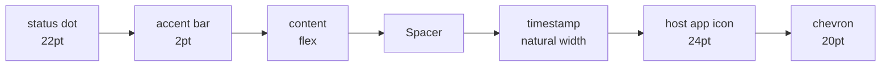
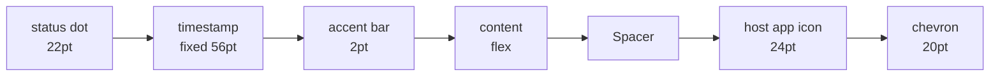

# Plan: Relative Today Timestamps in Fixed Left Column

## Working Protocol
- Use parallel subagents only if branching out (single-file edits here, so direct edits are fine).
- Mark steps done as you go — a fresh agent should be able to find where to resume.
- Run `swift test` (30s timeout) after the source edits to confirm the test deltas before adding new tests.
- If a build/test hangs, run `make kill-build` before retrying (per AGENTS.md).

## Overview
Restore the pre-Gmail timestamp behavior in two ways: (1) use relative labels (`5m`, `12h`) for any session whose timestamp falls today, instead of the current time-of-day (`1:22 PM`); (2) move the timestamp out of the right rail and back into a fixed-width column directly to the right of the status dot. Keep the current `.callout` typography and unread-bold treatment — only the position and the today-formatting branch change.

## User Experience
1. User opens the seshboard. Each row's left edge now reads `[● status dot] [ 5m ] [accent bar] [content...]` instead of `[● status dot] [accent bar] [content...] ... [ 1:22 PM ] [host icon] [chevron]`.
2. Sessions from earlier today read `12h` instead of `1:22 AM` — quick triage doesn't require parsing a clock time.
3. Yesterday and older rows still read `Apr 14` / `Dec 1, 2025` in the same fixed-width slot, so the timestamp column lines up vertically across all rows in the list.
4. Unread rows render the timestamp **bold + primary color** (matching the unread sender + preview); read rows render it **regular + secondary** — same as today, just in the new position.
5. The right rail loses the timestamp slot — host-app icon and chevron shift right by exactly the timestamp's removed width (no other layout change).

## Architecture

This is a UI-only render-path change. No data flow, persistence, or async behavior is touched. The diagrams below show the row layout columns before and after.

### Current

### Proposed

**Render path (unchanged in shape, only the label/position differ):**
- `SessionRowView` / `RecallResultRowView` / `RemoteClaudeCodeRowView` each construct a `SessionAgeDisplay(timestamp:)` and pass it to `ResultRowLayout`.
- `ResultRowLayout` reads `ageDisplay.label` once per body evaluation — `DateFormatter` instances are still cached in `SessionAgeDisplay.formatterCache`, so the change keeps that fast path even though the *today* branch no longer touches the formatter cache.
- The `label` computation runs on whichever actor SwiftUI invokes `body` on. The `bucket` computation (used by `SessionListView` for section headers) is unchanged.

## Current State
- **`Sources/SeshctlUI/Session+Display.swift`** — `SessionAgeDisplay.label` uses four branches: `< 1h past → s/m`, `same calendar day → time of day`, `same year → MMM d`, `else → MMM d, yyyy`. Future timestamps deliberately skip the relative branch.
- **`Sources/SeshctlUI/ResultRowLayout.swift`** — timestamp renders **after `Spacer()`**, just left of the host-app icon. `.callout`, `isUnread ? .bold : .regular`, `isUnread ? .primary : .secondary`, no fixed width.
- **`Tests/SeshctlUITests/SessionAgeDisplayTests.swift`** — 16 tests; 5 of them assert the time-of-day format that we're replacing (`labelOneHourAgo`, `labelSameDayEarlier`, `labelSameDayEvening`, `labelFutureSameDay`, and the docstring at the top of the label section).
- **`Tests/SeshctlUITests/ResultRowLayoutTests.swift`** — structural snapshot-style tests; not coupled to position.
- **Pre-Gmail history (commit `eb6ff33`)** — the previous fixed-width layout was `.frame(width: 40, alignment: .leading)` with monospaced `.body` `.secondary`. We're restoring the *position* and *fixed-width* parts, but keeping the current `.callout` + unread emphasis.

## Proposed Changes

**`SessionAgeDisplay.label` (Session+Display.swift):** collapse the today branch into the relative branch. New logic:
- `s < 60` → `"<n>s"`
- `s < 3600` → `"<n>m"`
- *same calendar day as now* → `"<n>h"` (where `n = max(secondsSince, 0) / 3600`, clamping future-today clock skew to `0h`)
- *same year* → `MMM d` (unchanged)
- *else* → `MMM d, yyyy` (unchanged)

The cross-midnight edge case (timestamp is yesterday but `< 1h` ago) still falls into the `s/m` branch because that branch checks elapsed seconds, not calendar day. Order: keep `s/m` first so a 45-minute-old yesterday timestamp still reads `45m` rather than `Apr 14`.

**`ResultRowLayout` (ResultRowLayout.swift):** move the `Text(ageDisplay.label)` block. Insertion point: between the status `Color.clear.overlay { status() }` and the `RoundedRectangle` accent-bar slot. Wrap in `.frame(width: 56, alignment: .leading)`. Drop the right-side timestamp render. Keep `.callout`, the unread-driven `fontWeight` and `foregroundStyle`, and `lineLimit(1)`.

**Width choice — 56pt:** comfortably fits the longest plausible label (`Dec 1, 2025` ≈ 11 chars in `.callout` regular ≈ 55pt). `23h` and `Apr 14` sit left-aligned with breathing room. Easy to tweak in a follow-up if the user wants tighter or wider.

### Complexity Assessment
**Low.** Two source files (~15 line delta), one test file with predictable rewrites (replace 4 time-of-day assertions, add 3-4 hour-format assertions). No new patterns, no new dependencies, no risk of cross-cutting regressions — the timestamp render site is a single line in `ResultRowLayout`. The only subtle bit is the future-today clamp, which is covered by an explicit test.

## Impact Analysis
- **New Files:** none.
- **Modified Files:**
  - `Sources/SeshctlUI/Session+Display.swift` — `label` body + docstring update.
  - `Sources/SeshctlUI/ResultRowLayout.swift` — move the `Text` view + add fixed-width frame; update the inline comment.
  - `Tests/SeshctlUITests/SessionAgeDisplayTests.swift` — update 4 time-of-day tests to expect hour-relative output; add tests for `1h` boundary, `12h` mid-day, `23h` near the day boundary, and future-today `0s` clamp.
- **Dependencies:** `SessionAgeDisplay` is consumed by `ResultRowLayout` (render) and `SessionListView` (bucket — unchanged). All three concrete row views (`SessionRowView`, `RecallResultRowView`, `RemoteClaudeCodeRowView`) get the change for free.
- **Similar Modules:** none — this is the only timestamp formatter in the project.

## Key Decisions
- **Hour format = `"3h"`** (round to hours, not `75m` or `3h 5m`). User-confirmed.
- **Typography = current `.callout` + unread bold/primary** (not the pre-Gmail monospaced `.body` `.secondary`). User-confirmed.
- **Future-today clamps to `0s`.** Simpler than carrying signed elapsed values; clock skew on the local machine is the only realistic source. Locked in by an explicit test.
- **Accent bar stays adjacent to content.** Order is `[dot][timestamp][accent][content]` — matches the pre-Gmail layout exactly. Accent bar's job is to mark the content column it precedes, so keeping it tight against `content` is intentional.
- **Fixed width = 56pt.** Sized for `Dec 1, 2025` worst case in `.callout`.

## Implementation Steps

### Step 1: Update `SessionAgeDisplay.label`
- [x] In `Sources/SeshctlUI/Session+Display.swift`, rewrite the `label` body to add an `h` branch inside a `isDate(inSameDayAs:)` check, replacing the time-of-day formatter call.
- [x] Drop the now-unused `timeFormatter` static (and its formatter-cache `"time"` kind) — `monthDayFormatter` and `fullDateFormatter` stay.
- [x] Update the `///` docstring above `label` to describe the new branches: `s` / `m` / `h` for today (including future-today clamped to `0s`), `MMM d` for same year, `MMM d, yyyy` for different year.

### Step 2: Move the timestamp in `ResultRowLayout`
- [x] In `Sources/SeshctlUI/ResultRowLayout.swift`, move the `Text(ageDisplay.label)` block from after `Spacer()` to immediately after the status `Color.clear.overlay { status() }` block (before the accent bar `RoundedRectangle`).
- [x] Add `.frame(width: 56, alignment: .leading)` to the `Text` modifier chain. Keep `.font(.callout)`, `fontWeight`, `foregroundStyle`, and `lineLimit(1)`.
- [x] Replace the now-stale block comment at lines 60-63 with a one-liner explaining the fixed-width left-column placement.

### Step 3: Update and extend tests
- [x] In `Tests/SeshctlUITests/SessionAgeDisplayTests.swift`, replace the four assertions that expected time-of-day output:
  - `labelOneHourAgo`: `"11:00\u{202F}AM"` → `"1h"`.
  - `labelSameDayEarlier` (9:11 AM, now=12:00): `"9:11\u{202F}AM"` → `"2h"`.
  - `labelSameDayEvening` (23:30, now=12:00 same day): `"11:30\u{202F}PM"` → `"0s"` (future clamp; verifies the same-day future path).
  - `labelFutureSameDay` (13:30, now=12:00): `"1:30\u{202F}PM"` → `"0s"`.
- [x] Update the section header comment block (lines 107-114) to describe the new `s` / `m` / `h` / `MMM d` / `MMM d, yyyy` rules.
- [x] Add new tests:
  - `label1HourFiveMinutesAgo` → `"1h"` (verifies hours integer-divide).
  - `label12HoursAgo` → `"12h"`.
  - `label23HoursAgoSameDay` (timestamp 00:30, now 23:30 same day) → `"23h"`.

### Step 4: Verify
- [x] Run `swift test` (timeout 30s). All `SessionAgeDisplay` tests should pass; `ResultRowLayoutTests` should be unaffected. → 638 tests pass, 0 failures.
- [x] Check coverage drift: `Session+Display.swift` at 94.9% (above 60%). `ResultRowLayout.swift` at 1.71% — exempt as a pure SwiftUI `View` per AGENTS.md.
- [ ] `make install` to deploy and eyeball the seshboard: confirm the timestamp sits flush-left of the accent bar with consistent column width across today/yesterday/older rows. *(manual — for user)*

## Acceptance Criteria
- [x] [test] `SessionAgeDisplay.label` returns `"<n>h"` for any past timestamp on the same calendar day where ≥ 1 hour has elapsed.
- [x] [test] `SessionAgeDisplay.label` returns `"0s"` for future-today timestamps (clock skew clamp).
- [x] [test] `SessionAgeDisplay.label` still returns `"<n>s"` / `"<n>m"` for `< 1h` past, including across-midnight cases (yesterday timestamp `< 1h` ago).
- [x] [test] `SessionAgeDisplay.label` still returns `MMM d` and `MMM d, yyyy` unchanged for yesterday/older.
- [ ] [test-manual] In the running seshboard, the timestamp sits in a fixed-width column directly to the right of the status dot, before the accent bar, with rows visually aligned across today / yesterday / older sections.
- [ ] [test-manual] Unread rows show the timestamp bold + primary; read rows show it regular + secondary — matching the existing pre-move treatment.

## Edge Cases
- **Future-today clock skew:** `0s` (clamped). Documented and tested.
- **Yesterday-but-recent (across midnight):** `< 1h` rule still wins, so a 45-minute-old timestamp from yesterday reads `45m`, not `Apr 14`. Existing behavior preserved.
- **Timestamp exactly 1 hour ago:** falls into the today branch (since `secondsSince == 3600` fails `< 3600`). Reads `1h`. Test added.
- **Long absolute labels (`Dec 1, 2025`):** fit in 56pt at `.callout` regular weight. If a user's locale produces a longer string (e.g., other date formats), it truncates to one line — acceptable for old labels.
