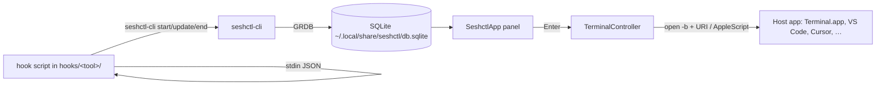
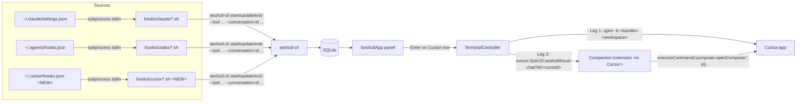

# Plan: Cursor as a First-Class LLM Tool (and Terminal-Host Polish)

## Context

The original ask was "add Cursor support" and frame it as bespoke (like VS Code), pending a future protocol-based abstraction. Exploration surfaced two distinct integrations:

1. **Cursor as a terminal host** — focus a Claude Code shell running inside Cursor's integrated terminal. The `.cursor` case in `TerminalApp` and the `cursor://` URI dispatch already exist (commit `2a578d4`, Mar 2026) but the path is unwired: the companion extension is only installed in VS Code via `make install-vscode`, the README compatibility table doesn't list Cursor, and only a single routing test covers Cursor.
2. **Cursor as an LLM tool** — Cursor's native chat/composer panel. Initial research suggested this was infeasible (no extension API for chat, deeplinks only create new chats with confirmation). However, **Cursor 1.7 (Oct 2025)** shipped a real lifecycle-hooks system at `~/.cursor/hooks.json` with the same subprocess + stdin-JSON model as Claude Code. That makes Cursor chat ingestable as a first-class session, mirroring how Codex is integrated today.

This plan delivers both layers. The LLM-tool integration is the primary unblock (chat sessions in seshctl); the terminal-host polish is a small parallel cleanup.

## Working Protocol
- Use parallel subagents for independent searches (e.g., auditing every switch-over-`SessionTool`).
- Mark steps done as completed — a fresh agent should be able to find where to resume from the checkbox state.
- Run `swift test` after each Swift step before moving on. Use 120s build timeout / 30s test timeout per `AGENTS.md`; run `make kill-build` if anything hangs.
- Step 0 (hook-payload probe) and Step 0.5 (chat-focus capability probe) are **already complete** (2026-05-13). Findings are folded into the implementation steps below — do not re-run those probes unless a question arises that they didn't answer.

## Overview

Add `SessionTool.cursor` and a `hooks/cursor/` script suite (mirroring `hooks/codex/`) so Cursor 1.7+ chat sessions appear in the seshctl panel via the same mechanism as Claude Code and Codex. Separately, finish wiring the long-dormant `.cursor` terminal-host case by adding a `make install-cursor` extension target, mirrored tests, and README rows.

## User Experience

**Scenario A: native Cursor chat (new)**
1. User installs hooks via `make install` (or `make install-hooks`). The installer copies `hooks/cursor/*.sh` and registers them in `~/.cursor/hooks.json`.
2. User opens Cursor, opens a workspace, starts a new chat in the Composer panel. Cursor fires `sessionStart` → row appears in seshctl with `tool=cursor`, status `working`, directory = workspace root.
3. User submits a prompt. `beforeSubmitPrompt` fires → row updates to status `working` with `lastAsk` = prompt text.
4. Cursor's agent responds. `afterAgentResponse` fires → `lastReply` updates.
5. The agent loop ends. `stop` fires → status becomes `idle`. (`sessionEnd` only fires on conversation close / window close — handled separately, sets status `completed`.)
6. User presses Enter on the row. seshctl runs a two-step focus (verified 2026-05-13 via P1/P2/P3 probe — see Step 0.5):
   - **Leg 1 — workspace focus:** `open -b com.todesktop.230313mzl4w4u92 <workspace>` reliably brings the existing Cursor window for that path to the front (no duplicates).
   - **Leg 2 — chat focus:** `cursor://julo15.seshctl/focus-chat?id=<conversation_id>` is handled by our companion extension, which calls `composer.openComposer(<id>)` — Cursor switches to that specific chat thread, including reopening closed/archived chats. Without the extension installed (`make install-cursor` skipped), Leg 2 is a no-op and the user gets workspace-level focus only (graceful degrade).
   - **Tab-replacement caveat:** if the target chat is already open as a tab, `openComposer` switches cleanly. If the chat is closed, Cursor reopens it by replacing the currently-active tab's slot — the displaced chat isn't deleted, it stays accessible via history. Documented in the README row.

**Scenario B: Claude Code in Cursor's terminal (existing, now polished)**
1. User runs `make install-cursor` to install the seshctl companion extension into Cursor (this requires the `cursor` CLI, installed by the Homebrew cask at `/opt/homebrew/bin/cursor`).
2. User opens a terminal inside Cursor and runs `claude`. The Claude Code `SessionStart` hook fires `seshctl-cli start ...`; `detectHostApp` walks the process tree and identifies Cursor by bundle ID.
3. Row appears tagged with host app "Cursor".
4. User presses Enter. `TerminalController.focus` dispatches `cursor://julo15.seshctl/focus-terminal?pid=<pid>` to the companion extension, which calls `terminal.show()` on the matching terminal tab.

## Architecture

### Current

Today, seshctl's LLM-tool ingestion is anchored on shell-side hooks. The pipeline:



The hook scripts are tool-specific; the CLI and DB are tool-agnostic. `SessionTool` is the enum that ties the tool name to per-tool behavior (display name, badge, transcript parser, resume command). Cursor is not in `SessionTool` today.

The terminal-host path (`.cursor` in `TerminalApp`) is wired through to `TerminalController` but the companion extension is only installed in VS Code, so the URI dispatch silently fails in Cursor.

### Proposed



**Runtime data flow for a Cursor chat session:**
1. User opens Cursor (already running, daemon-style — bundle ID `com.todesktop.230313mzl4w4u92`).
2. User opens or focuses a workspace, starts a composer conversation.
3. Cursor reads `~/.cursor/hooks.json`, sees the `sessionStart` entry, spawns `hooks/cursor/session-start.sh` as a subprocess.
4. The script reads JSON from stdin: `{ session_id, conversation_id, workspace_roots, cwd, transcript_path, ... }`. It extracts fields and invokes `seshctl-cli start --tool cursor --dir <cwd> --pid $PPID --conversation-id <session_id> [--transcript-path ...]`.
5. `seshctl-cli` opens the SQLite DB, calls `db.startSession(...)`, prints the new session ID. (Same code path as Codex today; the only new branch is the `.cursor` case in `SessionTool`.)
6. SeshctlApp's session list (driven by GRDB ValueObservation) picks up the new row and renders it with the Cursor badge.
7. On subsequent hook events (`beforeSubmitPrompt` → `update --status working --ask`, `afterAgentResponse` → `update --reply`, `stop` → `update --status idle`, `sessionEnd` → `end --status completed`), the script invokes `seshctl-cli update/end` to mutate the row.
8. When the user presses Enter on the row, `SessionAction.execute` resolves the host app from the stored bundle ID and dispatches `TerminalController.focus`. For a Cursor *chat* session (`session.tool == .cursor`), the focus path is two-step: (a) `open -b com.todesktop... <workspace>` brings the Cursor workspace window forward; (b) `cursor://julo15.seshctl/focus-chat?id=<conversation_id>` is sent to the companion extension, which calls `vscode.commands.executeCommand("composer.openComposer", id)` — Cursor switches the chat panel to that exact composer (verified working including for closed/archived chats; P1/P2/P3 in Step 0.5). The URI fire is retried after 500ms (existing pattern from VS Code terminal focus) to handle the case where Leg 1 hasn't completed by the time Leg 2 fires. If the extension isn't installed, Leg 2 is silently ignored by Cursor and the user gets workspace-level focus only — graceful degrade, same model as VS Code terminal focus today.

**Memory vs disk vs network:** Same as today — hooks write through CLI to local SQLite; the app is read-only against the DB except for actions the user triggers. No network. No new daemon or background service.

**State persistence:** A Cursor session lives in `~/.local/share/seshctl/db.sqlite` keyed on the `id` UUID assigned by `db.startSession`. `conversation_id` (Cursor's `session_id`) is the **primary** upsert key for subsequent events — confirmed in Step 0 that `$PPID` is *not* stable across hook events (each hook is a fresh `/bin/zsh -c` subprocess with a different shell PID; the actual Cursor process is the *grandparent*, a `Cursor Helper (Plugin)` helper process). Cursor's `session_id` and `conversation_id` fields carry the same UUID and are stable for the lifetime of a conversation.

## Current State

Files relevant to this plan:

- `Sources/SeshctlCore/Session.swift:13-17` — `SessionTool` enum: `claude`, `gemini`, `codex`. Add `cursor`.
- `Sources/SeshctlCore/TerminalApp.swift:12,25,38,47` — `.cursor` enum case + bundle ID + display name + URI scheme. **Already correct.**
- `Sources/SeshctlCore/TranscriptParser.swift:104-108` — per-tool transcript directory; needs `.cursor` case.
- `Sources/SeshctlUI/AgentBadgeSpec.swift:47-49` — per-tool badge glyph + color; needs `.cursor` case.
- `Sources/SeshctlUI/Session+Display.swift:243-245` — per-tool display name; needs `.cursor` case ("Cursor").
- `Sources/SeshctlUI/TerminalController.swift:288-303` — resume binary + resume command shape per tool; needs `.cursor` case (resume = focus, since Cursor has no `cursor <session>` CLI).
- `hooks/codex/{session-start,user-prompt,stop}.sh` — template to mirror into `hooks/cursor/`.
- `scripts/install-codex-hooks.sh` — template for `scripts/install-cursor-hooks.sh`.
- `scripts/install-hooks.sh:91` — adds a call to `install-cursor-hooks.sh`.
- `Makefile:88-93` (`install-vscode`) — template for new `install-cursor` target.
- `README.md:103-107` (LLM tools table), `:111-120` (Terminal apps table) — add Cursor rows in both.
- `Tests/SeshctlUITests/TerminalControllerTests.swift:612-632` — existing `cursorRouting()` test. Add precedence-test mirrors + a new `cursorChatFocusUsesComposerURI()` test.
- `vscode-extension/src/extension.ts` — existing companion extension; add a `/focus-chat` URI route that calls `vscode.commands.executeCommand("composer.openComposer", id)`. Same `.vsix` installs into both VS Code and Cursor (publisher-agnostic).

## Proposed Changes

### LLM-tool integration (primary)
- Add `SessionTool.cursor` with raw value `"cursor"`. Update every exhaustive switch.
- Create `hooks/cursor/{session-start,user-prompt,stop,session-end}.sh` mirroring the Codex scripts. Key differences from Codex per the Cursor 1.7 docs:
  - Event names are camelCase (`sessionStart`, `sessionEnd`, `beforeSubmitPrompt`, `stop`).
  - The Cursor stdin payload has both `session_id` and `conversation_id` — use `session_id` as our `conversation_id` (per-conversation identity).
  - `beforeSubmitPrompt` payload has `prompt` directly, not `user_prompt`.
  - `afterAgentResponse` payload has `text`. We can use this as `lastReply` (or keep that to `stop` like Codex does — TBD by Step 0 observation).
- Create `scripts/install-cursor-hooks.sh` mirroring `install-codex-hooks.sh`. Targets `~/.cursor/hooks.json`, JSON shape per Cursor docs (`{ "version": 1, "hooks": { "sessionStart": [{ "command": "..." }], ... } }`). No feature-flag gate (Cursor hooks are GA in 1.7+, no equivalent of `codex_hooks=true`).
- Hook `scripts/install-cursor-hooks.sh` into `scripts/install-hooks.sh` so `make install-hooks` covers all three.
- Mirror uninstall: extend `seshctl-cli uninstall --all` (or the script that backs it) to remove Cursor hooks. Audit which file owns uninstall first.

### Companion extension extension (NEW — enables chat-thread focus)
- Add a `/focus-chat?id=<composerId>` URI route to `vscode-extension/src/extension.ts`. Handler calls `vscode.commands.executeCommand("composer.openComposer", id)` inside `try/catch` so it no-ops gracefully on VS Code (where the command doesn't exist). The extension stays publisher-agnostic; the same `.vsix` installs into both VS Code and Cursor.
- `composer.openComposer` is an internal Cursor command discovered by grepping `Cursor.app/Contents/Resources/app/out/vs/workbench/workbench.desktop.main.js` and verified working via the Step 0.5 probe. **Argument shape:** string (the composerId UUID — same as our `conversation_id`). NOT the object form `{ type, id }` — that form throws `TypeError: t.startsWith is not a function`.
- **Workspace-scope quirk:** the command silently no-ops if the target chat doesn't live in the currently-focused workspace. Mitigation: always fire `open -b <workspace>` before the URI (Leg 1 / Leg 2 split in `TerminalController`).
- Bump the extension's `version` in `vscode-extension/package.json` so users who already have it installed get the new route on `make install-cursor` / `make install-vscode`.

### Terminal-host polish (parallel)
- Add `make install-cursor` target invoking `cursor --install-extension <vsix>`. Reuse the build artifact from `install-vscode` if running both; otherwise rebuild. Keep `install-vscode` unchanged (separate targets keep the bespoke pattern intact).
- Add a `Cursor` row to the README "Terminal apps" compatibility table near the `VS Code` row, noting it requires `make install-cursor` and shares the same companion extension.
- Add a `Cursor` row to the README "LLM tools" table (Hooks: Full, Transcript parsing: TBD — likely "None" for MVP, parser support deferred). Chat-focus column: "Full (requires `make install-cursor`)".
- Mirror the three VS Code precedence tests for Cursor in `TerminalControllerTests.swift` (cheap, completes the discipline).

### Out of scope (deliberately deferred)
- The protocol-based generic terminal-app abstraction. Keeping Cursor bespoke as agreed.
- Cursor transcript parsing in `TranscriptParser`. Cursor's transcript format is undocumented; MVP wires Cursor as a tool whose transcript is opaque (set `transcript_path` for future use, but `parse(tool: .cursor)` returns `nil` / empty). Follow-up plan if needed.
- Cursor `TERM_PROGRAM` defensive case in `TerminalApp.from(termProgram:)`. Process-tree walk in `detectHostApp` already identifies Cursor by bundle ID; the env fallback only matters in edge cases. Add only if Step 0 shows Cursor sets a distinct `TERM_PROGRAM` we can key off.
<!-- (Previously deferred: "targeting a specific composer/chat thread when focusing." Now in scope — Step 0.5 found Cursor's internal `composer.openComposer` command via bundle grep and verified end-to-end via probe. Our companion extension calls it through a `/focus-chat` URI route.) -->
- **DMG-friendly extension install.** `make install-cursor` assumes a dev checkout (it builds + packages the .vsix). For end users installing seshctl from a future DMG, the extension install needs a different surface (likely a `seshctl-cli install-extension` verb + a SeshctlApp onboarding card). Explicitly punted to a follow-up plan — same gap already exists for `make install-vscode`, so this PR doesn't make it worse. README will continue to assume a dev checkout for the foreseeable future.

### Complexity Assessment

**Low.** ~12 files modified. Bulk of it mirrors the Codex template (hook scripts + install script + SessionTool case + README rows + tests). Net-new code beyond mirroring: ~10-line `/focus-chat` route in the companion extension, a `--conversation-id` matcher path in `seshctl-cli update`/`end` + matching `Database` methods (Step 1.5), and one chat-focus branch in `TerminalController` for `.cursor` chat sessions. Step 0 + Step 0.5 already resolved the two genuine unknowns (hook payload schema, chat-focus capability). No DB migration; the `tool` column is a raw string. No new Swift package dependencies.

## Impact Analysis

- **New Files:**
  - `hooks/cursor/session-start.sh`
  - `hooks/cursor/user-prompt.sh`
  - `hooks/cursor/after-agent-response.sh`
  - `hooks/cursor/stop.sh`
  - `hooks/cursor/session-end.sh`
  - `scripts/install-cursor-hooks.sh`
  - `.agents/plans/2026-05-13-0021-add-cursor-llm-tool-support.md` (this file)
- **Modified Files:**
  - `Sources/SeshctlCore/Session.swift` (+1 enum case)
  - `Sources/SeshctlCore/TranscriptParser.swift` (+1 case → `nil` for MVP)
  - `Sources/SeshctlUI/AgentBadgeSpec.swift` (+1 case)
  - `Sources/SeshctlUI/Session+Display.swift` (+1 case)
  - `Sources/SeshctlUI/TerminalController.swift` (+1 case in resume binary/cmd switches)
  - `Sources/seshctl-cli/SeshctlCLI.swift` (help text + make `--pid` optional in `Update`/`End`; accept `--conversation-id` as matcher)
  - `Sources/SeshctlCore/Database.swift` (`findActiveSession(conversationId:tool:)`, `updateSession(conversationId:...)`, `endSession(conversationId:...)`)
  - `Sources/SeshctlUI/TerminalController.swift` (in addition to the enum switches: branch chat-focus path for `.cursor` sessions to use `composer.openComposer` URI instead of `focus-terminal` URI)
  - `vscode-extension/src/extension.ts` (+1 URI route: `/focus-chat?id=<composerId>` → `executeCommand("composer.openComposer", id)`)
  - `vscode-extension/package.json` (version bump so users who already have the extension pick up the new route)
  - `scripts/install-hooks.sh` (+1 line calling install-cursor-hooks.sh)
  - `Makefile` (+1 target `install-cursor`)
  - `README.md` (+1 row in LLM tools table, +1 row in Terminal apps table, AGENTS.md cross-reference)
  - `AGENTS.md` (mention `make install-cursor`, mirror the "Adding Terminal App Support" pattern for LLM tools if not already documented)
  - `Tests/SeshctlUITests/TerminalControllerTests.swift` (3 mirrored Cursor precedence tests)
  - **New test file:** `Tests/SeshctlCoreTests/CursorHookTests.swift` — golden-payload tests parsing a snapshot of Cursor's stdin JSON.
- **Dependencies:**
  - Cursor 1.7+ at runtime. Document in README.
  - `cursor` CLI on PATH (provided by Homebrew cask `cursor`, symlinked to `/opt/homebrew/bin/cursor`) for `make install-cursor`.
  - No new Swift package dependencies.
- **What relies on this:** the SeshctlApp session list automatically renders any row in the DB. The new `.cursor` `SessionTool` case is consumed by every per-tool switch — failing to add a case is a compile error (good).
- **Similar Modules:** the Codex integration (`hooks/codex/`, `scripts/install-codex-hooks.sh`, `SessionTool.codex`) is the line-by-line template. Do not duplicate logic — copy and adapt.

## Key Decisions

- **Two scopes shipped in one plan, not split.** They share a release ("Cursor support") and the docs work overlaps. Splitting would force a second README pass.
- **Focus = `open -b` + extension URI for Cursor chat sessions.** Verified via Step 0.5 probe (2026-05-13): `open -b <bundle> <workspace>` reliably focuses the existing window (no duplicates) and Cursor preserves last-active chat per window; the companion extension then routes `cursor://julo15.seshctl/focus-chat?id=<id>` to `composer.openComposer(id)`, which switches Cursor to the exact chat (including reopening closed chats — they replace the currently-active tab slot). Graceful degrade: without the extension, Leg 2 is silently ignored and the user gets workspace-level focus, same model as VS Code's terminal focus. The previously-speculated public `openchat` deeplink path doesn't exist (confirmed by grepping Cursor's bundled `cursor-deeplink` extension: only 8 paths exist — `/prompt`, `/command`, `/rule`, `/createchat`, `/background-agent`, `/glass`, `/pr-review`, `/settings` — none open an existing chat by id).
- **Cursor stays bespoke.** Per user direction: continue the per-app pattern; the generic protocol abstraction is a separate future plan, not this one.
- **Transcript parsing deferred.** Cursor's transcript format is undocumented and writing a parser without a payload sample is speculative. Capture `transcript_path` from `sessionStart` so it's there when we want to parse later; MVP returns `nil` from the parser.

## Implementation Steps

### Step 0: Validate Cursor's actual hook payload (COMPLETED 2026-05-13)

All five events probed against Cursor 3.3.30 on the `recall` workspace. Findings now folded into the steps below. Key results:

- **`session_id` == `conversation_id`** in every event; either works as the upsert key. Both are stable UUIDs for the lifetime of a conversation.
- **`$PPID` is NOT stable** across events. Each Cursor hook is invoked as `/bin/zsh -c 'printf %s "<base64>" | base64 -d | <script>'`, so the shell PID is fresh per event. Grandparent process is `Cursor Helper (Plugin): extension-host (agent-exec) <workspace>`, not the main Cursor.app. **Implication:** we must upsert on `--conversation-id`, not `--pid`. The `seshctl-cli update` and `end` commands currently require `--pid` as mandatory; we need to make it optional and accept `--conversation-id` as the alternate matcher (see Step 1.5 below).
- **`cwd` is NOT a top-level field** in any hook payload. Use `workspace_roots[0]` from stdin, or the `CURSOR_PROJECT_DIR` env var Cursor auto-sets.
- **`transcript_path` is null on `sessionStart` and `beforeSubmitPrompt`**, populated from `afterAgentResponse` onward. The JSONL file lives at `~/.cursor/projects/<encoded-workspace>/agent-transcripts/<session-id>/<session-id>.jsonl`. Capture it on the first event that has it and update the row.
- **`afterAgentResponse.text` is where reply text lives**, not `stop`. `stop` only has token counts + outcome status + loop_count. We capture `--reply` on `afterAgentResponse`.
- **`composer_mode: "agent"`** appears on every event. `is_background_agent: false` for normal user chats. We may want to filter out `is_background_agent: true` rows at ingest time.
- **Auto-set env vars (always present):** `CURSOR_PROJECT_DIR`, `CLAUDE_PROJECT_DIR` (alias), `CURSOR_WORKSPACE_LABEL`, `CURSOR_LAYOUT`, `CURSOR_VERSION`, `CURSOR_EXTENSION_HOST_ROLE`, `CURSOR_USER_EMAIL`. `CURSOR_TRANSCRIPT_PATH` is set from `afterAgentResponse` onward.
- **`sessionEnd.reason` enum**: `user_close` (observed), per docs also `completed|aborted|error|window_close`. Map `user_close`/`completed` → `.completed`; map `aborted`/`error` → `.canceled` (closest existing SessionStatus).
- **`sessionStart` does NOT fire for pre-existing conversations** — only when a new conversation is created. Conversations open before hooks.json was written will fire `beforeSubmitPrompt`/`afterAgentResponse`/`stop`/`sessionEnd` but never `sessionStart`. This means the hook scripts must handle "update or create" semantics: an `update` event for an unknown conversation should lazily create a session row.

### Step 0.5: Validate Cursor's chat-focus surface (COMPLETED 2026-05-13)

Goal: determine whether seshctl can focus a *specific* Cursor chat thread, not just the workspace window. Original plan assumed "no" based on docs/forum signals; closer inspection of `Cursor.app/Contents/Resources/app/` proved otherwise.

**Findings:**

1. **Public deeplink surface is exhaustive at 8 paths.** Grepping `Cursor.app/Contents/Resources/app/extensions/cursor-deeplink/dist/main.js` (Cursor's bundled URI handler): `/prompt`, `/command`, `/rule`, `/createchat`, `/background-agent`, `/glass`, `/pr-review`, `/settings`. None opens an existing chat by id. The speculative URI `cursor://anysphere.cursor-deeplink/openchat?id=<id>` was probed and silently ignored — confirmed Cursor activates but doesn't route.

2. **An internal command DOES exist** that does what we need. Grepping `app/out/vs/workbench/workbench.desktop.main.js`:
   - Command id: **`composer.openComposer`**
   - Internal call site shows: `await this.commandService.executeCommand("composer.openComposer", s.composerId)` with `composerId` as a bare string (UUID — same shape as our `conversation_id`).
   - The object form `composer.openComposer({type:"local",id:...})` also appears internally but **throws when called via extension API** (`TypeError: t.startsWith is not a function`) — only the string form is the right surface for us.

3. **End-to-end verification (P1/P2/P3 with a throwaway extension at `/tmp/seshctl-probe/`, installed via `cursor --install-extension`):**

   - **P1 — workspace scoping:** Calling `composer.openComposer(<seshctl-thread-B-id>)` from the *recall* window returned `undefined`, no exception, nothing visible. From the *seshctl* window with the same id, it switched the chat panel to Thread B. **Verdict:** the command is workspace-scoped — it silently no-ops if the target chat doesn't live in the current workspace. **Implication for our flow:** we must focus the right workspace (`open -b <bundle> <workspace>`) BEFORE firing the chat-focus URI.
   - **P2 — reopen closed chats:** Calling the command with the id of a closed Thread A reopened it. Behavior: rather than spawning a new tab, Cursor **replaces the currently-active tab's slot** with the target chat. The displaced chat is not deleted — it stays in history. This is acceptable for seshctl's UX (user clicked the row, they wanted to land on it).
   - **P3 — production URI flow end-to-end:** Fired `open -b com.todesktop... /…/seshctl` immediately followed by `open "cursor://julo15.seshctl-probe/focus-chat?id=<thread-B-id>"` from a non-Cursor app. Cursor came forward, the seshctl window was the focused one, and the chat panel was on Thread B. ✅
   - **Multi-window confidence (T1–T4):** `open -b <bundle> <workspace>` reliably focuses the existing window for a path; no duplicate windows are created. `cursor <path>` CLI behaves identically. Last-active chat is preserved per window.

**Translation into the implementation plan:**
- Companion extension gets a new URI route `/focus-chat?id=<composerId>` (Step 4.5 below).
- `TerminalController.focus` for `.cursor` chat sessions does a two-leg sequence: workspace `open -b`, then chat URI (with the same 500ms retry pattern VS Code terminal focus already uses).
- Without the extension installed, Leg 2 is a no-op and the user gets workspace-level focus — graceful degrade, same as VS Code today.

### Step 1: Add `SessionTool.cursor` and update every switch (compiler-driven)
- [ ] Add `case cursor` to `SessionTool` in `Sources/SeshctlCore/Session.swift` (raw value `"cursor"`).
- [ ] Build the project — collect every compiler error pointing at a non-exhaustive switch.
- [ ] Update `Sources/SeshctlCore/TranscriptParser.swift:104` — add `case .cursor: return nil` (or sentinel path for future).
- [ ] Update `Sources/SeshctlUI/AgentBadgeSpec.swift:47` — pick a glyph + color. Suggest `.letter("C")` + `.purple` (Cursor's brand color is purple/black).
- [ ] Update `Sources/SeshctlUI/Session+Display.swift:243` — `case .cursor: return "Cursor"`.
- [ ] Update `Sources/SeshctlUI/TerminalController.swift:288` — `case .cursor: binary = "cursor"` (placeholder; not used since cursor has no resume CLI).
- [ ] Update `Sources/SeshctlUI/TerminalController.swift:301` — `case .cursor: return .focusOnly` (or equivalent — read the surrounding logic; if there's no `.focusOnly`, just have the resume verb fall through to focus).
- [ ] Update help text in `Sources/seshctl-cli/SeshctlCLI.swift:34,170,219` from `"Tool name (claude, gemini, codex)."` to `"Tool name (claude, gemini, codex, cursor)."`.
- [ ] `swift build` clean. Run `swift test` — existing tests must still pass.

### Step 1.5: Make `--pid` optional in `Update` and `End`; add conversation-id matching (REQUIRED by Step 0 findings)

Without this, the Cursor hook scripts can't match later events back to the row created by `sessionStart` because PIDs are unstable across events.

- [ ] In `Sources/seshctl-cli/SeshctlCLI.swift`, change `Update.pid` from `@Option var pid: Int` to `@Option var pid: Int?`. Make the same change in `End.pid`.
- [ ] Require exactly one of `--pid` or `--conversation-id` per invocation; fail with a clear error if both are nil.
- [ ] In `Sources/SeshctlCore/Database.swift`, add `findActiveSession(conversationId:tool:)` (mirrors `findActiveSession(pid:tool:)`). Add `updateSession(conversationId:tool:...)` overload (or refactor existing `updateSession` to take an `Either<Pid, ConvId>` discriminator — pick the cleaner one based on call-site count).
- [ ] Same for `endSession`.
- [ ] In the CLI's `Update.run()` and `End.run()`, branch: when `pid` is set, use the existing path; when `conversationId` is set, use the new path.
- [ ] **Add unit tests** in `Tests/SeshctlCoreTests/DatabaseTests.swift` (or wherever existing pid-based update tests live) covering: update by conversation_id matches the right row; update by conversation_id when no matching row exists is a no-op (or lazy-create — see Step 2's lazy-create note).
- [ ] Rebuild; existing pid-based tests must still pass.

### Step 2: Write `hooks/cursor/` scripts
All four scripts use `--conversation-id "$SESSION_ID"` as the upsert key (NOT `--pid "$PPID"`). Extract `session_id` from stdin JSON. Use `workspace_roots[0]` for directory (or `$CURSOR_PROJECT_DIR` env var). Filter out `is_background_agent == true` (early `exit 0`).

- [ ] Create `hooks/cursor/session-start.sh` — extract `session_id`, `workspace_roots[0]`, `is_background_agent`. Invoke `seshctl-cli start --tool cursor --dir "$WORKSPACE" --conversation-id "$SESSION_ID"`. **PID is omitted intentionally** — Cursor doesn't give us a stable one. Host-app detection happens in `seshctl-cli` via the hook subprocess's PPID walk; even though PPID is the per-event shell, the walk will climb through `Cursor Helper (Plugin)` (which has `activationPolicy != .regular` so the loop continues) and eventually reach Cursor.app's main process. Verify in Step 7.
- [ ] Create `hooks/cursor/user-prompt.sh` — fired on `beforeSubmitPrompt`. Extract `prompt` and `session_id`. Invoke `seshctl-cli update --tool cursor --conversation-id "$SESSION_ID" --status working --ask "$PROMPT"`. **Lazy-create note:** if the conversation predates hooks.json being installed, this is the first event we see for it. The CLI's `update` path should either auto-create a row when no match is found, or fail silently — pick the policy. **Recommendation:** lazy-create here, so users who install seshctl mid-conversation still see their in-flight Cursor chats appear.
- [ ] Create `hooks/cursor/after-agent-response.sh` (NEW — not in original plan) — fired on `afterAgentResponse`. Extract `text` and `session_id` and `transcript_path`. Invoke `seshctl-cli update --tool cursor --conversation-id "$SESSION_ID" --reply "$TEXT" --transcript-path "$TRANSCRIPT_PATH"`. (`transcript_path` is non-null from this event onward — first chance to populate it on the row.)
- [ ] Create `hooks/cursor/stop.sh` — fired on `stop`. Extract `session_id`. Invoke `seshctl-cli update --tool cursor --conversation-id "$SESSION_ID" --status idle`. (We do not capture token counts; not used by seshctl today.)
- [ ] Create `hooks/cursor/session-end.sh` — fired on `sessionEnd`. Extract `session_id`, `reason`. Map `reason` → status: `user_close|completed` → `completed`; `aborted|error` → `canceled`; `window_close` → `completed` (treat unexpected close as completion). Invoke `seshctl-cli end --tool cursor --conversation-id "$SESSION_ID" --status <mapped>`.
- [ ] `chmod +x hooks/cursor/*.sh`.

### Step 3: Write `scripts/install-cursor-hooks.sh`
- [ ] Copy `scripts/install-codex-hooks.sh` → `scripts/install-cursor-hooks.sh`.
- [ ] Change `HOOKS_SOURCE` to `hooks/cursor`, `HOOKS_DEST` to `~/.local/share/seshctl/hooks/cursor`, `SETTINGS` to `~/.cursor/hooks.json`.
- [ ] Update `HOOK_DEFS` to use Cursor's camelCase event names: `sessionStart`, `beforeSubmitPrompt`, `afterAgentResponse`, `stop`, `sessionEnd` (five events, not four).
- [ ] Remove the `[features] codex_hooks = true` block (Cursor hooks are GA, no flag).
- [ ] Adapt the `jq` writer: Cursor's hooks.json shape is `{ "version": 1, "hooks": { "sessionStart": [ { "command": "...", "timeout": 10 } ] } }` — slightly different key path; verify against an actual Cursor `hooks.json` if one exists, otherwise just write `version=1` and the events array.
- [ ] `chmod +x scripts/install-cursor-hooks.sh`.
- [ ] Wire it: in `scripts/install-hooks.sh`, after the existing `install-codex-hooks.sh` call, add a `bash "$REPO_DIR/scripts/install-cursor-hooks.sh"` line.
- [ ] Add the uninstall side. Find where `seshctl-cli uninstall --all` or `make uninstall-hooks` removes Codex/Claude hook entries (likely a Swift function in `seshctl-cli`); add the analogous Cursor cleanup.

### Step 4: Makefile + extension install
- [ ] Add `install-cursor` to the `.PHONY` list and `help` block in `Makefile`.
- [ ] Add target body (mirror `install-vscode` but use `cursor --install-extension`). If `cursor` CLI is not on PATH, emit a clear error pointing to `brew install --cask cursor`.

### Step 4.5: Extend the companion extension with `/focus-chat`
- [ ] In `vscode-extension/src/extension.ts`, add an `else if (uri.path === "/focus-chat")` branch alongside the existing `/focus-terminal` and `/run-in-terminal` handlers.
- [ ] Implementation:
  ```ts
  else if (uri.path === "/focus-chat") {
    const id = params.get("id");
    if (!id) { log.appendLine("No id parameter in /focus-chat URI"); return; }
    log.appendLine(`/focus-chat: invoking composer.openComposer(${id})`);
    try {
      await vscode.commands.executeCommand("composer.openComposer", id);
    } catch (err) {
      log.appendLine(`composer.openComposer failed: ${err}`);
    }
  }
  ```
- [ ] Note the **string-arg form**: pass `id` directly, NOT `{ type: "local", id }` — the object form throws `TypeError: t.startsWith is not a function` (verified in Step 0.5).
- [ ] The command doesn't exist in VS Code; the `try/catch` ensures graceful no-op there.
- [ ] Bump `vscode-extension/package.json` `version` (e.g. `0.1.0` → `0.2.0`) so `cursor --install-extension` / `code --install-extension` swap the previous build.
- [ ] In `Sources/SeshctlUI/TerminalController.swift`, branch the Cursor focus path: when `session.tool == .cursor`, build `cursor://julo15.seshctl/focus-chat?id=<conversation_id>` instead of `cursor://julo15.seshctl/focus-terminal?pid=<pid>`. Keep the same `open -b` + 500ms retry pattern. (For terminal-host Cursor sessions — i.e. Claude Code running in Cursor's integrated terminal — keep using `/focus-terminal?pid=<pid>` as today; `session.tool` tells the two cases apart.)
- [ ] Add a unit test in `Tests/SeshctlUITests/TerminalControllerTests.swift`: `cursorChatFocusUsesComposerURI` — assert that a Cursor session with `tool == .cursor` and `conversationId == "<uuid>"` produces a URI containing `/focus-chat?id=<uuid>`, NOT `/focus-terminal`.

### Step 5: README + AGENTS.md
- [ ] Add a Cursor row to the LLM tools table (`README.md:103-107`). Hooks: "Full (1.7+)". Transcript parsing: "None (deferred)". Focus: "Workspace + chat thread (requires `make install-cursor` for chat-thread targeting)".
- [ ] Add a Cursor row to the Terminal apps table (`README.md:111-120`). Focusing: "Full — workspace via `open -b`; chat thread via companion extension". Note dependency on `make install-cursor`. Call out the tab-replacement behavior when reopening closed chats so users aren't surprised.
- [ ] Update line 27 ("If you use VS Code (or Cursor / VS Code Insiders)…") to also mention `make install-cursor`.
- [ ] Add a note in `AGENTS.md` mirroring the "Adding Terminal App Support" section: an "Adding an LLM Tool" section that codifies the SessionTool / hooks pattern. Cross-link from the Cursor integration.
- [ ] Document the chat-focus mechanism (open -b + extension URI + `composer.openComposer`) under the "Browser Tab Focusing" sibling section in `AGENTS.md`, or a new "Chat Focusing" subsection. Include the workspace-scoping quirk.

### Step 6: Tests
- [ ] **Mirror VS Code precedence tests in `Tests/SeshctlUITests/TerminalControllerTests.swift`:**
  - [ ] `cursorFocusFallsBackToDirectoryWhenLaunchDirMissing`
  - [ ] `cursorFocusPrefersHostWorkspaceFolder`
  - [ ] `cursorFocusEmptyHostWorkspaceFolderFallsBack`
- [ ] **New file `Tests/SeshctlCoreTests/CursorHookTests.swift`:**
  - [ ] Golden test: parse a captured `sessionStart` JSON payload (from Step 0) and assert the hook script extracts the right fields. Drive it by calling the shell script under `bash -c` and asserting the resulting `seshctl-cli start` argv (using a stub `seshctl-cli` shim from `$PATH`).
  - [ ] Same for `beforeSubmitPrompt` → `update --status working --ask --conversation-id <id>`.
  - [ ] Same for `afterAgentResponse` → `update --reply --transcript-path --conversation-id <id>`.
  - [ ] Same for `stop` → `update --status idle --conversation-id <id>`.
  - [ ] Same for `sessionEnd` → `end --status completed --conversation-id <id>` with `reason → status` mapping.
- [ ] **Add `SessionTool.cursor` to any existing CaseIterable-driven tests** (e.g., a test that asserts every `SessionTool` has a non-empty display name or a badge spec).

### Step 7: End-to-end manual verification
- [ ] `make install` + `make install-cursor`. Confirm `~/.cursor/hooks.json` contains seshctl entries; confirm `~/.local/share/seshctl/hooks/cursor/*.sh` exist and are executable; confirm the companion extension is installed in Cursor (`cursor --list-extensions | grep julo15.seshctl`).
- [ ] Open Cursor → Composer → start chat. Verify a row appears in seshctl panel with `tool=cursor` badge.
- [ ] Submit a prompt. Verify the row updates: status `working`, `lastAsk` shows the prompt.
- [ ] Wait for the agent to finish. Verify status returns to `idle` and `lastReply` populates from `afterAgentResponse`.
- [ ] **Chat-focus test:** Open a second chat (B) in the same workspace, switch to it, then press Enter on the *first* chat's row in seshctl. Verify Cursor switches the chat panel back to chat A (the row's chat), not whichever was last-active.
- [ ] **Cross-workspace chat-focus test:** Open Cursor on a second workspace, focus that workspace's window, then press Enter on a seshctl row whose chat lives in the first workspace. Verify Cursor flips to the first workspace's window AND lands on that chat.
- [ ] **Closed-chat reopen test:** Close a chat tab in Cursor; press Enter on its seshctl row. Verify Cursor reopens the chat (replacing the currently-active tab slot — document this in README).
- [ ] Close the Composer / workspace. Verify the row transitions to `completed`.
- [ ] `make uninstall-hooks`. Verify `~/.cursor/hooks.json` no longer contains seshctl entries (other tools/users' hooks preserved).

## Acceptance Criteria
- [ ] [test] `swift test` passes with the new `SessionTool.cursor` case across all switches (compiler-enforced).
- [ ] [test] The three Cursor precedence tests pass in `TerminalControllerTests`.
- [ ] [test] `cursorChatFocusUsesComposerURI` passes — a Cursor chat session produces `/focus-chat?id=<convId>`, not `/focus-terminal`.
- [ ] [test] The five `CursorHookTests` golden-payload tests pass (one per event: `sessionStart`, `beforeSubmitPrompt`, `afterAgentResponse`, `stop`, `sessionEnd`).
- [ ] [test] An existing CaseIterable test (or a new one) asserts `SessionTool.cursor` has a display name, badge spec, and Session+Display string.
- [ ] [test-manual] Step 7 end-to-end run shows a Cursor chat session appear, update, and complete in the seshctl panel.
- [ ] [test-manual] Pressing Enter on a Cursor chat row brings Cursor + the correct workspace forward AND lands the chat panel on the right composer (verified via Step 7's chat-focus / cross-workspace / closed-chat tests).
- [ ] [test-manual] `make install-cursor` installs the seshctl companion extension into Cursor; opening a terminal inside Cursor and running `claude` produces a row whose Enter focuses the correct Cursor terminal tab.
- [ ] [test-manual] Without `make install-cursor` (extension absent), Enter on a Cursor chat row still focuses the workspace (graceful degrade — Leg 2 silently no-ops).
- [ ] [test-manual] `make uninstall-hooks` removes only seshctl entries from `~/.cursor/hooks.json`, preserving any pre-existing user hooks.

## Edge Cases

- **Cursor not installed.** `make install-cursor` should fail with a clear message and not corrupt anything else. `make install-hooks` should detect a missing `~/.cursor/` directory and skip Cursor registration with a warning, not error out (so Cursor-less users can still install Claude + Codex hooks).
- **Cursor hooks.json already has user-defined hooks.** The install script must merge, not overwrite. The Codex install script's `jq` upsert pattern (filter out previous seshctl entries by `command` substring match, append the new one) handles this — same pattern applies.
- **PID instability between hook invocations.** Confirmed in Step 0: each Cursor hook runs in a fresh `/bin/zsh -c` subprocess with a different PID; the grandparent is `Cursor Helper (Plugin)`, not Cursor.app. Mitigation: upsert on `--conversation-id` (Step 1.5 makes this work).
- **Multiple Cursor windows / workspaces.** Each workspace gets its own window; `sessionStart` fires per-conversation. Distinct rows per conversation; `workspace_roots[0]` is the directory. Focusing brings the right *workspace window* forward (verified 2026-05-13 with two windows: `open -b <bundle> <path>` focuses the existing window, never opens a duplicate). For chat-thread focus across workspaces: Leg 1 (`open -b`) flips Cursor to the right workspace window, Leg 2 (`cursor://…/focus-chat?id=<convId>`) lands the chat panel on the exact composer — including chats that live in a *different* workspace from the currently-focused one. The 500ms URI retry handles Leg 2 firing before Leg 1's window switch completes.
- **`composer.openComposer` workspace-scope quirk.** Verified in Step 0.5: the command silently no-ops if the target composer doesn't belong to the currently-focused workspace. This is why we MUST fire `open -b <workspace>` before the chat URI — otherwise Leg 2 lands on the wrong workspace's extension instance and does nothing. The retry-after-500ms gives Cursor time to surface the right workspace's extension host.
- **Tab replacement when reopening a closed chat.** Verified in Step 0.5 P2: calling `composer.openComposer(<id>)` for a chat that isn't currently a tab causes Cursor to swap the target chat into the currently-active tab slot (the displaced chat goes back to history, not deleted). For seshctl's UX this is acceptable (user clicked to navigate). README and AGENTS.md must document the behavior so it doesn't surprise.
- **`detectHostApp` ambiguity.** If Cursor's hook subprocess parent chain doesn't reach the Cursor GUI app (e.g., Cursor spawns hooks via a worker process that loses the parent chain), `detectHostApp` falls through to TERM_PROGRAM / frontmost. Defensive add of a Cursor `TERM_PROGRAM` case may be needed; deferred until Step 0 reveals what Cursor actually sets.
- **`sessionEnd` not firing on window-close.** Per Cursor docs, `sessionEnd` can be missed if Cursor crashes or is force-quit. Sessions then sit in `working`/`idle` indefinitely. seshctl's existing stale-session detection (status `stale` per `SessionStatus`) handles this for other tools and should cover Cursor by inheritance.
