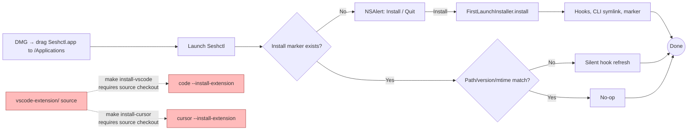
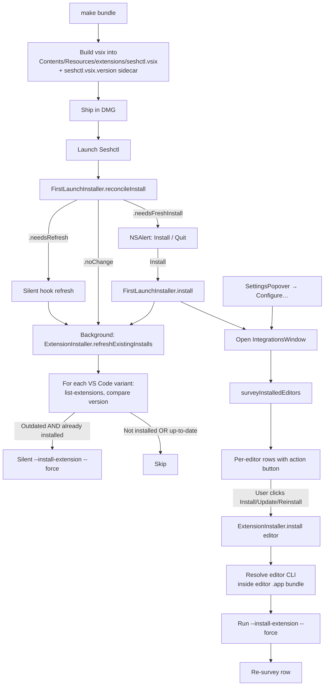

# Plan: VS Code & Cursor Extension Install via Onboarding Pane

## Working Protocol

- Use parallel subagents only for independent work (e.g., bundling script edits + Swift module changes can run in parallel; test writing depends on the module being scaffolded first).
- Mark each step's checkboxes done as you complete them — a fresh agent should be able to find where to resume.
- Run `swift build` (timeout 120s) after each Swift step before moving on. If a hang is suspected, `make kill-build` first per `AGENTS.md`.
- Run tests via a subagent per `AGENTS.md`. Always pass `--enable-code-coverage` for steps that add new source files.
- If `make bundle` is impacted (Step 3), validate by running it end-to-end before the next step starts.
- If blocked, document the blocker here before stopping.

## Context

Today, the VS Code companion extension (`vscode-extension/` — same source serves Cursor) is installable only via `make install-vscode` / `make install-cursor`. Those targets require a source checkout (Node, npm, `@vscode/vsce`, the editor's CLI on PATH). DMG-installed users have none of that, so they can't get the in-IDE focus integration today — terminal-tab AppleScript focus still works, but the `/focus-terminal` URI handler (VS Code) and the `composer.openComposer` chat-focus (Cursor) silently no-op without the extension.

The existing Cursor-support plan (`.agents/plans/2026-05-13-0021-add-cursor-llm-tool-support.md`) explicitly punts this gap to a follow-up — this is that follow-up. Goal: ship the pre-built `.vsix` inside `Seshctl.app/Contents/Resources/extensions/` and give DMG users an in-app **Editor Integrations** flow to install it into each detected editor, with silent version-bump refresh on subsequent launches.

## Overview

Add an `ExtensionInstaller` module to `SeshctlCore` that detects installed editors (VS Code, VS Code Insiders, Cursor), inspects the installed Seshctl extension version via `--list-extensions --show-versions`, and can install/refresh by shelling out to each editor's bundled CLI. Surface this via a new SwiftUI **Editor Integrations** window: auto-opened once after fresh install, and always reachable from Settings. Wire silent version-bump refresh on every launch (background queue), mirroring how hook scripts are silently refreshed. Bundle the `.vsix` at `make bundle` time so DMG ships everything needed.

## User Experience

### Flow 1 — Fresh install (DMG → first launch)

1. Existing `NSAlert` welcome panel ("Set up seshctl on this Mac?" → **Install** / **Quit**). User clicks **Install**.
2. `FirstLaunchInstaller.install()` runs (CLI symlink, hooks, marker — unchanged).
3. **Editor Integrations** window opens (new `NSWindow`, SwiftUI). One row per supported editor that's installed on this Mac:
   - VS Code (`com.microsoft.VSCode`)
   - VS Code Insiders (`com.microsoft.VSCodeInsiders`)
   - Cursor (`com.todesktop.230313mzl4w4u92`)
   - Editors that aren't installed don't appear. If none of the three are installed, this window is skipped entirely (no empty-state on first run).
4. Each row: app icon (32×32, `NSWorkspace.shared.icon(forFile:)`), display name, status line, and a primary action button:
   - Status `Not installed` → button **Install Extension**
   - Status `Installed v0.2.1` → button **Reinstall**
   - Status `Installed v0.1.0 — update available` → button **Update to v0.2.1**
5. Below each row, a small "What is this?" disclosure expands to a one-paragraph explanation (terminal-tab focus for VS Code, chat-tab focus for Cursor).
6. Clicking the action button runs `<editor-cli> --install-extension <bundled .vsix> --force` (30s timeout). Row goes to a transient "Installing…" state, then re-surveys and reflects the new status. Failures show a one-line truncated error with a **Details** disclosure for full stderr.
7. Footer **Done** button closes the window. The user can reopen it anytime.

### Flow 2 — Subsequent launches (silent upgrade)

1. AppDelegate's existing reconciler runs. After hooks finish refreshing, a new background step (`ExtensionInstaller.refreshExistingInstalls`) iterates each editor.
2. For each editor that already has `julo15.seshctl` installed at a version different from the bundled version, silently reinstall. No UI. Logged to `~/Library/Logs/Seshctl/install.log` via the existing `appendInstallLog` helper.
3. Editors where the extension was *never* installed are left alone — silent refresh applies only to editors the user opted into.

### Flow 3 — From Settings (anytime)

1. `SettingsPopover` gets a new section **Editor Integrations** with a single button **Configure…**.
2. Clicking it opens the same window as Flow 1, surveyed fresh. User can install/reinstall per editor at any time (e.g., after installing Cursor later).

## Architecture

### Current

Red boxes = unreachable for DMG users today.

### Proposed

### Runtime walkthrough

**At bundle time** (`make bundle` / CI release):
1. `scripts/build-app-bundle.sh` runs `npm install --no-audit --no-fund && npm run build && npm exec -- @vscode/vsce package` inside `vscode-extension/`, writing the `.vsix` directly to `<bundle>/Contents/Resources/extensions/seshctl.vsix`.
2. Reads `vscode-extension/package.json`'s `version` (via `python3 -c 'import json…'` — no jq dep) and writes it to `<bundle>/Contents/Resources/extensions/seshctl.vsix.version`. This sidecar is the runtime source of truth for "what version are we shipping" — avoids parsing the .vsix zip at runtime.
3. The `.vsix` (~10 KB) and version file (~10 bytes) ship in the DMG. No `node_modules` ships.

**On every launch** (background queue, `.utility` QoS):
1. AppDelegate calls `FirstLaunchInstaller.reconcileInstall(...)` — unchanged.
2. AppDelegate calls new `ExtensionInstaller.refreshExistingInstalls(bundleURL:)`. For each `TerminalApp.allVSCodeVariants`:
   - Resolve editor `.app` URL via `NSWorkspace.shared.urlForApplication(withBundleIdentifier:)`. Skip if not installed.
   - Resolve editor CLI: `<editor.app>/Contents/Resources/app/bin/{code|code-insiders|cursor}`. Skip if missing (fall back to `which` on PATH before skipping).
   - Run `<cli> --list-extensions --show-versions` with 5s timeout. Parse for `^julo15\.seshctl@(\S+)$`.
   - If matched and version != bundled version: run `<cli> --install-extension <bundled .vsix> --force` with 30s timeout. Append log line.
   - If not matched: do nothing.
3. After fresh install only (`runFirstLaunchInstallerIfNeeded` returned `true`), AppDelegate presents `IntegrationsWindowController.shared`.

**Editor Integrations window** (SwiftUI in `IntegrationsView.swift`, hosted by `IntegrationsWindowController : NSWindowController`):
1. On `.onAppear`, calls `ExtensionInstaller.surveyInstalledEditors(bundleURL:)` on a background queue, updates `@State` rows.
2. Each row is independent: clicking its action button kicks off a per-row install on a background queue, sets row state to `.installing`, then re-surveys when complete.
3. Window is fixed-size, non-resizable, ~500×420. Standard close/minimize buttons. Closing the window does not block any other UI.

### Memory vs disk

- **In memory at runtime:** `[EditorIntegration]` array (≤3 entries) for the lifetime of the window.
- **On disk (shipped):**
  - `Seshctl.app/Contents/Resources/extensions/seshctl.vsix` — bundled extension.
  - `Seshctl.app/Contents/Resources/extensions/seshctl.vsix.version` — bundled version string.
- **On disk (per-user, managed by editors):**
  - `~/.vscode/extensions/julo15.seshctl-<version>/` — VS Code's own extension store.
  - `~/.cursor/extensions/julo15.seshctl-<version>/` — Cursor's own extension store.
- **No new marker under `~/Library/Application Support/Seshctl/`.** Installation state is read from the editors themselves on each survey. This sidesteps the cache-coherence trap of "we think the extension is installed but the user uninstalled it manually inside VS Code".

### Where the slow parts are

- **Bundle build:** `npm install + npm run build + vsce package` adds 5–15 s to `make bundle` and `make install`. Mitigation: `npm install` is incremental — only re-runs work when `package-lock.json` changed. For dev `make install` loops, the marginal cost is ~1–2 s after the first run.
- **Launch:** 3 × `--list-extensions` subprocesses (one per VS Code variant present) = 300–600 ms wall time, on a background queue so the menu bar UI is unaffected.
- **Install button click:** 5–15 s for `--install-extension`. Row shows a spinner.

## Current State

Key files referenced from the exploration:

- **`Makefile:104-117`** — `install-vscode` and `install-cursor` targets shell out to `code`/`cursor` CLI; assume source checkout.
- **`scripts/build-app-bundle.sh`** — copies `hooks/{claude,codex,cursor}/` into `Contents/Resources/hooks/`. No extension handling today.
- **`vscode-extension/package.json`** — `version: 0.2.1`, publisher `julo15`, name `seshctl` → installed extension ID is `julo15.seshctl`. TypeScript build via `tsc`, packaged via `@vscode/vsce`. ~10 KB `.vsix` output.
- **`Sources/SeshctlCore/FirstLaunchInstaller.swift`** — canonical install orchestrator. Marker at `~/Library/Application Support/Seshctl/installed-v1.json`. `resolveHookSourceDirs(bundleURL:)` (lines 558–598) is the pattern to mirror for extension-file resolution.
- **`Sources/SeshctlApp/AppDelegate.swift:572-657`** — `runFirstLaunchInstallerIfNeeded()` returns `true` only on fresh install path; that boolean is our hook for opening the new window. `appendInstallLog` (lines 550–570) is reusable for silent-refresh logging.
- **`Sources/SeshctlUI/SettingsPopover.swift`** — SwiftUI popover with Application section (Uninstall, Quit). The right place for the **Editor Integrations → Configure…** entry.
- **`Sources/SeshctlUI/TerminalController.swift:150-181`** — `runShellCommandCapturingStdout(path:args:timeout:)` is the canonical subprocess pattern (`DispatchSemaphore` timeout, SIGTERM grace period).
- **`Sources/SeshctlCore/TerminalApp.swift:23-25, 111-113`** — bundle IDs and `allVSCodeVariants: [.vscode, .vscodeInsiders, .cursor]` static collection. Already exhaustive over the editors we care about.
- **`Resources/Seshctl.entitlements`** — unsandboxed; only AppleEvents entitlement. No new entitlements needed for `Process` invocation.
- **`Tests/SeshctlCoreTests/FirstLaunchInstallerTests.swift`** — `makeTempHome()` + `makeFakeBundle(in:)` harness pattern to mirror for `ExtensionInstallerTests`.

## Proposed Changes

**Strategy:** Add `ExtensionInstaller` as a new module in `SeshctlCore`, parallel to `FirstLaunchInstaller`. It owns only the editor-extension lifecycle (survey, install, refresh, uninstall). Add `IntegrationsView` + `IntegrationsWindowController` in `SeshctlUI`. Wire AppDelegate to (a) open the window after fresh install only, (b) call `refreshExistingInstalls` on every launch in the background. Wire `SettingsPopover` to open the window. Extend `scripts/build-app-bundle.sh` to bundle the `.vsix` and version sidecar.

### Why a new module rather than extending `FirstLaunchInstaller`

`FirstLaunchInstaller` is idempotent over local file state we fully own (symlinks, hooks, marker). Extensions are state owned by *other apps* (VS Code, Cursor), so the install decision is driven by querying those apps, not our own marker. Mixing concerns would slow down `install()` (3 extra subprocess calls) and couple the marker to editor state we don't control.

### Why no new marker file for extension state

The editors are the authoritative source. Re-querying via `--list-extensions` on launch is cheap (<200 ms each) and always-correct. Avoids the "what if the user manually uninstalled the extension in VS Code" coherence trap.

### Why install per-editor rather than bulk

Per the clarifying questions: per-editor rows. Some users want VS Code but not Cursor or vice versa. Per-row buttons make the choice explicit and reversible (Reinstall stays available).

### Why silent upgrade

Per the clarifying questions: silent on launch, like hooks. A version bump in `vscode-extension/package.json` flows out to every opted-in user without prompts, mirroring the existing hook refresh model.

### Reuse audit

- **`NSWorkspace.shared.urlForApplication(withBundleIdentifier:)`** — already used in `TerminalController:184` and `HostAppResolver:57`. Reuse directly.
- **`NSWorkspace.shared.icon(forFile:)`** — used in `HostAppResolver:57`. Reuse for the rows.
- **Subprocess + timeout pattern** — `TerminalController.runShellCommandCapturingStdout` lives in `SeshctlUI`. **Plan:** extract into a new file `Sources/SeshctlCore/ShellRunner.swift` (move, not duplicate). Update the existing `TerminalController` call site to delegate. This makes the helper usable from `ExtensionInstaller` (in core) without `SeshctlUI` depending on it. Capture stderr too — the existing helper discards it, but install failures need it.
- **JSON read/write** — `FirstLaunchInstaller` uses `JSONSerialization`. We don't add a marker file, but if we ever do, mirror the pattern.
- **NSWindowController + SwiftUI hosting** — no existing example in the repo (only `NSPopover` and `NSAlert`). One small helper (~25 lines): subclass `NSWindowController`, build an `NSWindow` hosting `NSHostingController<IntegrationsView>`. Standard Apple recipe.
- **Welcome NSAlert** — *not* reused. User wants a "page" not another alert. The NSAlert stays for the existing fresh-install gate; the new window is a separate concern that opens after.
- **`TerminalApp.allVSCodeVariants`** — already a static collection. Iterate directly. Adding a new variant later (e.g., Windsurf) automatically extends the onboarding pane.
- **`appendInstallLog`** in AppDelegate — reuse for silent-refresh logging.

### Complexity Assessment

**Medium.** ~9 files touched, one new pattern (NSWindowController hosting SwiftUI — well-known AppKit territory). New module `ExtensionInstaller` mirrors `FirstLaunchInstaller`'s shape. Highest-risk areas:

- **Bundle-script changes** (`scripts/build-app-bundle.sh`): adds an `npm install + vsce package` step that needs to be reliable across `make install` (dev loop, runs many times a day) and `make dist` (release, runs occasionally). Hard-fail with a clear error if `npm` is missing — don't silently produce a bundle with no `.vsix`.
- **`code` / `cursor` CLI shell-out**: editor CLI error output is not 100% deterministic. Need to handle editor running but locked, an existing `julo15.seshctl` from a different source (Marketplace), permissions issues writing to `~/.vscode/extensions/`. Catch nonzero exit codes, surface trimmed stderr in the row.
- **SwiftUI/AppKit interop** for the new window: the repo doesn't have an existing precedent of this exact shape. Follow Apple's standard `NSHostingController` recipe.
- **Tests**: subprocess invocation is the hardest part to test. Gate `Process` invocation behind a `Runner` protocol injected into `ExtensionInstaller`; tests use a `MockRunner` returning canned stdout/exit codes.

## Impact Analysis

**New files:**
- `Sources/SeshctlCore/ExtensionInstaller.swift` — detect/install/refresh logic. Public API: `surveyInstalledEditors(bundleURL:) -> [EditorIntegration]`, `install(editor:, bundleURL:) throws -> InstallStatus`, `refreshExistingInstalls(bundleURL:) -> [String]`, `uninstall(editor:) throws`.
- `Sources/SeshctlCore/ShellRunner.swift` — extracted subprocess helper (moved from `TerminalController`).
- `Sources/SeshctlUI/IntegrationsView.swift` — SwiftUI view for the editor list.
- `Sources/SeshctlUI/IntegrationsWindowController.swift` — `NSWindowController` hosting the SwiftUI view; static `shared` instance to prevent duplicate windows.
- `Tests/SeshctlCoreTests/ExtensionInstallerTests.swift` — install/refresh/uninstall idempotency, version-parse, error handling. Uses `MockRunner`.

**Modified files:**
- `scripts/build-app-bundle.sh` — add VSIX build + sidecar version write to `Contents/Resources/extensions/`. Hard-error if `npm` is missing.
- `Sources/SeshctlApp/AppDelegate.swift` — after `runFirstLaunchInstallerIfNeeded` returns `true`, open `IntegrationsWindowController`. On every launch, call `ExtensionInstaller.refreshExistingInstalls` on `DispatchQueue.global(qos: .utility)`.
- `Sources/SeshctlUI/SettingsPopover.swift` — add **Editor Integrations** section with **Configure…** button. Mirror the existing `onUninstall` closure pattern.
- `Sources/SeshctlUI/TerminalController.swift` — replace local `runShellCommandCapturingStdout` body with delegation to `ShellRunner.run(...)`. Net-neutral refactor.
- `Sources/SeshctlCore/TerminalApp.swift` — add `var extensionCLIName: String?` returning `"code"` / `"code-insiders"` / `"cursor"` for VS Code variants, `nil` for terminals. Exhaustive `switch`.
- `README.md` — Compatibility section: note that DMG users no longer need a source checkout for extension features. Document silent-upgrade behavior.
- `AGENTS.md` — short addendum: new "Editor Integrations" section documenting the bundle layout, the `ExtensionInstaller` module, the "read state from editor, not local marker" rule, and the silent-refresh-only-for-opted-in-editors rule.
- `docs/release.md` — note the `npm` build-host dependency.

**Dependencies:**
- Build-time: `node` + `npm` on the bundle host (CI machine and dev macs running `make bundle`).
- Runtime: user must have a VS Code / Cursor `.app` *and* its bundled CLI binary. We do NOT require `code` / `cursor` on PATH — we locate the CLI inside the editor's `.app`. PATH lookup is a fallback only.

**What relies on this:** Cursor's chat-focus (`composer.openComposer`) and VS Code's `/focus-terminal` URI handler only work when the companion extension is loaded. Without the extension, focus degrades gracefully to workspace-level (Cursor) or to AppleScript terminal-tab focus (VS Code).

**Similar modules to avoid duplicating:**
- `FirstLaunchInstaller` — shares the orchestrator shape but does NOT share state. Keep separate.
- `TerminalController.fork*` — shares the "shell out to editor-specific CLI" pattern but has different failure modes (fork is fast, can fall through; install is slow, must report). Don't unify.

## Key Decisions

1. **Bundle the .vsix at build time, don't build at runtime.** DMG users won't have `node`/`npm`. Build into `Contents/Resources/extensions/seshctl.vsix` during `make bundle`. Sidecar `seshctl.vsix.version` is the runtime source of truth for the bundled version — avoids parsing the .vsix zip.
2. **Read editor state from the editor, not from our own marker.** Querying `--list-extensions --show-versions` on launch is cheap and always-correct.
3. **Silent upgrade only for editors that already have our extension.** Don't auto-install into editors that opted out. The onboarding pane is the only place where a fresh editor gets the extension.
4. **Locate CLI inside the editor's .app bundle first.** More reliable for DMG users who may not have run "Shell Command: Install code in PATH". Fall back to PATH only if the in-bundle CLI is missing.
5. **No new entitlements.** Seshctl is unsandboxed; `Process` is fine.
6. **No CLI verb (`seshctl-cli install-extension`) in this plan.** Per the clarifying answer. The make targets continue to work for source-checkout dev. Can add later if requested.
7. **Window auto-open is fresh-install-only.** Refresh path does not open a window; it's silent. Matches the existing model where upgrades never show a welcome panel.

## Implementation Steps

### Step 1: Plumbing — extract `ShellRunner`, add `TerminalApp.extensionCLIName`
- [x] Create `Sources/SeshctlCore/ShellRunner.swift`. Define `enum ShellRunner { public static func run(path: String, args: [String], timeout: TimeInterval) -> Result? }` where `Result = (stdout: String, stderr: String, status: Int32)`. Use the existing `DispatchSemaphore` + `terminationHandler` + SIGTERM-grace pattern from `TerminalController:150-181`. Capture both stdout *and* stderr (the original helper discards stderr).
- [x] Refactor `TerminalController.runShellCommandCapturingStdout(path:args:timeout:)` to delegate: `ShellRunner.run(path:, args:, timeout:)?.stdout` (with the same status==0 check). Confirm all existing call sites compile and behave identically.
- [x] In `Sources/SeshctlCore/TerminalApp.swift`, add `public var extensionCLIName: String? { switch self … }` returning `"code"` for `.vscode`, `"code-insiders"` for `.vscodeInsiders`, `"cursor"` for `.cursor`, and `nil` for all terminals. Make the switch exhaustive (no `default`).
- [x] `swift build` clean. Run the existing test suite via a subagent to confirm no regressions.

### Step 2: New `ExtensionInstaller` module in `SeshctlCore`
- [x] Create `Sources/SeshctlCore/ExtensionInstaller.swift`.
- [x] Define types (all `public`):
  - `enum EditorExtensionStatus: Equatable { case notInstalled; case installed(version: String); case outdated(installed: String, bundled: String); case cliUnavailable }` _(added `.cliUnavailable` for editors installed without a usable CLI; lets the view disable the action button)_
  - `struct EditorIntegration { let app: TerminalApp; let appURL: URL; let status: EditorExtensionStatus }` _(dropped `icon: NSImage` — SeshctlCore is Foundation-only; the SwiftUI view fetches the icon at render time via `NSWorkspace.shared.icon(forFile: appURL.path)`)_
  - `enum InstallError: Error { case cliNotFound; case bundledVsixMissing; case subprocessFailed(stderr: String, status: Int32); case timeout }`
- [x] Define injection seams: `ExtensionRunner` protocol (wraps `ShellRunner.Result?`) with `DefaultExtensionRunner`, plus new `AppLocator` protocol (no AppKit in core — production impl lives in SeshctlUI, wired up in Step 5). Inject via `ExtensionInstaller.init(runner: ExtensionRunner = DefaultExtensionRunner(), appLocator: AppLocator, fileManager: FileManager = .default)`.
- [x] Implement `bundledVsixURL(bundleURL: URL) -> URL` and `bundledVersion(bundleURL: URL) -> String?` (reads `Contents/Resources/extensions/seshctl.vsix.version`, trims whitespace).
- [x] Implement `resolveEditorCLI(editor: TerminalApp) -> URL?`: uses injected `AppLocator`, appends `Contents/Resources/app/bin/<editor.extensionCLIName>`. Returns `nil` if the file doesn't exist; fall back to PATH (`/usr/bin/which <name>` via `ShellRunner`) before giving up.
- [x] Implement `surveyInstalledEditors(bundleURL: URL) -> [EditorIntegration]`:
  - For each `editor in TerminalApp.allVSCodeVariants` where `AppLocator.appURL` returns non-nil:
    - Resolve CLI. If missing, status = `.cliUnavailable` (row still appears so user can read the hint).
    - Run `<cli> --list-extensions --show-versions` with 5s timeout. Parse for `julo15.seshctl@<version>` (exact id match on left of `@`).
    - Compare to bundled version. Set status accordingly. If sidecar missing, never report `.outdated`.
- [x] Implement `install(editor: TerminalApp, bundleURL: URL) throws -> EditorExtensionStatus`: resolve CLI + vsix path, run `<cli> --install-extension <vsix> --force` with 30s timeout. On nonzero status, `throw .subprocessFailed(stderr:, status:)`. On success, re-query and return new status.
- [x] Implement `uninstall(editor: TerminalApp) throws`: runs `<cli> --uninstall-extension julo15.seshctl`. Idempotent — nonzero exit with "not installed" stderr is treated as success.
- [x] Implement `refreshExistingInstalls(bundleURL: URL) -> [String]`: surveys all editors; for any in `.outdated` state, runs `install`; returns log lines (timestamped, ISO8601) for `appendInstallLog`. Never throws — failures captured as log lines.

### Step 3: Bundle the .vsix at build time
- [x] Edit `scripts/build-app-bundle.sh`. Before the existing `cp -R hooks/...` block, add an extensions block:
  - Hard-error with a clear message if `command -v npm` is empty (point at `docs/release.md`).
  - `mkdir -p "$BUNDLE_DIR/Contents/Resources/extensions"`.
  - `( cd "$REPO_DIR/vscode-extension" && npm install --no-audit --no-fund && npm run build && npm exec -- @vscode/vsce package --allow-missing-repository --out "$BUNDLE_DIR/Contents/Resources/extensions/seshctl.vsix" )`.
  - Extract version: `VERSION=$(python3 -c 'import json,sys;print(json.load(open(sys.argv[1]))["version"])' "$REPO_DIR/vscode-extension/package.json")`. Write to `"$BUNDLE_DIR/Contents/Resources/extensions/seshctl.vsix.version"`. (Avoiding `jq` keeps the build host's dep list small.)
- [x] Run `make bundle` and verify both files exist and have non-zero size. _(Verified: vsix is 10,077 bytes; sidecar contains `0.2.1`.)_
- [x] Run `make install` end-to-end (target: <30s for a clean run, <5s for incremental). If incremental cost is unacceptable, gate the `npm install` step on a `package-lock.json` mtime check. _(npm install was already incremental at ~200ms on warm cache; no gating needed.)_

> Follow-up worth filing: `@vscode/vsce` is currently resolved via `npm exec` on demand rather than declared as a devDependency in `vscode-extension/package.json`. Works today (matches existing make targets) but a fresh CI machine would pay a one-time install cost. Low priority.

### Step 4: SwiftUI `IntegrationsView` + `NSWindowController`
- [x] Create `Sources/SeshctlUI/IntegrationsView.swift`:
  - Top-level `struct IntegrationsView: View` taking `bundleURL: URL` in init.
  - `@State private var rows: [EditorIntegration] = []`, `@State private var inFlight: Set<TerminalApp> = []`, `@State private var lastError: [TerminalApp: String] = [:]`.
  - `.onAppear` and a refresh button re-survey via `ExtensionInstaller.surveyInstalledEditors(bundleURL:)` on a background queue.
  - One row per `EditorIntegration`: HStack of icon (Image(nsImage:), 32×32), VStack(name, statusLine), Spacer, action button. Action button title depends on status:
    - `.notInstalled` → "Install Extension"
    - `.installed(version)` → "Reinstall"
    - `.outdated(installed, bundled)` → "Update to v\(bundled)"
  - Disabled state while `inFlight.contains(app)`; shows a small spinner inline.
  - Error rendering: one-line truncated under the row, with a "Details" disclosure that expands to a scrollable text view of the stderr.
  - Empty state: "No supported editors detected on this Mac." centered, with a hint that the user can install VS Code or Cursor and reopen Settings → Configure…
  - Footer **Done** button calls a closure passed in from the controller to close the window.
- [x] Create `Sources/SeshctlUI/IntegrationsWindowController.swift`:
  - `final class IntegrationsWindowController: NSWindowController`. Static `shared: IntegrationsWindowController` initialized lazily, constructing a production `ExtensionInstaller` wired to `NSWorkspaceAppLocator` and `Bundle.main.bundleURL`.
  - `init(installer:bundleURL:)`: builds an `NSWindow` (titled, closable, miniaturizable, NOT resizable; styleMask without `.resizable`). `contentRect: NSRect(x: 0, y: 0, width: 520, height: 420)`. Centers on screen. `contentViewController = NSHostingController(rootView: IntegrationsView(installer:, bundleURL:, onClose:))`.
  - Override `showWindow(_:)` to also call `NSApp.activate(ignoringOtherApps: true)` so the menu bar app brings the window forward.
- [x] _(Also added)_ `Sources/SeshctlUI/NSWorkspaceAppLocator.swift` — tiny production `AppLocator` wrapping `NSWorkspace.shared.urlForApplication(withBundleIdentifier:)`. Lives in SeshctlUI to keep SeshctlCore AppKit-free.
- [x] _(Also added)_ `@unchecked Sendable` annotation on `ExtensionInstaller` so the view can share the installer across `Task.detached` boundaries. Justification comment in the source.

### Step 5: Wire AppDelegate
- [x] In `AppDelegate.swift`, after `runFirstLaunchInstallerIfNeeded()` returns `true` (the existing fresh-install path), call `IntegrationsWindowController.shared.showWindow(nil)`.
- [x] Add `private func refreshEditorExtensionsInBackground()`. It dispatches to `DispatchQueue.global(qos: .utility)`, constructs an `ExtensionInstaller(appLocator: NSWorkspaceAppLocator())` inside the closure, and calls `refreshExistingInstalls(bundleURL:)`. Returned log lines are forwarded to `appendInstallLog` after hopping back to MainActor.
- [x] Call `refreshEditorExtensionsInBackground()` from `applicationDidFinishLaunching` after the existing `runFirstLaunchInstallerIfNeeded()`. It runs regardless of fresh-install vs refresh path — `refreshExistingInstalls` is a no-op if nothing's installed.
- [x] Confirm the order: hooks first, then extension refresh. They're independent and both background-safe.

### Step 6: Wire SettingsPopover
- [x] In `SettingsPopover.swift`, add a new section titled **Editor Integrations** with a **Configure…** button. _(Placed between About and Application so the prominent Uninstall/Quit stay at the very bottom.)_
- [x] Add an `onOpenIntegrations: (() -> Void)?` closure to `SettingsPopover` (mirroring `onUninstall`). Defaulted to nil so existing previews / `SettingsPopover(store:)` call sites keep compiling.
- [x] Threaded through `RootView` → `SessionListView` → `SettingsPopover`. AppDelegate's setup site passes `{ IntegrationsWindowController.shared.showWindow(nil) }`.

### Step 7: Tests
- [x] Create `Tests/SeshctlCoreTests/ExtensionInstallerTests.swift` with `MockRunner` + `MockAppLocator` + `makeFakeEditorApp` / `makeFakeSeshctlBundle` helpers.
- [x] 19 ExtensionInstaller cases (all from the spec, plus three additional: `cliUnavailable` survey path, `bundledVsixMissing` install path, `cliNotFound` install path, exact-prefix parse-match) — all pass.
- [x] 4 added `ShellRunner` integration cases using real `/bin/echo` and `/bin/sh`, covering stdout-capture, stderr+nonzero-status, launch-failure, and timeout-terminate branches. Closes the coverage gap left by `MockRunner` never exercising the real subprocess plumbing.
- [x] Run `swift test --enable-code-coverage` and verify coverage. Achieved: `ExtensionInstaller.swift` **75%**, `ShellRunner.swift` **95.45%** — both above their targets.

### Step 8: Documentation
- [ ] **`README.md`** — update Compatibility section: VS Code / Cursor extension is now installable from inside the app for DMG users (was: source-checkout only). Add a one-paragraph "Editor Integrations" section explaining the onboarding pane, where to find it from Settings, and the silent-upgrade behavior.
- [ ] **`AGENTS.md`** — add an "Editor Integrations" section after the existing "Adding an LLM Tool" section. Cover: bundle layout (`Contents/Resources/extensions/seshctl.vsix` + `.vsix.version`), the `ExtensionInstaller` module, the rule that state is read from the editor (not a local marker), the rule that silent refresh only applies to opted-in editors, and how to add a new editor (extend `TerminalApp.extensionCLIName`).
- [ ] **`docs/release.md`** — note the `npm` build-host dependency. Document the new bundle paths.

## Acceptance Criteria

- [ ] [test] Survey returns `.installed(version:)` when `--list-extensions` output contains `julo15.seshctl@<version>`.
- [ ] [test] Survey returns `.outdated` when bundled version differs from installed version.
- [ ] [test] Survey returns `.notInstalled` when extension is missing or output is malformed.
- [ ] [test] `install(editor:)` invokes the editor-specific CLI inside the editor's `.app` bundle with `--install-extension <vsix> --force`.
- [ ] [test] `install(editor:)` throws with captured stderr on nonzero exit status.
- [ ] [test] `refreshExistingInstalls` is a no-op for editors without the extension installed.
- [ ] [test] `refreshExistingInstalls` re-installs only editors whose installed version differs from the bundled version.
- [ ] [test] `TerminalApp.extensionCLIName` returns `nil` for terminal apps and the correct CLI name for each VS Code variant.
- [ ] [test-manual] On a fresh DMG install with VS Code present, the Editor Integrations window opens automatically after the welcome alert and shows VS Code with "Install Extension". Clicking installs the extension; row updates to "Installed v0.2.1".
- [ ] [test-manual] On a Mac with neither VS Code nor Cursor installed, the Editor Integrations window does not auto-open after fresh install. Settings → Configure… still opens it and shows the empty state.
- [ ] [test-manual] On a subsequent launch with extension already installed and bundled version newer (manually edit sidecar to "9.9.9" to simulate), the extension is silently reinstalled and `~/Library/Logs/Seshctl/install.log` records the refresh.
- [ ] [test-manual] Settings → Editor Integrations → Configure… opens the same window. Reinstall button works.
- [ ] [test-manual] `make bundle` produces `dist/Seshctl.app/Contents/Resources/extensions/seshctl.vsix` and matching `seshctl.vsix.version`. Both have non-zero size.
- [ ] [test-manual] `make bundle` fails with a clear error message if `npm` is not on PATH.

## Edge Cases

- **Editor is running during install:** `--install-extension --force` is safe to run while the editor is open — the editor picks up the new extension on next reload. Row status text after install: "Installed v0.2.1 — reload VS Code to activate."
- **Editor's in-bundle CLI binary missing:** Fall back to `which code` / `which cursor` on PATH. If both fail, status is `.notInstalled` with a tooltip "Editor CLI not found — install the 'Shell Command' helper from VS Code's Command Palette".
- **Extension installed from elsewhere (Marketplace, manual drop):** `--install-extension --force` overwrites it. Acceptable — the user invoked the install knowing they want our version.
- **User manually uninstalls extension between launches:** Next launch's `refreshExistingInstalls` sees `.notInstalled` and leaves the editor alone. Correct.
- **`npm install` fails during `make bundle`:** Hard-fail with a clear error. Don't ship a bundle missing the `.vsix`.
- **Concurrent runs:** Background `refreshExistingInstalls` and a user click on the onboarding pane could both invoke `--install-extension` on the same editor. `--force` makes this idempotent. Accept the race.
- **Multiple editor installs on disk (e.g., two VS Code copies):** `urlForApplication` returns the system-blessed default. We install into that one only. Document as a known limitation in `AGENTS.md`.
- **Sidecar version file missing or unreadable:** Survey falls back to a "we don't know the bundled version" state — all rows show `.installed(version)` without `.outdated` detection. Install button still works (uses the .vsix as-is); silent refresh is a no-op. Logged so we can detect it in release builds.
