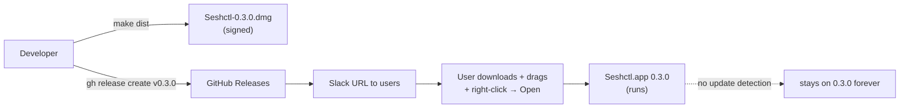
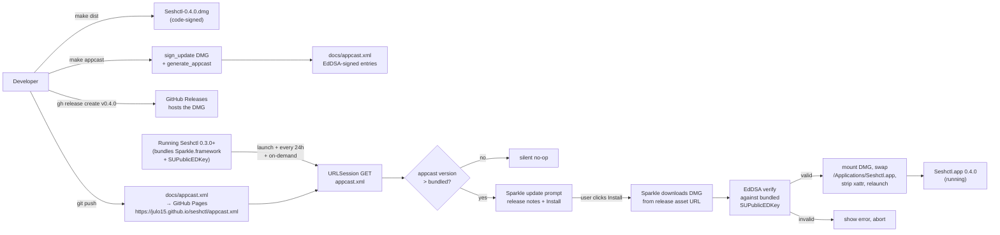

# Plan: Sparkle Auto-Updates (Phase 2)

## Working Protocol
- Use parallel subagents for independent tasks (e.g., SwiftPM wiring + script writing + doc updates can proceed concurrently once the key is generated).
- Mark each step's checkbox done as you complete it — a fresh agent should be able to find where to resume.
- Run `swift build` (timeout 120s) after each Swift step before moving on. `make kill-build` first if a hang is suspected.
- Tests via a subagent per `AGENTS.md`.
- `make appcast` end-to-end smoke (publish a test 0.4.0-test release on a throwaway tag, run the local 0.3.0 build, confirm Sparkle prompts) belongs in Step 9 — don't ship 0.4.0 from main until the smoke passes.
- If blocked, document the blocker here before stopping.

## Overview

Integrate Sparkle 2.x into Seshctl so the app can detect and install updates with a single user confirmation. Replaces the current "Slack the link to a new DMG, user re-downloads and re-drags" flow. Hosting: project-site GitHub Pages under `https://julo15.github.io/seshctl/appcast.xml`, with the appcast.xml committed to `docs/` in this repo (no cross-repo coupling).

## User Experience

### Update available (the happy path)

1. User runs Seshctl 0.4.0+. On launch (and again every 24 hours while the app stays running), Sparkle quietly fetches `https://julo15.github.io/seshctl/appcast.xml` in the background.
2. When the appcast advertises a newer `<sparkle:shortVersionString>`, Sparkle pops a standard `Update Available` window over the menu bar app — title, release notes (pulled from the appcast `<description>`), and three buttons: **Install Update**, **Remind Me Later**, **Skip This Version**.
3. User clicks **Install Update**. Sparkle downloads the new DMG to a temp directory, verifies it against the bundled EdDSA public key, mounts the DMG, swaps `/Applications/Seshctl.app`, strips the `com.apple.quarantine` xattr, and relaunches the new bundle. Total elapsed time: ~10 seconds on a fast connection.
4. The app comes back at the new version. AppDelegate's launch-time reconciler refreshes the CLI symlink, hooks, and bundled editor extensions exactly as it does today. Session state is preserved (everything is in GRDB).

### User-initiated check

1. User clicks the menu-bar icon → gear → **Check for Updates…** in the SettingsPopover's About section.
2. Sparkle runs the same check synchronously. If no update is available, it shows "You're up to date" (Sparkle's standard "no update" sheet). If one is available, the same Update Available window from step 2 above appears.

### No update available

Silent. Sparkle never surfaces anything when the appcast says the bundled version is current. The 24-hour timer keeps running in the background.

### Update fails (network / signature / DMG mount)

Sparkle shows its standard error sheet ("Update Error" with the underlying cause). The user can dismiss and continue running the current version. The 24h timer retries.

## Architecture

### Current



### Proposed



### Runtime data flow

**At launch (every time Seshctl.app starts):**

1. `AppDelegate.applicationDidFinishLaunching` runs. Today's order is: hide dock icon → run first-launch installer → silent editor-extension refresh → request Accessibility → initialize DB + ViewModel → build UI → register hotkey → register status item. **Sparkle insertion point: between "first-launch installer" and "silent editor-extension refresh"** — `SPUStandardUpdaterController(startingUpdater: true, updaterDelegate: nil, userDriverDelegate: nil)` is constructed and stored on AppDelegate.
2. Sparkle's internal scheduler reads `SUEnableAutomaticChecks=true` from Info.plist and starts a background timer. First check fires immediately on launch (Sparkle default for fresh starts); subsequent checks every 24 hours while the app is running.
3. Each background check is an HTTPS GET to `SUFeedURL` (the appcast.xml on Pages). All happens off the main thread — never blocks UI.
4. If the appcast contains a `<sparkle:shortVersionString>` greater than the running bundle's `CFBundleShortVersionString`, Sparkle dispatches to the main thread and presents its standard update window. The window is an NSWindow owned by Sparkle's framework — it works fine for `LSUIElement: true` menu-bar apps.

**At release time (developer-side):**

1. Developer runs `make dist` → produces `dist/Seshctl-<VERSION>.dmg`. Unchanged from today.
2. Developer runs `make appcast`:
   - Copies the new DMG into a local mirror dir (`dist/releases/`, gitignored). This dir accumulates all historical DMGs.
   - Runs `sign_update --ed-key-file ~/path/to/sparkle_priv.key dist/Seshctl-<VERSION>.dmg` → prints the EdDSA signature + length.
   - Runs `generate_appcast dist/releases/ -o docs/appcast.xml` → walks the mirror dir, emits a complete appcast with one `<item>` per DMG, each carrying its signature.
   - The script also injects a `<description>` per item by reading `docs/release-notes/<VERSION>.md` (a new convention) so release notes show up in the Sparkle prompt.
3. Developer commits `docs/appcast.xml` (and the optional release-notes file), pushes to main. GitHub Pages rebuilds — usually within 60 seconds.
4. Developer runs `gh release create v<VERSION> dist/Seshctl-<VERSION>.dmg ...` as today.

**Memory vs disk:**

- **In memory at runtime:** one `SPUStandardUpdaterController` instance held by `AppDelegate`. ~negligible.
- **On disk in the bundle:** `Sparkle.framework` (~3 MB) inside `Contents/Frameworks/`, plus the public key + feed URL in `Info.plist`.
- **On disk during update:** Sparkle writes a temp DMG under `~/Library/Caches/Sparkle/app.seshctl.Seshctl/`; deletes it after install.
- **Persistent state outside the bundle:** Sparkle stores user-defaults (skipped versions, last-check timestamp) under our app's UserDefaults domain. No new SeshctlCore code touches this.

**Slow parts:** the appcast fetch (~50 ms on cold network) and the DMG download (~5 s for 10 MB). Both are background. The user-perceived blocking action is the relaunch itself (~1 s).

## Current State

Key files referenced from the exploration:

- **`Sources/SeshctlApp/AppDelegate.swift:35-177`** — `applicationDidFinishLaunching` sequence. Sparkle init slots between first-launch reconcile and silent extension refresh.
- **`Sources/SeshctlApp/AppDelegate.swift:124-125`** — existing pattern: `onUninstall` / `onOpenIntegrations` closures threaded through RootView → SessionListView → SettingsPopover. Same shape for `onCheckForUpdates`.
- **`Sources/SeshctlUI/SettingsPopover.swift:22-35, 90-130`** — current popover has an "About" section that shows the version string. The "Check for Updates…" button slots naturally as a sibling in About (semantically pairs with the version label).
- **`Sources/SeshctlUI/SessionListView.swift:15-39, 100-102`** — middle layer for the closure plumbing.
- **`Resources/Info.plist`** — currently has `CFBundleIdentifier`, `CFBundleShortVersionString=0.3.0`, `CFBundleVersion=3`, `LSUIElement=true`. Will add `SUFeedURL`, `SUPublicEDKey`, `SUEnableAutomaticChecks`.
- **`Resources/Seshctl.entitlements`** — only `com.apple.security.automation.apple-events`. Not sandboxed → no Sparkle sandbox flags needed.
- **`scripts/build-app-bundle.sh`, `scripts/sign-app.sh`, `scripts/make-dmg.sh`** — existing release scripts. Sparkle adds `scripts/make-appcast.sh` and a new Makefile target.
- **`docs/release.md`, `docs/signing.md`** — existing release docs to extend.
- **`Package.swift`** — Swift package manifest. Add Sparkle as a `.package(url:)` dependency on the app target ONLY (keep SeshctlCore Foundation-free).

## Proposed Changes

**Strategy:** drop Sparkle 2.x in as a SwiftPM dependency on the app target. Wire one `SPUStandardUpdaterController` into AppDelegate (3 lines). Add a "Check for Updates…" button via the existing closure-plumbing pattern. New `make appcast` target runs `sign_update` + `generate_appcast` against a local DMG mirror dir and writes `docs/appcast.xml`. Enable Pages on the seshctl repo, serve from docs/. EdDSA private key lives in login Keychain (Sparkle's default) with a 1Password export mirroring the .p12 backup pattern from `docs/signing.md`.

### Why GitHub Pages from docs/ (and not raw release assets)

- Project-site Pages (docs/ in this repo) has no cross-repo coupling — fully self-contained in `julo15/seshctl`.
- Stable URL (`https://julo15.github.io/seshctl/appcast.xml`) that never churns; the file content changes per release, the URL doesn't.
- Appcast goes through the same code review / commit / push flow as the rest of the repo. PR-able.
- No "every release must re-upload the full history" awkwardness that the raw-asset approach has.

### Why separate `make appcast` (not chained into `make dist`)

- `make dist` produces local artifacts (DMG, signed bundle) — testable in isolation, no network or release-state dependencies.
- `make appcast` requires the DMG mirror dir to be accurate (every prior version present) and writes into `docs/`, which is the public release surface. Decoupling lets you re-run `make dist` for local smoke tests without churning the appcast.
- Mirrors the existing `make bundle` / `make sign` / `make-dmg` separation — each Makefile target does one thing.

### Why mirror the .p12 / Keychain pattern for EdDSA key backup

- Already documented and battle-tested for code-signing (`docs/signing.md`). The threat model is identical: losing the key forces a public-key rotation that orphans existing installs.
- 1Password is the canonical "single source of truth backup" location in this repo's conventions.
- `generate_keys -x sparkle_priv.key` produces a single line of base64 — fits cleanly in a 1Password secure note next to the existing `.p12` entry.

### Why pre-Phase-1B (no Developer ID / notarization yet)

- Sparkle's EdDSA signatures are independent of Apple's code signature, so it functions identically pre- and post-notarization.
- The one-time Gatekeeper "right-click → Open" friction on first install is unchanged either way; subsequent Sparkle updates strip `com.apple.quarantine` and skip Gatekeeper entirely. So pre-notarization Sparkle is strictly better than no Sparkle.
- Sequencing Sparkle now means Phase 1B (when it lands) only needs to update Info.plist + signing cert, not also bolt on update plumbing.

### Reuse audit

For every component this plan introduces, an existing pattern was checked:

| New component | Existing pattern reused | Reuse strategy |
|---|---|---|
| `SPUStandardUpdaterController` init in AppDelegate | Existing launch-sequence order — `applicationDidFinishLaunching` already orchestrates first-launch reconciler, extension refresh, AX requests, etc. | New init slots in by line position. |
| "Check for Updates…" closure plumbing | `onUninstall`, `onOpenIntegrations` closure pattern (AppDelegate → RootView → SessionListView → SettingsPopover) | Exact mirror: new `onCheckForUpdates: (() -> Void)?` follows identical shape. |
| `make appcast` Makefile target + shell script | `make bundle`, `make sign`, `make-dmg` — `bash scripts/*.sh` per target | Same shape: new `scripts/make-appcast.sh` invoked from a one-line make target. |
| Version + bundle ID handling | `plutil -extract CFBundleShortVersionString raw -o - Resources/Info.plist` (used by `make-dmg.sh:36`) | Reused verbatim by the new script. |
| EdDSA key documentation | `docs/signing.md` — code-signing cert lifecycle + .p12 backup + login keychain | Append new section using the same structure. |
| DMG mirror dir for `generate_appcast` | `dist/` (gitignored) | New subdir `dist/releases/` lives under the same gitignored tree. No new ignore rule needed (it's already covered). |
| Initial appcast.xml entries | (no precedent — first release with Sparkle) | New. `make appcast` generates from `dist/releases/` at release time. |

No new code component duplicates existing functionality.

### Complexity Assessment

**Low to medium.** Swift-side changes are minimal — one new dependency, ~3 lines of AppDelegate wiring, one closure threaded through the existing settings-popover plumbing. The non-trivial work is on the release-pipeline side: a new shell script, a Makefile target, EdDSA key generation + backup, enabling Pages on the repo, and the release-time discipline of regenerating the appcast on every release. About 8 files touched. Risk concentrations:

- **EdDSA key loss** = orphan event for existing installs. Mitigation: 1Password backup (mandatory step in Step 3 below), public-key rotation procedure documented in docs/signing.md.
- **First Sparkle-enabled release.** Users on 0.3.0 (today's release) don't have Sparkle bundled, so they won't auto-update to the first Sparkle release. They have to manually grab the next DMG — documented in the 0.4.0 release notes.
- **Sparkle's relaunch dance** running while the user has a session panel open. Tested by Sparkle for menu-bar apps but worth a manual smoke per Step 9.

## Impact Analysis

**New files:**
- `scripts/make-appcast.sh` — wraps `sign_update` + `generate_appcast`.
- `docs/appcast.xml` — Sparkle's feed file. Committed; rewritten on every release by `make appcast`.
- `docs/release-notes/0.4.0.md` (and one per future release) — optional but recommended; consumed by `make-appcast.sh` for the `<description>` field in each appcast entry.
- `Tests/SeshctlAppTests/InfoPlistSparkleKeysTests.swift` *(or wherever Swift Testing tests for the app target live)* — asserts `SUFeedURL`, `SUPublicEDKey`, `SUEnableAutomaticChecks` are present in `Resources/Info.plist`.

**Modified files:**
- `Package.swift` — add Sparkle dependency, attach to the app target only.
- `Sources/SeshctlApp/AppDelegate.swift` — store `SPUStandardUpdaterController`, init in `applicationDidFinishLaunching`, expose a `checkForUpdates()` method, pass `onCheckForUpdates:` closure through to `RootView`.
- `Sources/SeshctlUI/RootView.swift` *(or wherever the closures land before reaching `SessionListView`)* — accept and forward `onCheckForUpdates`.
- `Sources/SeshctlUI/SessionListView.swift` — accept and forward `onCheckForUpdates` to `SettingsPopover`.
- `Sources/SeshctlUI/SettingsPopover.swift` — accept `onCheckForUpdates`, render the button in the About section.
- `Resources/Info.plist` — add `SUFeedURL=https://julo15.github.io/seshctl/appcast.xml`, `SUPublicEDKey=<base64 string>`, `SUEnableAutomaticChecks=true`.
- `Makefile` — new `appcast` target (one line invoking the script).
- `docs/release.md` — new pre-release checklist item ("regenerate appcast.xml"); new `make appcast` + commit step; the GitHub Pages one-time enablement.
- `docs/signing.md` — new EdDSA key section: where the private key lives (login Keychain item `https://sparkle-project.org`), how to export for 1Password backup (`generate_keys -x sparkle_priv.key`), how to restore (`generate_keys -f sparkle_priv.key`), the public-key-rotation procedure if the private key is ever lost.
- `AGENTS.md` — replace the "Phase 2 will add Sparkle auto-updates. Don't re-introduce manual update infrastructure as a 'missing feature' — the plan deliberately defers it." paragraph with: Phase 2 is implemented; document the EdDSA key location, the `make appcast` step, the Pages dependency, the orphan-on-rotation rule.

**Dependencies introduced:**
- Build-time: Sparkle's `bin/generate_keys`, `bin/sign_update`, `bin/generate_appcast` (live inside the resolved package at `.build/artifacts/sparkle/Sparkle/bin/`).
- Runtime: `Sparkle.framework` embedded in the .app bundle.
- Infrastructure: GitHub Pages enabled on `julo15/seshctl` (one-time, via repo settings).

**What relies on this:** the Phase 1B notarization work (next) inherits Sparkle's signing path verbatim — only the Apple code-signature side changes.

**Similar modules to avoid duplicating:**
- `FirstLaunchInstaller` — the launch-time reconciler. Sparkle's update path is parallel, not stacked on top. Don't try to fold update logic into the reconciler.
- `ExtensionInstaller.refreshExistingInstalls()` — silent on-launch refresh. Same pattern for "do something useful on every launch without UI" but explicitly different concern (extension state, not app version).

## Key Decisions

1. **GitHub Pages from `docs/` (not raw release asset).** Stable URL, no per-release URL churn, full version control of the appcast itself. No cross-repo coupling with `julo15.github.io`.
2. **Sparkle's defaults for cadence.** Launch check + 24h timer + "Check for Updates…" menu item. Doesn't suppress prompts, doesn't add a check-on-resume hook.
3. **Login Keychain + 1Password export for the EdDSA private key.** Mirrors `.p12` handling in `docs/signing.md` exactly.
4. **Separate `make appcast` target (not chained into `make dist`).** Keeps `make dist` testable without a populated `dist/releases/` mirror.
5. **Ship before Phase 1B notarization.** First-install Gatekeeper friction is unchanged; subsequent Sparkle updates skip Gatekeeper entirely. Net positive.
6. **No beta channel for now.** `<sparkle:channel>` is YAGNI with one user. Easy to add later.

## Implementation Steps

### Step 1: Add Sparkle SwiftPM dependency
- [x] Edit `Package.swift`. Add `.package(url: "https://github.com/sparkle-project/Sparkle", from: "2.9.0")` to dependencies. Attach `.product(name: "Sparkle", package: "Sparkle")` to the `SeshctlApp` target ONLY (not `SeshctlCore`, not `SeshctlUI`, not the CLI). Pinned to 2.9.0 (latest 2.x at planning time was 2.9.2).
- [x] `swift build` — Sparkle resolves and the framework links cleanly.

### Step 2: Generate EdDSA keypair + back up
- [ ] Run `.build/artifacts/sparkle/Sparkle/bin/generate_keys` from the worktree root. This creates the private key in your login Keychain (item: `https://sparkle-project.org`, the only item Sparkle ever creates there) and prints the base64 public key to stdout.
- [ ] Capture the public key string. **Don't commit it to anything yet** — it goes into Info.plist in Step 4.
- [ ] Export the private key for 1Password backup: `.build/artifacts/sparkle/Sparkle/bin/generate_keys -x /tmp/sparkle_priv.key`. Copy the file contents into a new 1Password secure note titled "Seshctl Sparkle EdDSA private key" alongside the existing Seshctl .p12 entry. Verify the export is a single line of base64. Delete `/tmp/sparkle_priv.key` after the copy.
- [ ] **Do not commit the private key anywhere in the repo.** The only thing the repo holds is the public key in Info.plist.

### Step 3: Add Sparkle keys to Info.plist
- [x] Edit `Resources/Info.plist`:
  - `SUFeedURL` (string): `https://julo15.github.io/seshctl/appcast.xml`
  - `SUPublicEDKey` (string): the base64 public key from Step 2.
  - `SUEnableAutomaticChecks` (bool): `true`
  - Do NOT add `SUEnableInstallerLauncherService` or `SUEnableDownloaderService` — those are sandbox-only and we're not sandboxed.

### Step 4: Wire `SPUStandardUpdaterController` into AppDelegate
- [ ] Add `import Sparkle` at the top of `Sources/SeshctlApp/AppDelegate.swift`.
- [ ] Add a stored property: `private var updaterController: SPUStandardUpdaterController?` near the existing stored properties.
- [ ] In `applicationDidFinishLaunching`, after the first-launch installer call (line ~63 today) and before the silent extension refresh (line ~58 today — Sparkle init must run from MainActor), instantiate: `updaterController = SPUStandardUpdaterController(startingUpdater: true, updaterDelegate: nil, userDriverDelegate: nil)`. `startingUpdater: true` tells Sparkle to begin its background timer immediately.
- [ ] Add a `checkForUpdates()` method on AppDelegate that calls `updaterController?.checkForUpdates(nil)`.
- [ ] Pass `onCheckForUpdates: { [weak self] in self?.checkForUpdates() }` to `RootView` in the existing closure-init block (line ~124 today, alongside `onUninstall` and `onOpenIntegrations`).

### Step 5: Thread the closure through RootView → SessionListView → SettingsPopover
- [ ] Mirror the existing `onUninstall` / `onOpenIntegrations` pattern exactly:
  - `RootView` — accept `onCheckForUpdates: (() -> Void)?` and forward to `SessionListView`.
  - `SessionListView` — declare `var onCheckForUpdates: (() -> Void)?`, accept it in init, forward to `SettingsPopover`.
  - `SettingsPopover` — declare `private let onCheckForUpdates: (() -> Void)?`, accept it in init, render a `Button("Check for Updates…") { onCheckForUpdates?() }` inside the About section beneath the version string.
- [ ] Hide the button when `onCheckForUpdates == nil` (matches the conditional pattern used for `onOpenIntegrations` etc.).

### Step 6: Build `scripts/make-appcast.sh` + `make appcast` target
- [ ] Create `scripts/make-appcast.sh`. Required behavior:
  - `set -euo pipefail`. Strict mode like the other scripts.
  - Locate Sparkle's tooling: `.build/artifacts/sparkle/Sparkle/bin/sign_update` and `.build/artifacts/sparkle/Sparkle/bin/generate_appcast`. Hard-error if missing (with a suggestion to run `swift build` first).
  - Read `VERSION` from `Resources/Info.plist` via `plutil -extract CFBundleShortVersionString raw -o -` (mirrors `make-dmg.sh:36`).
  - Ensure `dist/Seshctl-<VERSION>.dmg` exists. Copy it into `dist/releases/` (create the mirror dir if missing).
  - Optional: if `docs/release-notes/<VERSION>.md` exists, embed it into `dist/releases/<VERSION>.html` (Sparkle's `generate_appcast` reads release-notes from sibling HTML files keyed by version).
  - Run `generate_appcast dist/releases/ -o docs/appcast.xml`. `generate_appcast` walks the dir, signs each DMG against the Keychain private key, emits the full appcast XML.
  - Print "appcast.xml updated. Review changes, commit, push to publish on Pages."
- [ ] Add to `Makefile`:
  ```
  appcast:
  	bash scripts/make-appcast.sh
  ```
- [ ] Confirm `dist/releases/` is already covered by the gitignored `dist/` entry. No new `.gitignore` line needed.

### Step 7: One-time GitHub Pages enablement (manual)
- [ ] User toggles Pages on in the repo settings: Settings → Pages → Source: "Deploy from a branch" → Branch: `main`, Folder: `/docs`. Save.
- [ ] Within ~60 seconds, `https://julo15.github.io/seshctl/` should serve `docs/index.md` or similar (or 404 if no index — that's fine, only the appcast.xml path matters).
- [ ] Document this one-time step in `docs/release.md` so a future maintainer knows the dependency.

### Step 8: Update documentation
- [ ] `docs/signing.md` — append a new section "EdDSA key for Sparkle auto-updates":
  - Generation: `.build/artifacts/sparkle/Sparkle/bin/generate_keys` (login Keychain).
  - Backup: `generate_keys -x` exports single-line base64, store in 1Password.
  - Restore on a new build host: `generate_keys -f sparkle_priv.key`.
  - **Public-key rotation procedure**: if the private key is ever lost, generate a new pair, update `SUPublicEDKey` in Info.plist, ship a new release. **Existing installs WILL NOT auto-update to that release** (their bundled public key doesn't match the new signature). They must manually download the rotation release. Document the user-facing communication ("hey, please manually grab v0.X.0 from Releases — we rotated signing keys") to send via Slack.
- [ ] `docs/release.md`:
  - Pre-release checklist: add "Regenerate appcast: `make appcast`, review `docs/appcast.xml`, commit + push".
  - Add a new short section "GitHub Pages dependency" noting the one-time enablement done in Step 7.
  - Optional: mention the `docs/release-notes/<VERSION>.md` convention if Step 6 implemented release-notes embedding.
- [ ] `AGENTS.md`:
  - Update the "Phase 2 will add Sparkle auto-updates…" paragraph in the Distributable App Build section: Phase 2 is implemented. Document where the EdDSA key lives, that `make appcast` regenerates `docs/appcast.xml`, that Pages serves it.

### Step 9: Tests
- [ ] Create `Tests/SeshctlAppTests/InfoPlistSparkleKeysTests.swift` (or place in the SeshctlCore test target if app-target tests don't exist — preferable to extend an existing test target than create a new one).
- [ ] Test cases (Swift Testing — `@Suite`, `@Test`, `#expect`):
  - **`testInfoPlistHasSparkleFeedURL`**: reads `Resources/Info.plist`, asserts `SUFeedURL` exists, is a String, equals `https://julo15.github.io/seshctl/appcast.xml`. Catches typos / accidental removal.
  - **`testInfoPlistHasSparklePublicKey`**: asserts `SUPublicEDKey` exists, is a non-empty String, decodes as base64 to exactly 32 bytes (ed25519 public key size). Catches typo / truncation / dropped key.
  - **`testInfoPlistHasSparkleAutomaticChecks`**: asserts `SUEnableAutomaticChecks` exists, is a Bool, is `true`. Catches accidental flip to disable auto-checks.
- [ ] Run `swift test --enable-code-coverage` via subagent. Confirm all three pass and the full suite stays green.

### Step 10: End-to-end smoke (manual)
- [ ] Bump `Info.plist` to `0.4.0-test` (`CFBundleShortVersionString`) and `4` (`CFBundleVersion`). Run `make dist` → produces `dist/Seshctl-0.4.0-test.dmg`.
- [ ] Run `make appcast`. Verify `docs/appcast.xml` now lists a `0.4.0-test` item with a `sparkle:edSignature` attribute.
- [ ] **DO NOT commit/push yet** — staging only for the smoke test.
- [ ] On a secondary location: copy `Seshctl-0.3.0.dmg` (from today's release) to a temp folder, install at `/Applications/Seshctl.app`, run it. **Sparkle is NOT bundled in 0.3.0** — so this scenario only validates the post-0.4.0 path. Skip this if cumbersome — the more important smoke is below.
- [ ] **Primary smoke:** bump Info.plist to `0.4.0`. Run `make dist`, `make appcast`. Manually copy `dist/Seshctl-0.4.0.dmg` to `dist/releases/`. Edit `docs/appcast.xml` to point the `<enclosure url>` at a localhost file:// or a temporary release URL. Run the app. Confirm:
  - On launch (or after triggering Check for Updates from the menu), Sparkle prompts to update from your local 0.4.0 to a fabricated 0.5.0 (or reverse).
  - Clicking Install Update downloads, verifies the EdDSA signature against `SUPublicEDKey`, mounts the DMG, swaps the bundle, relaunches.
  - The relaunched app reports the new version in About.
  - `~/Library/Logs/Seshctl/install.log` reflects the silent-refresh path running against the new bundle.
- [ ] Revert the test version bumps before any commit.

### Step 11: First Sparkle-enabled release (0.4.0)
- [ ] Bump `Info.plist` to `0.4.0` (CFBundleShortVersionString) and `4` (CFBundleVersion). Commit.
- [ ] Write `docs/release-notes/0.4.0.md`: covers Sparkle auto-updates as the headline feature.
- [ ] `make dist` → produces `dist/Seshctl-0.4.0.dmg`.
- [ ] `make appcast` → updates `docs/appcast.xml`.
- [ ] Commit `Resources/Info.plist`, `docs/appcast.xml`, `docs/release-notes/0.4.0.md`. Push to main (still on the feature branch — PR + merge before pushing the tag).
- [ ] After merge: `gh release create v0.4.0 dist/Seshctl-0.4.0.dmg --title "Seshctl 0.4.0" --notes-file docs/release-notes/0.4.0.md`.
- [ ] Verify `https://julo15.github.io/seshctl/appcast.xml` serves the new entry within 60s.
- [ ] Notes for existing 0.3.0 users (one-time): they must manually download v0.4.0 from Releases since they don't have Sparkle bundled. All subsequent releases will auto-update for them.

## Acceptance Criteria

- [ ] [test] `testInfoPlistHasSparkleFeedURL` — Info.plist contains the canonical Pages URL.
- [ ] [test] `testInfoPlistHasSparklePublicKey` — Info.plist contains a base64 string that decodes to exactly 32 bytes.
- [ ] [test] `testInfoPlistHasSparkleAutomaticChecks` — Info.plist enables automatic checks.
- [ ] [test-manual] On launch, Sparkle silently fetches the appcast and surfaces an Update Available window when a newer version is advertised.
- [ ] [test-manual] Clicking **Check for Updates…** in SettingsPopover → About surfaces Sparkle's update window synchronously (or its "you're up to date" sheet).
- [ ] [test-manual] Clicking **Install Update** downloads the DMG, verifies the EdDSA signature, swaps `/Applications/Seshctl.app`, relaunches, and the running app reports the new `CFBundleShortVersionString` in About.
- [ ] [test-manual] No Gatekeeper "right-click → Open" prompt appears during the Sparkle-driven upgrade (quarantine xattr stripped automatically).
- [ ] [test-manual] An update download with a tampered EdDSA signature fails with Sparkle's standard error sheet — the running app is not modified.
- [ ] [test-manual] `make appcast` produces a `docs/appcast.xml` whose `<item>` for the current `CFBundleShortVersionString` has a populated `sparkle:edSignature` attribute and a `length` matching the DMG byte size.
- [ ] [test-manual] `https://julo15.github.io/seshctl/appcast.xml` serves the latest committed appcast within ~60s of push.

## Edge Cases

- **First Sparkle-enabled release (0.4.0).** Existing 0.3.0 installs don't ship Sparkle, so they cannot auto-update to 0.4.0 — they must manually download the DMG once. Documented in 0.4.0 release notes. Every release after 0.4.0 will auto-update cleanly for users running 0.4.0+.
- **EdDSA private key lost.** Generate new keypair, update `SUPublicEDKey` in Info.plist, ship a new release. Existing installs will see the appcast but fail signature verification → Sparkle aborts with an error sheet. User must manually re-download from Releases. Documented as the public-key rotation procedure in `docs/signing.md`.
- **GitHub Pages outage.** Sparkle's appcast fetch fails silently, retries on next interval. No UI noise.
- **Appcast advertises a version the user just skipped.** Sparkle tracks skipped versions in UserDefaults; respects the skip until a newer version supersedes it. Standard Sparkle behavior.
- **User quits the app mid-download.** Sparkle aborts the download cleanly; resumes from scratch on next check.
- **Two consecutive releases without `make appcast` regenerating.** `docs/appcast.xml` stays at the older version; running apps don't see the newer release. Mitigation: `docs/release.md` checklist makes this an explicit step.
- **brew cask coexistence (future).** When we publish a cask formula, we'll set `auto_updates true` to tell brew that Sparkle is in charge. Brew's recorded version may drift from the installed version — expected. Out of scope for this iteration.
- **Sparkle prompts while the user has an active session.** Sessions are all persisted to GRDB; quit → relaunch loses nothing. The user's session panel will close, but reopens with the same DB-backed state after relaunch.
- **Network egress through a corporate proxy / VPN.** Sparkle respects system proxy settings via URLSession.shared defaults. No additional configuration needed.
