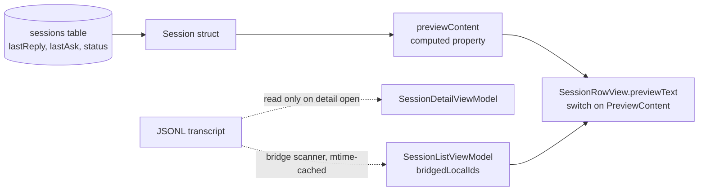
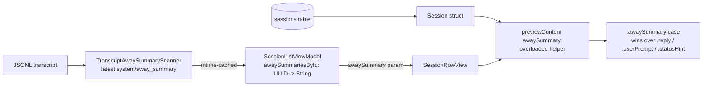

# Plan: Show `away_summary` in session row preview

## Working Protocol
- Use parallel subagents for independent tasks (reading, searching, implementing across files).
- Mark steps done as you complete them — a fresh agent should be able to find where to resume.
- Run `swift test` (30s timeout) after each step before moving on. If a build/test hangs, immediately run `make kill-build` before retrying.
- If blocked, document the blocker here before stopping.

## Overview
Replace the session row's preview text with the latest Claude Code `away_summary` ("recap") when one exists in the JSONL transcript. Minimal slice — in-memory mtime cache only, no schema change, no detail-view integration. The goal is to see how the recap reads as a one-line status before committing to a bigger indexing system (see `.agents/plans/2026-05-20-2251-session-indexing-from-jsonl.md` for the full vision).

## User Experience

1. User opens the Seshctl panel. The session list refreshes.
2. For each local Claude row whose JSONL transcript contains at least one `system/away_summary` record, the row's preview slot (line-1, right column) shows the **content of the most recent `away_summary`** — e.g. "Shipped two PRs to main today: agent-badge polish (#31) and hide-recent-sessions (#32)..." — rendered with the same `.title3` regular-weight primary-color styling as `.reply`.
3. For rows with no recap yet (fresh sessions, non-Claude tools, sessions that haven't been idle), the preview falls through to the existing chain unchanged: `lastReply` → `lastAsk` → status hint.
4. The "(disable recaps in /config)" tail Claude Code appends to every recap is stripped at scan time, so the row reads as a clean one-liner.
5. As the user works in a session, new `away_summary` records get appended to the JSONL; on the next 2-second refresh the row picks up the new recap automatically (mtime advances → cache miss → re-scan).

## Architecture

### Current

Today the row's preview text comes from `Session.previewContent`, a pure computed property over DB fields (`lastReply`, `lastAsk`, `status`). The transcript JSONL is read **only in the detail view** when the user opens a session. The list view does no JSONL parsing for preview purposes — there's already one JSONL-reading code path on the list (`TranscriptBridgeScanner.extractBridgedRemoteId`) but it's only used to compute the `isBridged` boolean, not preview content.

### Proposed

Add a second JSONL scanner that pulls the latest `system/away_summary` content with the same mtime-keyed cache pattern as the bridge scanner. The VM computes a `[UUID: String]` map during its refresh pass and the row uses it to override the preview chain when a recap is present.

**Step-by-step at runtime:**

1. `SessionListViewModel.refresh()` runs (every ~2s while the panel is open). For each local row whose `session.tool == .claude` and `session.transcriptPath != nil`:
   - Stat the file. If the mtime matches the cached entry, reuse the cached `String?`.
   - Otherwise scan the file: `enumerateLines` → JSON-parse each line → keep the most recent record where `type=="system" && subtype=="away_summary"`. Pull `content` (string), strip the trailing `(disable recaps in /config)` tail, trim whitespace, take first non-empty line.
   - Store the result in `transcriptAwaySummaryCache[path] = (mtime, summary)` and write to `awaySummariesById[session.id]` when non-nil.
2. The list view passes `awaySummary: viewModel.awaySummariesById[session.id]` into each `SessionRowView`.
3. The row's `previewText` view calls `session.previewContent(awaySummary: awaySummary)`. When the summary is non-nil and non-empty, the new `.awaySummary(String)` case is returned; otherwise the existing priority chain runs.
4. `previewText` switch grows a new branch for `.awaySummary` — same styling as `.reply` (`.title3`, regular weight, `.primary` color, bold on unread).

**Memory / cost:** Cache is a `[String: (Date, String?)]` keyed by transcript path. Bounded by `pruneTranscriptAwaySummaryCache(keepingPaths:)` called alongside the existing `pruneTranscriptBridgeCache` in the refresh path — entries for closed sessions get dropped on the next prune. Per-file scan is a single `enumerateLines` pass with per-line JSON deserialize; the bridge scanner already does the same on every Claude row and the cost has been acceptable in practice.

## Current State

- `Sources/SeshctlCore/Session.swift` — `Session` struct; fields include `tool`, `transcriptPath`, `lastReply`, `lastAsk`, `status`. No transcript-derived fields.
- `Sources/SeshctlCore/TranscriptBridgeScanner.swift` — single-purpose JSONL scanner for `system/bridge_status`. This is the canonical pattern to mirror.
- `Sources/SeshctlUI/SessionListViewModel.swift:34` — `transcriptBridgeCache: [String: (mtime: Date, cseId: String?)]`.
- `Sources/SeshctlUI/SessionListViewModel.swift:208` — bridge cache populated during `refresh()`'s per-session loop.
- `Sources/SeshctlUI/SessionListViewModel.swift:671` — `cachedBridgedRemoteId(for:)` (the exact pattern to copy).
- `Sources/SeshctlUI/SessionListViewModel.swift:687` — `pruneTranscriptBridgeCache(keepingPaths:)`.
- `Sources/SeshctlUI/Session+Display.swift:159` — `PreviewContent` enum (`.reply`, `.userPrompt`, `.statusHint`).
- `Sources/SeshctlUI/Session+Display.swift:205` — `previewContent` computed property.
- `Sources/SeshctlUI/SessionRowView.swift:31` — `init(session:hostApp:isUnread:isBridged:...)` — where to add the new `awaySummary:` param.
- `Sources/SeshctlUI/SessionRowView.swift:176` — `previewText` switch over `PreviewContent`.
- `Sources/SeshctlUI/SessionListView.swift:355` and `Sources/SeshctlUI/SessionTreeView.swift:82` — the two callers of `SessionRowView(...)` that need the new arg.

## Proposed Changes

**Strategy.** Add a single scanner module and a single VM cache map; wire the result into the row via one new optional param. Make the `awaySummary` win the preview chain when present — the user can revert the priority later if it doesn't read well, but for "see how it looks" the recap needs to actually be visible.

Three layers, mirrored from the bridge-scanner pipeline:

1. **Scanner (`SeshctlCore`)** — pure Foundation, JSON-line scan, latest-wins. Reuse the `enumerateLines` + `JSONSerialization` shape from `TranscriptBridgeScanner.extractBridgedRemoteId(transcript:)`. Strip the `(disable recaps in /config)` tail at the source so every downstream caller gets clean text.
2. **VM cache (`SeshctlUI/SessionListViewModel`)** — `transcriptAwaySummaryCache` + `awaySummariesById` populated in the same `refresh` per-session loop that already runs `cachedBridgedRemoteId(for:)` (line 208). One extra call per Claude row; the mtime guard makes it cheap on the steady-state path.
3. **Preview routing (`SeshctlUI/Session+Display` + `SessionRowView`)** — add `.awaySummary(String)` to the enum; add `previewContent(awaySummary:)` overload that prefers the summary then falls through to the existing chain. Row view takes a new `awaySummary: String?` param and routes through the overload.

**Why this approach over alternatives.**
- *Persist in DB.* Rejected per user choice — heavier, hides the data behind a migration that's hard to roll back, makes it harder to evolve scanner logic.
- *Parse in detail-view only, copy to memory there.* Rejected because then the row only gets a recap *after* the user opens the session — defeats the whole "see how it looks at a glance" goal.
- *Compute in `Session.previewContent` directly.* Rejected — `Session+Display.swift` is in `SeshctlUI` but the `Session` struct lives in `SeshctlCore` and has no transcript-access machinery. Keeping the JSONL scan in the VM layer matches where `cachedBridgedRemoteId` lives today.

### Complexity Assessment

**Low.** Two new files (one scanner, one test). Five files modified, four of which take one-line additions (param threading + cache prune). The only nontrivial file is `SessionListViewModel.swift` where we add a new cache dict, a new published `[UUID: String]`, a `cachedAwaySummary(for:)` helper, and one call site inside `refresh()`. Pattern is 1:1 with `TranscriptBridgeScanner` + `transcriptBridgeCache`, which is well-established. Regression risk: small — the new preview case only activates when a recap exists and the row would have shown `.reply`/`.userPrompt`/`.statusHint` otherwise, so non-Claude tools and fresh sessions are unaffected.

## Impact Analysis

- **New Files**
  - `Sources/SeshctlCore/TranscriptAwaySummaryScanner.swift`
  - `Tests/SeshctlCoreTests/TranscriptAwaySummaryScannerTests.swift`
- **Modified Files**
  - `Sources/SeshctlUI/Session+Display.swift` — extend `PreviewContent` enum + new `previewContent(awaySummary:)` overload
  - `Sources/SeshctlUI/SessionListViewModel.swift` — cache + map + helper + prune + call site in refresh
  - `Sources/SeshctlUI/SessionRowView.swift` — new init param + new switch case in `previewText`
  - `Sources/SeshctlUI/SessionListView.swift` — pass `awaySummary:` arg
  - `Sources/SeshctlUI/SessionTreeView.swift` — pass `awaySummary:` arg
  - `Tests/SeshctlUITests/SessionDisplayHelpersTests.swift` — coverage for the overload
- **Dependencies**
  - Relies on Claude Code emitting `system/away_summary` records into the JSONL (already shipping; verified across 37 recaps in 13 sessions per research note).
  - Relies on `Session.transcriptPath` being populated by the existing CLI hook (already done).
- **Similar Modules**
  - `TranscriptBridgeScanner` (`SeshctlCore`) — the byte-for-byte template. Same input shape (path or string), same `enumerateLines` + JSON-line guard, same "latest wins" semantics.
  - `transcriptBridgeCache` + `cachedBridgedRemoteId(for:)` + `pruneTranscriptBridgeCache` (`SessionListViewModel`) — the cache pattern to mirror.

## Key Decisions

- **Summary wins over `lastReply`.** Even when `lastReply` is newer than the recap, the recap takes precedence. Justification: the whole purpose of this slice is to compare recap text vs reply text. If recap loses to reply, the user never sees it. We can swap the priority later if the recap reads worse than the reply in practice.
- **Strip `(disable recaps in /config)` at the scanner.** Cleaner display, fewer responsibilities for downstream callers. Belongs at the source.
- **In-memory cache only, no DB persistence.** Per user direction during clarification. Re-scan on every app launch is fine at current scale; if it turns out to be slow we can persist later without changing the consumer surface.
- **Pure-Foundation scanner in `SeshctlCore`.** Stays test-friendly and AppKit-free, same as `TranscriptBridgeScanner`.

## Implementation Steps

### Step 1: Add the scanner
- [x] Create `Sources/SeshctlCore/TranscriptAwaySummaryScanner.swift` with two public entry points (mirror `TranscriptBridgeScanner`):
  - `static func extractLatestAwaySummary(transcriptPath: String) -> String?` — reads file via `String(contentsOfFile:encoding:)`, delegates to the string overload, returns `nil` on read failure.
  - `static func extractLatestAwaySummary(transcript: String) -> String?` — `enumerateLines`, JSON-parse each line, keep the most recent `type=="system" && subtype=="away_summary"`, extract `content` (String), strip the `(disable recaps in /config)` trailing parenthetical (and any surrounding whitespace), trim, return `nil` if empty.
- [x] Build: `swift build` (120s timeout).

### Step 2: VM cache + map + refresh wiring
- [ ] In `Sources/SeshctlUI/SessionListViewModel.swift`, add a `private var transcriptAwaySummaryCache: [String: (mtime: Date, summary: String?)] = [:]` next to `transcriptBridgeCache`.
- [ ] Add `@Published public private(set) var awaySummariesById: [UUID: String] = [:]` near the other published row metadata. (Or a non-published computed view if `awaySummariesById` doesn't need to drive view updates — verify by checking how `bridgedLocalIds` is exposed.)
- [ ] Add `fileprivate func cachedAwaySummary(for session: Session) -> String?` mirroring `cachedBridgedRemoteId(for:)` line-for-line — `.claude`-only guard, mtime-keyed cache, `TranscriptAwaySummaryScanner.extractLatestAwaySummary(transcriptPath:)` on miss.
- [ ] Add `fileprivate func pruneTranscriptAwaySummaryCache(keepingPaths:)` mirroring `pruneTranscriptBridgeCache`.
- [ ] In the refresh per-session loop (currently around line 208), call `cachedAwaySummary(for: session)` alongside `cachedBridgedRemoteId(for: session)` and accumulate non-nil results into a new `[UUID: String]` dict; assign to `awaySummariesById` at the end of the pass. Call the new prune alongside `pruneTranscriptBridgeCache`.

### Step 3: Preview-content overload
- [ ] In `Sources/SeshctlUI/Session+Display.swift`, add a `.awaySummary(String)` case to the `PreviewContent` enum.
- [ ] Add `func previewContent(awaySummary: String?) -> PreviewContent` on `Session` that returns `.awaySummary(text)` when `awaySummary` has a non-empty first line, else falls through to the existing `previewContent` computed property.

### Step 4: Row view threading
- [ ] In `Sources/SeshctlUI/SessionRowView.swift`, add `var awaySummary: String? = nil` to the struct and to the `public init`.
- [ ] Update `previewText` to call `session.previewContent(awaySummary: awaySummary)` and add a `case .awaySummary(let text):` branch with the same styling as `.reply` (`.title3`, weight = `.bold` on unread / `.regular` otherwise, `foregroundStyle(.primary)`).
- [ ] In `Sources/SeshctlUI/SessionListView.swift:355` and `Sources/SeshctlUI/SessionTreeView.swift:82`, pass `awaySummary: viewModel.awaySummariesById[session.id]` into the `SessionRowView(...)` call.

### Step 5: Write tests
- [ ] Create `Tests/SeshctlCoreTests/TranscriptAwaySummaryScannerTests.swift`, mirroring `TranscriptBridgeScannerTests.swift`:
  - Test: returns nil for empty string.
  - Test: returns nil when no `away_summary` record exists.
  - Test: returns the `content` of the only `away_summary` record.
  - Test: returns the **most recent** `away_summary` when multiple exist (most recent = last-seen in scan order — append-only JSONL semantics; document in the test comment).
  - Test: strips the trailing `(disable recaps in /config)` parenthetical and trims whitespace.
  - Test: ignores `system` records with other subtypes (e.g. `bridge_status`, `turn_duration`).
  - Test: skips malformed JSON lines without crashing.
- [ ] Update `Tests/SeshctlUITests/SessionDisplayHelpersTests.swift` (or create the file if `previewContent(awaySummary:)` is too new to fit existing test groups):
  - Test: `previewContent(awaySummary: "Shipped two PRs...")` returns `.awaySummary("Shipped two PRs...")` even when `lastReply` is non-empty.
  - Test: `previewContent(awaySummary: nil)` falls through to existing chain identically to the no-arg property.
  - Test: `previewContent(awaySummary: "")` and whitespace-only summary fall through to the existing chain.
  - Test: multi-line summary returns the first non-empty line, matching existing chain behavior.
- [ ] Run `swift test` (30s timeout) via a subagent (per CLAUDE.md "always run tests via subagents").

### Step 6: Verify in the running app
- [ ] `make install` (rebuilds and reinstalls `Seshctl.app` into `/Applications`).
- [ ] Open Seshctl, confirm Claude sessions with known recaps show the recap text in place of the lastReply preview; confirm non-Claude rows and recap-less Claude rows are unchanged.
- [ ] Trigger a new recap in a live session (let a Claude session idle ~3 minutes) and confirm the row picks it up on the next refresh.

## Acceptance Criteria

- [ ] [test] `TranscriptAwaySummaryScanner.extractLatestAwaySummary` returns the most recent recap content, strips the disable-recaps tail, and returns nil for transcripts without a recap.
- [ ] [test] `Session.previewContent(awaySummary:)` returns `.awaySummary` when a non-empty summary is provided, regardless of `lastReply` / `lastAsk` contents.
- [ ] [test] `Session.previewContent(awaySummary:)` falls through to the existing chain when the summary is nil, empty, or whitespace-only.
- [ ] [test-manual] In the running app, a Claude session row with at least one `away_summary` in its JSONL shows that recap as the preview text — verified by opening Seshctl after running a session past the ~3-minute idle threshold.
- [ ] [test-manual] Non-Claude tools (Codex, Cursor, Gemini) and fresh Claude sessions show the preview unchanged from before this change.

## Edge Cases

- **No transcript path on the session.** `cachedAwaySummary(for:)` returns nil, row falls through.
- **Transcript file missing or unreadable.** `String(contentsOfFile:)` throws → scanner returns nil → row falls through.
- **Multi-line recap content.** `previewContent(awaySummary:)` reuses `firstNonEmptyLine` semantics — first non-empty line wins; the row already enforces single-line truncation downstream.
- **Recap content is only the `(disable recaps in /config)` tail.** After stripping, content is empty → scanner returns nil → row falls through.
- **Mtime unavailable (rare FS edge).** Cache miss path runs the scanner every refresh; functionally correct, just unoptimized — matches the bridge-scanner behavior.
- **Non-Claude tools.** Guarded at the top of `cachedAwaySummary(for:)` (same as bridge scanner) — never touches the filesystem.
