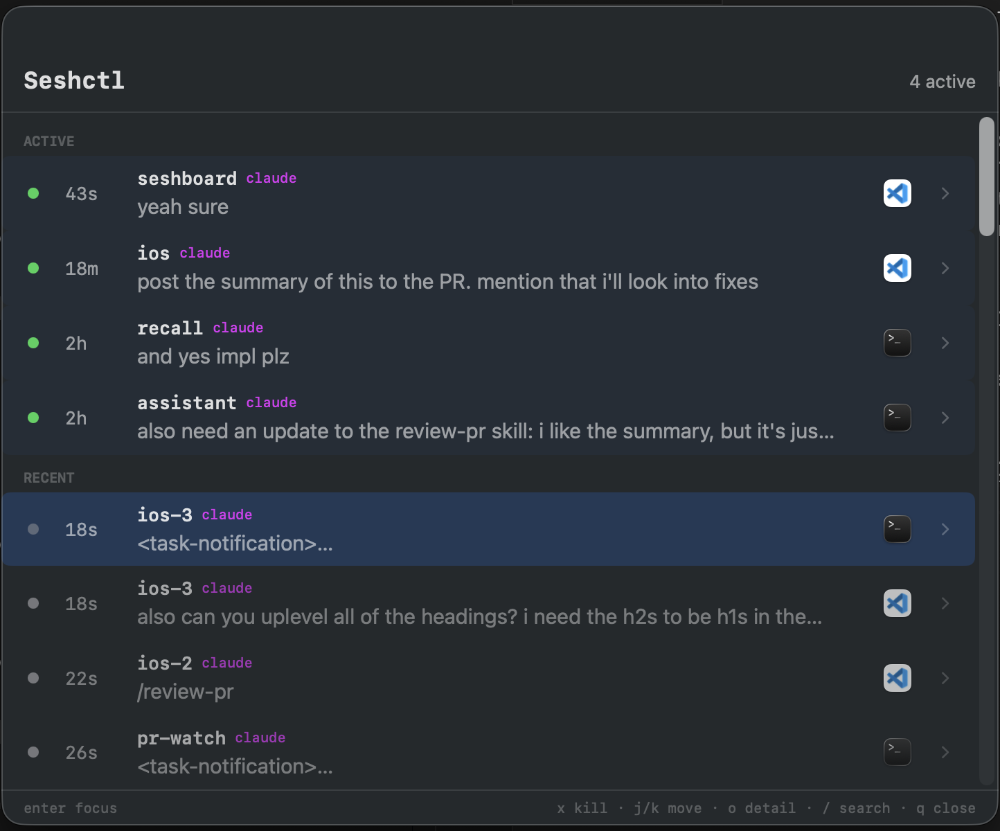

# Seshctl

A macOS session manager for terminal-based workflows. Tracks coding sessions across Terminal.app, iTerm2, and VS Code terminals, with a native menu bar app and CLI.



## Requirements

- macOS 13+
- Swift 6.0+ (comes with Xcode 16+)
- [jq](https://jqlang.github.io/jq/) (for `make install-hooks`)

## Install

### Build from source

```sh
git clone https://github.com/julo15/seshctl.git
cd seshctl
make install    # builds release + installs CLI + hooks + launches app
```

`make install` builds a release, installs `seshctl-cli` to `~/.local/bin`, registers hooks, and launches the menu bar app. Make sure `~/.local/bin` is on your `PATH`.

To uninstall everything:

```sh
make uninstall  # stops app + removes CLI + unregisters hooks
```

### VS Code extension

The extension lets Seshctl focus VS Code terminal tabs by PID.

```sh
cd vscode-extension
npm install
npm run build
npm exec -- @vscode/vsce package --allow-missing-repository
code --install-extension seshctl-*.vsix
rm seshctl-*.vsix
```

> **Tip:** If you use VS Code Insiders, replace `code` with `code-insiders`.

### LLM CLI hooks

Seshctl tracks session status through hooks for [Claude Code](https://docs.anthropic.com/en/docs/claude-code/hooks) and Codex. `make install` registers these automatically. To manage hooks separately:

```sh
make install-hooks    # register hooks for Claude Code and Codex
make uninstall-hooks  # remove hooks for Claude Code and Codex
```

Hook scripts are installed to `~/.local/share/seshctl/hooks/{claude,codex}/` and registered in `~/.claude/settings.json` and `~/.agents/hooks.json` respectively. Both commands are idempotent.

## Usage

Press **Cmd+Shift+S** to toggle the session panel.

### Session list

- **j / k** or **Arrow keys** — navigate sessions
- **gg** — jump to top
- **G** — jump to bottom
- **Enter** — focus the selected session's terminal
- **o** — open session detail view
- **x** — kill session process (then **y** to confirm, **n** to cancel)
- **v** — toggle list/tree view
- **/** — search/filter sessions
- **q** or **Esc** — dismiss the panel

### Session detail

- **j / k** or **Arrow keys** — scroll line by line
- **gg** — jump to top
- **G** — jump to bottom
- **Ctrl+d / Ctrl+u** — half-page down/up
- **Ctrl+f / Ctrl+b** — full page down/up
- **q** or **Esc** — back to list

## Compatibility

### LLM tools

| Tool | Hooks | Transcript parsing | Notes |
|------|-------|--------------------|-------|
| Claude Code | Full | Full | All hook events, full transcript support |
| Codex | Partial | Full | `SessionStart` hook doesn't fire until the first message is sent. No `UserPromptSubmit` (sessions never show "In Progress"). No `SessionEnd` hook — sessions close on `Stop` only. Requires `codex_hooks = true` feature flag (set automatically by `make install-hooks`) |
| Gemini | None | None | Tracked via CLI only (`seshctl-cli start --tool gemini`), no auto-hooks or transcript parsing yet |

### Terminal apps

| App | Focusing | Notes |
|-----|----------|-------|
| Terminal.app | Full | TTY-based tab matching via AppleScript |
| VS Code | Full | Requires the [companion extension](#vs-code-extension) for terminal tab focusing |
| iTerm2 | Implemented | TTY-based tab matching via AppleScript, not extensively tested |
| Ghostty | Full | Working-directory matching via native AppleScript API; resume via surface configuration |
| Warp | Full | DB-assisted tab matching via Warp's internal SQLite; resume via keystroke simulation. No split pane support yet |
| Other | Basic | Falls back to window-name matching via System Events |

## Development

```sh
make build          # debug build
make test           # run all tests
make run-app        # run menu bar app (debug)
make run-cli ARGS="list"  # run CLI with arguments
make help           # see all available commands
```
